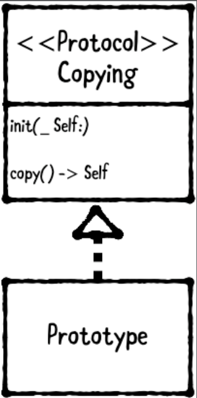

# Chapter 14: Prototype Pattern

------

## 大綱

- [When should you use it?](#1)
- [Playground example](#2)
- [What should you be careful about?](#3)
- [Tutorial project](#4)
- [Key points](#5)

------

<h2 id="1">When should you use it?</h2>

- **The prototype pattern** is a creational pattern that allows an object to copy itself. 
  - **A copying protocol** that declares copy methods.
  - **A prototype class** that conforms to the copying protocol.



- two different types of copies: **shallow and deep**.
  - **A shallow copy**: creates a new object instance, but doesn’t copy its properties. Any properties that are reference types still point to the same original objects.
    -  For example, whenever you copy a Swift Array, which is a struct and thereby happens automatically on assignment, a new array instance is created but its elements aren’t duplicated.
  - **A deep copy**:  creates a new object instance and duplicates each property as well. 
    - For example, if you deep copy an Array, each of its elements are copied too. Swift doesn’t provide a deep copy method on Array by default
- **When should you use it?**
  - Use this pattern to enable an object to copy itself.


------

<h2 id="2">Playground example</h2>

- 目標: deep copy

```swift
let monster = Monster(health: 700, level: 37)
let monster2 = monster.copy() // 檢查是否copy到每個property
print("Watch out! That monster's level is \(monster2.level)!") // “Watch out! That monster's level is 37!

let eyeball = EyeballMonster(health: 3002, level: 60,
                             redness: 999)
let eyeball2 = eyeball.copy() // 檢查是否copy到每個property
print("Eww! Its eyeball redness is \(eyeball2.redness)!") // “Eww! Its eyeball redness is 999!

let eyeballMonster3 = EyeballMonster(monster) // error: 'init' is unavailable: Call copy() instead
```

- Protocol - Copy

```Swift
public protocol Copying: class {
  // a required initializer, init(_ prototype: Self). This is called a copy initializer as its purpose is to create a new class instance using an existing instance.
  init(_ prototype: Self)
}

extension Copying {
  // call copy() on a conforming Copying class instance that you want to copy.
  public func copy() -> Self {
    return type(of: self).init(self)
  }
}
```

- Prototype class

```swift
public class Monster: Copying {
  
  public var health: Int
  public var level: Int
  
  public init(health: Int, level: Int) {
    self.health = health
    self.level = level
  }
  
  // In order to satisfy Copying, you must declare init(_ prototype:) as required.
  // However, you’re allowed to mark this as convenience and call another designated initializer, which is exactly what you do.
  public required convenience init(_ monster: Monster) {
    self.init(health: monster.health, level: monster.level)
  }
}

public class EyeballMonster: Monster {
  
  public var redness = 0
  
  public init(health: Int, level: Int, redness: Int) {
    self.redness = redness
    super.init(health: health, level: level)
  }
  
  @available(*, unavailable, message: "Call copy() instead to create a copy")
  public required convenience init(_ prototype: Monster) {
    // This compiles fine, but it causes a runtime exception. This is due to the forced cast you performed earlier, where you called prototype as! EyeballMonster.
    let eyeballMonster = prototype as! EyeballMonster
    self.init(health: eyeballMonster.health,
              level: eyeballMonster.level,
              redness: eyeballMonster.redness)
  }
}
```


------

<h2 id="3">What should you be careful about?</h2>

- by default it’s possible to **pass a superclass instance to a subclass’s copy initializer**. 

  - This may not be a problem if a subclass can be fully initialized from a superclass instance. However, i**f the subclass adds any new properties, it may not be possible to initialize it from a superclass instance.**

  - To mitigate this issue, you can **mark the subclass copy initializer as “unavailable.”** In response, the compiler will refuse to compile any direct calls to this method


------

<h2 id="4">Tutorial project</h2>


------

<h2 id="5">Key points</h2>

- **The prototype pattern** enables an object to copy itself. It involves two types: **a copying protocol and a prototype.**
- **The copying protocol** declares copy methods, and the prototype conforms to the protocol.
- Foundation provides an **NSCopying** protocol, **but it doesn’t work well in Swift**. It’s easy to roll your own Copying protocol, which eliminates reliance on Foundation or any other framework entirely.
- The key to creating a Copying protocol is **creating a copy initializer with the form init(_ prototype:)**

