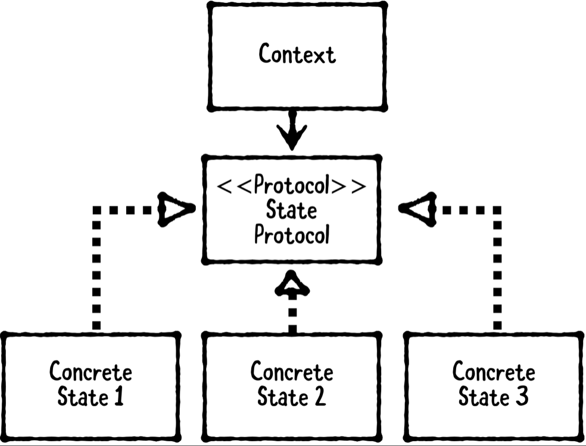

# Chapter 15: State Pattern

------

## 大綱

- [When should you use it?](#1)
- [Playground example](#2)
- [What should you be careful about?](#3)
- [Tutorial project](#4)
- [Key points](#5)

------

<h2 id="1">When should you use it?</h2>

- **The state pattern** is a behavioral pattern that allows an object to change its behavior at runtime
  - **The context**: the object that has a current state and whose behavior changes.
  - **The state protocol**: defines required methods and properties. 
  - **Concrete states**: conform to the state protocol, If you ever need a new behavior, you define a new concrete state.



- **When should you use it?**
  - Use the state pattern to create a system that has two or more states that it changes between during its lifetime.
    - For example, a traffic light can be defined using a closed set of “traffic light states.” In the simplest case, it progresses from green to yellow to red to green again.
  - If you have a class with several switch or if-else statements, try to define it using the state pattern instead. You’ll likely create a more flexible and easier maintain system as a result.

  - 一个对象存在多个状态，不同状态下的行为会有不同，而且状态之间可以相互转换。
  - 如果我们通过`if else`来判断对象的状态，那么代码中会包含大量与对象状态有关的条件语句，而且在添加，删除和更改这些状态的时候回比较麻烦；而如果使用状态模式。将状态对象分散到不同的类中，则可以消除 `if...else`等条件选择语句。

------

<h2 id="2">Playground example</h2>

- 目標：建立一個紅綠燈的狀態

```swift
let greenYellowRed: [SolidTrafficLightState] =
  [.greenLight(), .yellowLight(), .redLight()]
let trafficLight = TrafficLight(states: greenYellowRed)
PlaygroundPage.current.liveView = trafficLight

// The state pattern doesn’t actually tell you where or how to perform state changes. 
// In this case, you actually have two choices: you can put state change logic within TrafficLight, or you can put this within TrafficLightState
extension TrafficLightState {
  public func apply(to context: TrafficLight, after delay: TimeInterval) {
    let queue = DispatchQueue.main
    let dispatchTime = DispatchTime.now() + delay
    queue.asyncAfter(deadline: dispatchTime) { [weak self, weak context] in
      guard let self = self, let context = context else { return }
      context.transition(to: self)
    }
  }
}
```

- 建立Context

```Swift
// MARK: - Context
public class TrafficLight: UIView {
  
  // MARK: - Instance Properties
  // These layers will hold onto the green/yellow/red states as sublayers.
  public private(set) var canisterLayers: [CAShapeLayer] = []
  public private(set) var currentState: TrafficLightState
  public private(set) var states: [TrafficLightState]
  
  // MARK: - Object Lifecycle
  @available(*, unavailable,
  message: "Use init(canisterCount: frame:) instead")
  public required init?(coder aDecoder: NSCoder) {
    fatalError("init(coder:) is not supported")
  }
  
  // declare init(canisterCount:frame:) as the designated initializer and provide default values for both canisterCount and frame.
  public init(canisterCount: Int = 3,
              frame: CGRect =
    CGRect(x: 0, y: 0, width: 160, height: 420),
              states: [TrafficLightState]) {
    
    guard !states.isEmpty else {
      fatalError("states should not be empty")
    }
    self.currentState = states.first!
    self.states = states
    
    super.init(frame: frame)
    backgroundColor =
      UIColor(red: 0.86, green: 0.64, blue: 0.25, alpha: 1)
    createCanisterLayers(count: canisterCount)
    transition(to: currentState)
  }
  
  private func createCanisterLayers(count: Int) {
    let paddingPercentage: CGFloat = 0.2
    let yTotalPadding = paddingPercentage * bounds.height
    let yPadding = yTotalPadding / CGFloat(count + 1)
    
    let canisterHeight = (bounds.height - yTotalPadding) / CGFloat(count)
    let xPadding = (bounds.width - canisterHeight) / 2.0
    var canisterFrame = CGRect(x: xPadding,
                               y: yPadding,
                               width: canisterHeight,
                               height: canisterHeight)
    
    for _ in 0 ..< count {
      let canisterShape = CAShapeLayer()
      canisterShape.path = UIBezierPath(ovalIn: canisterFrame).cgPath
      canisterShape.fillColor = UIColor.black.cgColor
      
      layer.addSublayer(canisterShape)
      canisterLayers.append(canisterShape)
      
      canisterFrame.origin.y += (canisterFrame.height + yPadding)
    }
  }
  
  public func transition(to state: TrafficLightState) {
    removeCanisterSublayers()
    currentState = state
    currentState.apply(to: self)
    nextState.apply(to: self, after: currentState.delay)
  }
  
  private func removeCanisterSublayers() {
    canisterLayers.forEach {
      $0.sublayers?.forEach {
        $0.removeFromSuperlayer()
      }
    }
  }
  
  public var nextState: TrafficLightState {
    guard let index = states.index(where: { $0 === currentState }),
      index + 1 < states.count else {
        return states.first!
    }
    return states[index + 1]
  }
}
```

-[其他好懂例子]([https://knightsj.github.io/2019/03/17/%E9%9D%A2%E5%90%91%E5%AF%B9%E8%B1%A1%E8%AE%BE%E8%AE%A1%E7%9A%84%E8%AE%BE%E8%AE%A1%E6%A8%A1%E5%BC%8F%EF%BC%88%E4%B8%89%EF%BC%89%EF%BC%9A%E8%A1%8C%E4%B8%BA%E5%9E%8B%E6%A8%A1%E5%BC%8F/](https://knightsj.github.io/2019/03/17/面向对象设计的设计模式（三）：行为型模式/))

------

<h2 id="3">What should you be careful about?</h2>

- Be careful about creating tight coupling between the context and concrete states. 
  - Will you ever want to reuse the states in a different context? If so, consider putting a protocol between the concrete states and context, instead of having concrete states call methods on a specific context.
- If you choose to implement state change logic within the states themselves, be careful about tight coupling from one state to the next. 
  - Will you ever want to transition from state to another state instead? In this case, consider passing in the next state via an initializer or property.

------

<h2 id="4">Tutorial project</h2>


------

<h2 id="5">Key points</h2>

- **The state pattern permits** an object to change its behavior at runtime. It involves three types: the context, state protocol and concrete states.
- The context is the object that has a current state; the state protocol defines required methods and properties; and the concrete states implement the state protocol and actual behavior that changes at runtime.
- **The state pattern doesn’t actually tell you where to put transition logic between states**. Rather, this is left for you to decide: you can put this logic either within the context or within the concrete states.

