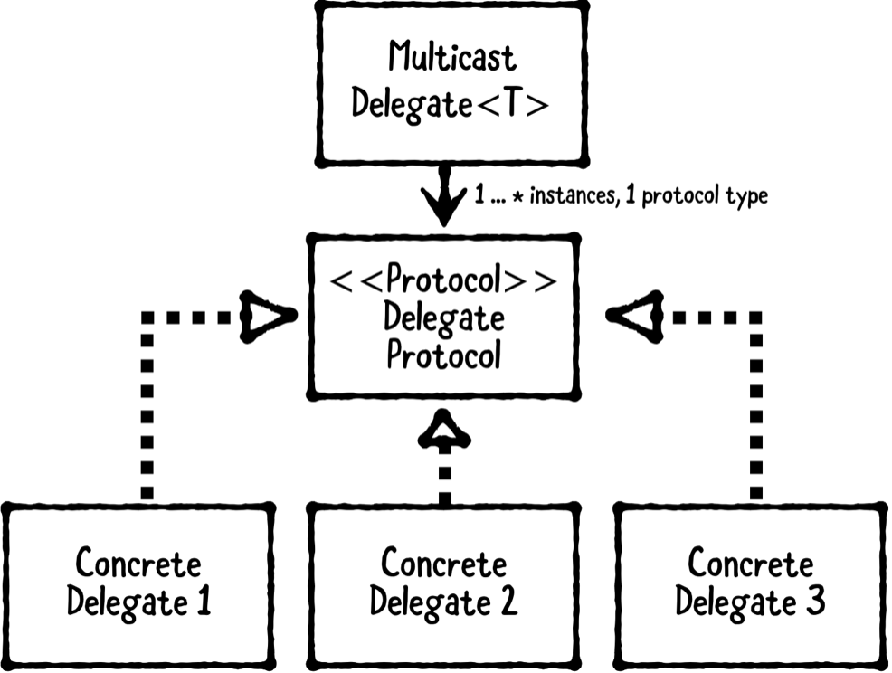

# Chapter 16: Multicast Delegate Pattern

------

## 大綱

- [When should you use it?](#1)
- [Playground example](#2)
- [What should you be careful about?](#3)
- [Tutorial project](#4)
- [Key points](#5)

------

<h2 id="1">When should you use it?</h2>

- **The multicast delegate pattern** is a behavioral pattern that’s a variation on the delegate pattern. 
  - It allows you to create **one-to-many** delegate relationships, instead of one-to-one relationships in a simple delegate.



- An **object needing a delegate**, also known as the delegating object, is the object that has one or more delegates.
- The **delegate protocol** defines the methods a delegate may or should implement.
- The **delegate(s)** are objects that implement the delegate protocol.
- **The multicast delegate** is a helper class that holds onto delegates and allows you to notify each delegate whenever a delegate-worthy event happens.

- **When should you use it?**
  - Use this pattern to create one-to-many delegate relationships.
    - For example, you can use this pattern to inform multiple objects whenever a change has happened to another object. Each delegate can then update its own state or perform relevant actions in response.

------

<h2 id="2">Playground example</h2>

- 目標: 製作multicast delegate

```swift
// MARK: - Example
let dispatch = DispatchSystem()
// object needing a delegate
var policeStation: PoliceStation! = PoliceStation()
var fireStation: FireStation! = FireStation()

// The multicast delegate
dispatch.multicastDelegate.addDelegate(policeStation)
dispatch.multicastDelegate.addDelegate(fireStation)

dispatch.multicastDelegate.invokeDelegates {
  $0.notifyFire(at: "Ray's house!")
}

print("")
// Police were notified about a fire at Ray's house!
// Firefighters were notified about a fire at Ray's house!”

fireStation = nil

dispatch.multicastDelegate.invokeDelegates {
  $0.notifyCarCrash(at: "Ray's garage!")
}
// Police were notified about a fire at Ray's house!
```

- *Delegate Protocol*

```swift
// MARK: - Delegate Protocol
public protocol EmergencyResponding {
  func notifyFire(at location: String)
  func notifyCarCrash(at location: String)
}
```

- *Delegates*

```swift
public class FireStation: EmergencyResponding {
  
  public func notifyFire(at location: String) {
    print("Firefighters were notified about a fire at "
      + location)
  }
  
  public func notifyCarCrash(at location: String) {
    print("Firefighters were notified about a car crash at "
      + location)
  }
}

public class PoliceStation: EmergencyResponding {
  
  public func notifyFire(at location: String) {
    print("Police were notified about a fire at "
      + location)
  }
  
  public func notifyCarCrash(at location: String) {
    print("Police were notified about a car crash at "
      + location)
  }
}
```

- *Delegating Object*

```swift
public class DispatchSystem {
  let multicastDelegate =
    MulticastDelegate<EmergencyResponding>()
}
```

- **MulticastDelegate**: 核心

```swift
public class MulticastDelegate<ProtocolType> {
  
  // MARK: - DelegateWrapper
  private class DelegateWrapper {
    
    weak var delegate: AnyObject?
    
    init(_ delegate: AnyObject) {
      self.delegate = delegate
    }
  }
  
  // MARK: - Instance Properties
  private var delegateWrappers: [DelegateWrapper]
  
  public var delegates: [ProtocolType] {
    delegateWrappers = delegateWrappers
      .filter { $0.delegate != nil }
    return delegateWrappers.map
      { $0.delegate! } as! [ProtocolType]
  }
  
  // MARK: - Object Lifecycle
  public init(delegates: [ProtocolType] = []) {
    delegateWrappers = delegates.map {
      DelegateWrapper($0 as AnyObject)
    }
  }
  
  // MARK: - Delegate Management
  public func addDelegate(_ delegate: ProtocolType) {
    let wrapper = DelegateWrapper(delegate as AnyObject)
    delegateWrappers.append(wrapper)
  }
  
  public func removeDelegate(_ delegate: ProtocolType) {
    guard let index = delegateWrappers.index(where: {
      $0.delegate === (delegate as AnyObject)
    }) else {
      return
    }
    delegateWrappers.remove(at: index)
  }
  
  public func invokeDelegates(_ closure: (ProtocolType) -> ()) {
    delegates.forEach { closure($0) }
  }
}

```

------

<h2 id="3">What should you be careful about?</h2>

- This pattern works best for “information only” delegate calls.
- If delegates need to provide data, this pattern doesn’t work well. 
  - That’s because multiple delegates would be asked to provide the data, which could result in duplicated information or wasted processing.

------

<h2 id="4">Tutorial project</h2>


------

<h2 id="5">Key points</h2>

- **The multicast delegate pattern** allows you to create one-to-many delegate relationships. It involves four types: an object needing a delegate, a delegate protocol, delegates, and a multicast delegate.
- An object needing a delegate has one or more delegates; the delegate protocol defines the methods a delegate should implement; the delegates implement the delegate protocol; and the multicast delegate is a helper class for holding onto and notifying the delegates.
- **Swift doesn’t provide a multicast delegate object for you**. However, it’s easy to implement your own to support this pattern.”