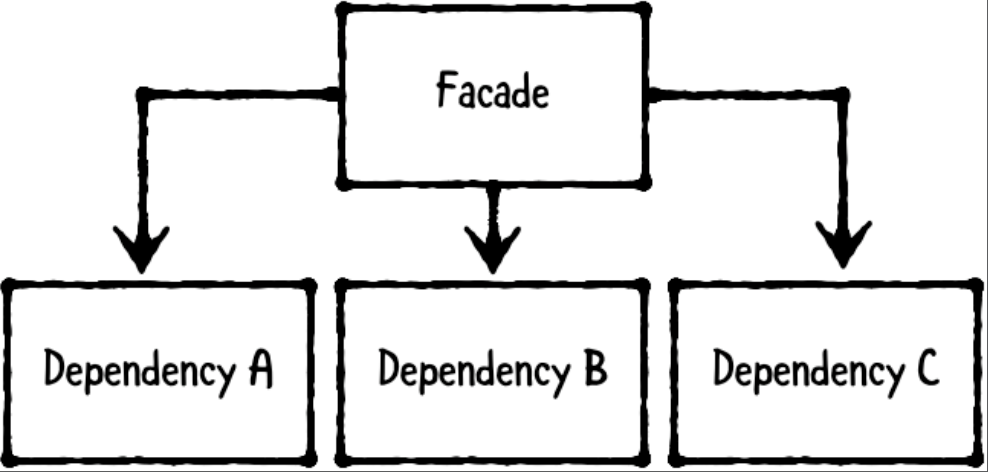

# Chapter 17: Facade Pattern

------

## 大綱

- [When should you use it?](#1)
- [Playground example](#2)
- [What should you be careful about?](#3)
- [Tutorial project](#4)
- [Key points](#5)

------

<h2 id="1">When should you use it?</h2>

- The facade pattern is a structural pattern that provides a simple interface to a complex system.

  - **The facade**:  provides simple methods to interact with the system. This allows consumers to use the facade instead of knowing about and interacting with multiple classes in the system.
  - **The dependencies**: are objects owned by the facade. Each dependency performs a small part of a complex task.

  

- **When should you use it?**

  - Use this pattern whenever you have a system made up of multiple components and want to **provide a simple way for users to perform complex tasks**.


------

<h2 id="2">Playground example</h2>

- 目標: a product ordering system involves several components: customers and products, inventory in stock, shipping orders and others.
  - **provide a facade to expose common tasks** such as placing and fulfilling a new order

```Swift
// MARK: - Example
// 1. set up two products
let rayDoodle = Product(
  identifier: "product-001",
  name: "Ray's doodle",
  cost: 0.25)

let vickiPoodle = Product(
  identifier: "product-002",
  name: "Vicki's prized poodle",
  cost: 1000)

// 2. create inventoryDatabase using the products
let inventoryDatabase = InventoryDatabase(
  inventory: [rayDoodle: 50, vickiPoodle : 1]
)

// 3. create the orderFacade using the inventoryDatabase and a new ShippingDatabase.
let orderFacade = OrderFacade(
  inventoryDatabase: inventoryDatabase,
  shippingDatabase: ShippingDatabase())

// 4. create a customer and call orderFacade.placeOrder(for:by:).
let customer = Customer(
  identifier: "customer-001",
  address: "1600 Pennsylvania Ave, Washington, DC 20006",
  name: "Johnny Appleseed")

// provide a simple way for users to perform complex tasks
orderFacade.placeOrder(for: vickiPoodle, by: customer)
// Place order for 'Vicki's prized poodle' by 'Johnny Appleseed'
// Order placed for 'Vicki's prized poodle' by 'Johnny Appleseed
```

- Dependencies

```swift
// MARK: - Dependencies

// 1. define two simple models
public struct Customer {
  public let identifier: String
  public var address: String
  public var name: String
}

// 2. make both of these types conform to Hashable to enable you to use them as keys within a dictionary
extension Customer: Hashable {
  
  public var hashValue: Int {
    return identifier.hashValue
  }
  
  public static func ==(lhs: Customer,
                        rhs: Customer) -> Bool {
    return lhs.identifier == rhs.identifier
  }
}

public struct Product {
  public let identifier: String
  public var name: String
  public var cost: Double
}

extension Product: Hashable {
  
  public var hashValue: Int {
    return identifier.hashValue
  }
  
  public static func ==(lhs: Product,
                        rhs: Product) -> Bool {
    return lhs.identifier == rhs.identifier
  }
}

// This is a simplified version of a database that stores available inventory, which represents the number of items available for a given Product.
public class InventoryDatabase {
  public var inventory: [Product: Int] = [:]
  
  public init(inventory: [Product: Int]) {
    self.inventory = inventory
  }
}

// This is likewise a simplified version of a database that holds onto pendingShipments, which represents products that have been ordered but not yet shipped for a given Customer.
public class ShippingDatabase {
  public var pendingShipments: [Customer: [Product]] = [:]
}
```

- Facade

```swift
// MARK: - Facade

public class OrderFacade {
  public let inventoryDatabase: InventoryDatabase
  public let shippingDatabase: ShippingDatabase
  
  public init(inventoryDatabase: InventoryDatabase,
              shippingDatabase: ShippingDatabase) {
    self.inventoryDatabase = inventoryDatabase
    self.shippingDatabase = shippingDatabase
  }
  
  // 將placeOrder中所需要的dependency進行邏輯封裝
  public func placeOrder(for product: Product,
                         by customer: Customer) {
    print("Place order for '\(product.name)' by '\(customer.name)'")
    
    // 檢查庫存
    let count = inventoryDatabase.inventory[product, default: 0]
    guard count > 0 else {
      print("'\(product.name)' is out of stock!")
      return
    }
    
    // 調整庫存內容
    inventoryDatabase.inventory[product] = count - 1
    
    // 調整shipment內容
    var shipments =
      shippingDatabase.pendingShipments[customer, default: []]
    shipments.append(product)
    shippingDatabase.pendingShipments[customer] = shipments
    
    print("Order placed for '\(product.name)' " +
      "by '\(customer.name)'")
  }
}
```

------

<h2 id="3">What should you be careful about?</h2>

- Be careful about creating a “god” facade that knows about every class in your app.
- It’s okay to create more than one facade for different use cases.

------

<h2 id="4">Tutorial project</h2>


------

<h2 id="5">Key points</h2>

- The facade pattern provides a simple interface to a complex system. It involves two types: the facade and its dependencies.
- The facade provides simple methods to interact with the system. Behind the scenes, it owns and interacts with its dependencies, each of which performs a small part of a complex task.