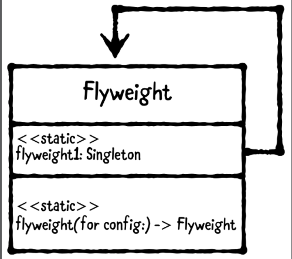

# Chapter 18: Flyweight Pattern

------

## 大綱

- [When should you use it?](#1)
- [Playground example](#2)
- [What should you be careful about?](#3)
- [Tutorial project](#4)
- [Key points](#5)

------

<h2 id="1">When should you use it?</h2>

- **The flyweight pattern** is a structural design pattern that **minimizes memory usage and processing**
- The flyweight pattern has objects, called flyweights, and a static method to return them.
- The flyweight pattern is a variation on the singleton pattern. 
- In the flyweight pattern, you usually have multiple different objects of the same class. 



- When should you use it?
  - Use a flyweight in places where you would **use a singleton, but you need multiple shared instances with different configurations.** 

------

<h2 id="2">Playground example</h2>

- Flyweights are very common in UIKit. UIColor, UIFont, and UITableViewCell are all examples of classes with flyweights.

```swift
import UIKit

let red = UIColor.red
let red2 = UIColor.red
print(red === red2) // true, 表示red和red2是共享同一個memory address

// 但不是UIColor中每個方法都是遵守Flyweights pattern
let color = UIColor(red: 1, green: 0, blue: 0, alpha: 1)
let color2 = UIColor(red: 1, green: 0, blue: 0, alpha: 1)
print(color === color2) // false, custom color並不是Flyweights pattern
```

- 如何讓custom color也遵守Flyweights pattern？

```swift
extension UIColor {
  
  // 1: 建立一個static dic來存RGBA
  public static var colorStore: [String: UIColor] = [:]
  
  // 2: 建立一個function
  public class func rgba(_ red: CGFloat,
                         _ green: CGFloat,
                         _ blue: CGFloat,
                         _ alpha: CGFloat) -> UIColor {
    // 利用RGBA組合當key
    let key = "\(red)\(green)\(blue)\(alpha)"
    if let color = colorStore[key] {
      // 找到對應的key就回傳對應color
      return color
    }
    
    // 3: 沒有在目前colorStore中，就存入
    let color = UIColor(red: red,
                        green: green,
                        blue: blue,
                        alpha: alpha)
    colorStore[key] = color
    return color
  }
}

let flyColor = UIColor.rgba(1, 0, 0, 1)
let flyColor2 = UIColor.rgba(1, 0, 0, 1)
print(flyColor === flyColor2)  // proves this is a flyweight class method
```

------

<h2 id="3">What should you be careful about?</h2>

- be careful about how big your flyweight memory grows.
- you minimize memory usage for the same color, but you can still use too much memory in the flyweight store.
  - 為什麼apple的UIColor只針對某些特定color是遵守Flyweights pattern, 像藍色，紅色。至於客製化顏色都弄成Flyweights pattern就會導致colorStore過於龐大。
- **Set bounds on how much memory you use** or register for memory warnings and respond by removing some flyweights from memory
  - LRU (Least Recently Used) cache to handle this.
- **flyweight shared instance must be a class** and not a struct. Structs use copy semantics

------

<h2 id="4">Tutorial project</h2>

- 希望每次切換tab可以切換指定的不同大小的字型。
  - 每次切換都不需要再次產生instace因此可以利用Flyweight Pattern來處理。


- Fonts Class

```Swift
public final class Fonts {
  // 1. 3個flyweight object分別表示不同字型
  public static let large = loadFont(name: fontName, size: 30.0)
  public static let medium = loadFont(name: fontName, size: 25.0)
  public static let small = loadFont(name: fontName, size: 18.0)
  
  private static let fontName = "coolstory-regular"
  // 2. 利用static function來回傳對應的flyweight object
  private static func loadFont(name: String, size: CGFloat) -> UIFont {
    if let font = UIFont(name: name, size: size) {
      return font
    }

    let bundle = Bundle(for: Fonts.self)
    
    guard let url = bundle.url(forResource: name, withExtension: "ttf"),
      let fontData = NSData(contentsOf: url),
      let provider = CGDataProvider(data: fontData),
      let cgFont = CGFont(provider),
      let fontName = cgFont.postScriptName as String? else {
        preconditionFailure("Unable to load font named \(name)")
    }
    
    CTFontManagerRegisterGraphicsFont(cgFont, nil)
    return UIFont(name: fontName, size: size)!
  }
}
```

```Swift
// MARK: - 切換tab
// 每次切換到對應的字型時，都只會產生一次object, 不會重複產生
  @IBAction public func segmentedControlValueChanged(_ sender: UISegmentedControl) {
    switch sender.selectedSegmentIndex {
    case 0:
      textLabel.font = Fonts.small
    case 1:
      textLabel.font = Fonts.medium
    case 2:
      textLabel.font = Fonts.large
    default:
      textLabel.font = Fonts.small
    }
  }
```

------

<h2 id="5">Key points</h2>

- The flyweight pattern minimizes memory usage and processing.
- This pattern has objects, called flyweights, and a static method to return them. It’s a variation on the singleton pattern.
- When creating flyweights, be careful about the size of your flyweight memory. If you’re storing several flyweights, it’s still possible to use too much memory in the flyweight store.
- Examples of flyweights include caching objects such as images, or keeping a pool of objects stored in memory for quick access.

