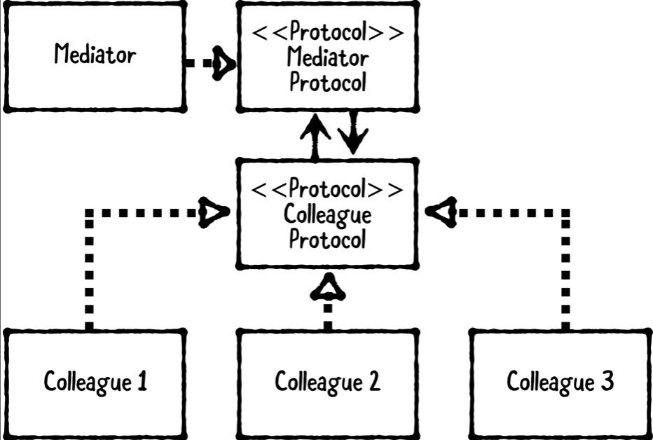

# Chapter 19: Mediator Pattern

------

## 大綱

- [When should you use it?](#1)
- [Playground example](#2)
- [What should you be careful about?](#3)
- [Tutorial project](#4)
- [Key points](#5)

------

<h2 id="1">When should you use it?</h2>

- The mediator pattern is a behavioral design pattern that **encapsulates how objects communicate with one another**.
  - **The colleagues**: the objects that want to communicate with each other. They implement the colleague protocol.
  - **The colleague protocol**: defines methods and properties that each colleague must implement.
  - **The mediator**: the object that controls the communication of the colleagues. It implements the mediator protocol.
  - **The mediator protocol**: defines methods and properties that the mediator must implement.



- **When should you use it?**
  - This pattern is especially useful when you need one or more colleagues to act upon events initiated by another colleague, and, in turn, have this colleague generate further events that affect other colleagues.


------

<h2 id="2">Playground example</h2>

- 結果

```Swift
// MARK: - Example
let mediator = MusketeerMediator()
let athos = Musketeer(mediator: mediator, name: "Athos")
let porthos = Musketeer(mediator: mediator, name: "Porthos")
let aramis = Musketeer(mediator: mediator, name: "Aramis")

athos.sendMessage("One for all...!")
print("")

porthos.sendMessage("and all for one...!")
print("")

aramis.sendMessage("Unus pro omnibus, omnes pro uno!")
print("")

mediator.invokeColleagues() {
  $0.colleague(nil, didSendMessage: "Charge!")
}

// 當一個Colleague發出event時，在同一個Mediator下的其他Colleague都會同時收到event
/*
Athos sent: One for all...!
Porthos received: One for all...!
Aramis received: One for all...!

Porthos sent: and all for one...!
Athos received: and all for one...!
Aramis received: and all for one...!

Aramis sent: Unus pro omnibus, omnes pro uno!
Athos received: Unus pro omnibus, omnes pro uno!
Porthos received: Unus pro omnibus, omnes pro uno!”
*/
```

- Step1: 實作*Colleague Protocol*

```Swift
// MARK: - Colleague Protocol
public protocol Colleague: class {
  // 收到某個Colleague所傳送的event
  func colleague(_ colleague: Colleague?,
                 didSendMessage message: String)
}
```

- Step2: 實作*Mediator Protocol*

```Swift
// MARK: - Mediator Protocol
public protocol MediatorProtocol: class {
  // 加入Colleague到Mediator的管理中
  func addColleague(_ colleague: Colleague)
  // 將某個Colleague發出的event轉發給其他Colleague
  func sendMessage(_ message: String, by colleague: Colleague)
}
```

- Step3: 實作*Colleague*

```Swift
/ MARK: - Colleague
public class Musketeer {
  
  public var name: String
  public weak var mediator: MediatorProtocol?
  
  public init(mediator: MediatorProtocol, name: String) {
    self.mediator = mediator
    self.name = name
    // 將自己加入到某個mediator中
    mediator.addColleague(self)
  }
  
  public func sendMessage(_ message: String) {
    print("\(name) sent: \(message)")
    // 是透過mediator傳送message到其他Colleague中
    mediator?.sendMessage(message, by: self)
  }
}

extension Musketeer: Colleague {
  // 實作Colleague
  // 收到某個Colleague所傳送的event
  public func colleague(_ colleague: Colleague?,
                        didSendMessage message: String) {
    print("\(name) received: \(message)")
  }
}

```

- Step4: 實作*Mediator*

```Swift
// MARK: - Mediator
public class MusketeerMediator: Mediator<Colleague> {
  
}
extension MusketeerMediator: MediatorProtocol {
  
  public func addColleague(_ colleague: Colleague) {
    self.addColleague(colleague, strongReference: true)
  }
  
  public func sendMessage(_ message: String,
                          by colleague: Colleague) {
    invokeColleagues(by: colleague) {
      $0.colleague(colleague, didSendMessage: message)
    }
  }
}
```

```Swift
// 1. accepts any ColleagueType as the generic type
open class Mediator<ColleagueType> {
  
  // 2. define ColleagueWrapper as an inner class
  private class ColleagueWrapper {
    // 3. want Mediator to retain colleagues, but in others, you won’t want this. Hence, you declare both weak and strong properties to support both scenarios.
    var strongColleague: AnyObject?
    weak var weakColleague: AnyObject?
    
    // 4. declare colleague as a computed property
    var colleague: ColleagueType? {
      return (weakColleague ?? strongColleague) as? ColleagueType
    }
    
    // 5. declare two designated initializers, init(weakColleague:) and init(strongColleague:), for setting either weakColleague or strongColleague
    init(weakColleague: ColleagueType) {
      self.strongColleague = nil
      self.weakColleague = weakColleague as AnyObject
    }
    
    init(strongColleague: ColleagueType) {
      self.strongColleague = strongColleague  as AnyObject
      self.weakColleague = nil
    }
  }
  
  // MARK: - Instance Properties
  // 6. declare colleagueWrappers to hold onto the ColleagueWrapper instances
  private var colleagueWrappers: [ColleagueWrapper] = []
  
  // 7. add a computed property for colleagues. This uses filter to find colleagues from colleagueWrappers that have already been released and then returns an array of definitely non-nil colleagues”
  public var colleagues: [ColleagueType] {
    var colleagues: [ColleagueType] = []
    colleagueWrappers = colleagueWrappers.filter {
      guard let colleague = $0.colleague else { return false }
      colleagues.append(colleague)
      return true
    }
    return colleagues
  }
  
  // MARK: - Object Lifecycle
  // 8. public designated initializer for Mediator.
  public init() { }
  
  // MARK: - Colleague Management
  // 9. creates a ColleagueWrapper that either strongly or weakly references colleague depending on whether strongReference is true or not.
  public func addColleague(_ colleague: ColleagueType,
                           strongReference: Bool = true) {
    let wrapper: ColleagueWrapper
    if strongReference {
      wrapper = ColleagueWrapper(strongColleague: colleague)
    } else {
      wrapper = ColleagueWrapper(weakColleague: colleague)
    }
    colleagueWrappers.append(wrapper)
  }
  
  // 10. first attempt to find the index for the ColleagueWrapper that matches the colleague using pointer equality, === instead of ==, so that it’s the exact ColleagueType object. If found, you remove the colleague wrapper at the given index.”
  public func removeColleague(_ colleague: ColleagueType) {
    guard let index = colleagues.index(where: {
      ($0 as AnyObject) === (colleague as AnyObject)
    }) else { return }
    colleagueWrappers.remove(at: index)
  }
  
  // 11. Both of these methods iterate through colleagues. The only difference is invokeColleagues(by:closure:) does not call the passed-in closure on the matching colleague that’s passed in. This is very useful to prevent a colleague from acting upon changes or events that itself initiated.”
  public func invokeColleagues(closure: (ColleagueType) -> Void) {
    colleagues.forEach(closure)
  }
  
  public func invokeColleagues(by colleague: ColleagueType,
                               closure: (ColleagueType) -> Void) {
    colleagues.forEach {
      guard ($0 as AnyObject) !== (colleague as AnyObject)
        else { return }
      closure($0)
    }
  }
}
```

------

<h2 id="3">What should you be careful about?</h2>

- This pattern is very useful in decoupling colleagues. 
  - Instead of colleagues interacting directly, each colleague communicates through the mediator.
- Be careful about turning the mediator into **a “god” object** — an object that knows about every other object within a system.
  - **If your mediator gets too big, consider breaking it up into multiple mediator–colleague systems**

------

<h2 id="4">Tutorial project</h2>

- 目標: This app will help users **plan a date that involves three different locations**: a bar, restaurant and movie theater. 

------

<h2 id="5">Key points</h2>

- The mediator pattern encapsulates how objects communicate with one another. It involves four types: colleagues, a colleague protocol, a mediator, and a mediator protocol.
- The **colleagues** are the objects that communicate; the **colleague protocol** defines methods and properties all colleagues must have; the **mediator** controls the communication of the colleagues; and the **mediator protocol** defines required methods and properties that the mediator must have.
- In lieu of talking directly, colleagues hold onto and communicate through the mediator. The colleague protocol and mediator protocol helps prevent tight coupling between all objects involved.”