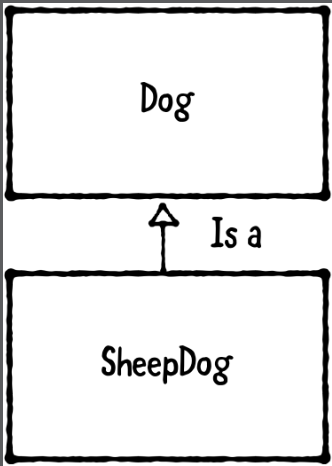
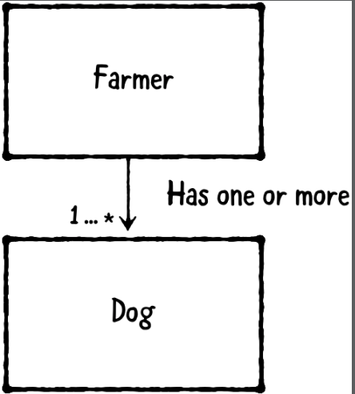
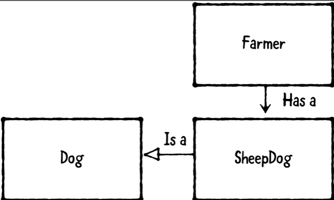
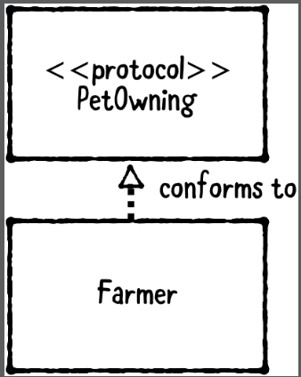
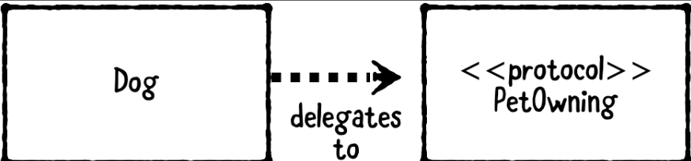
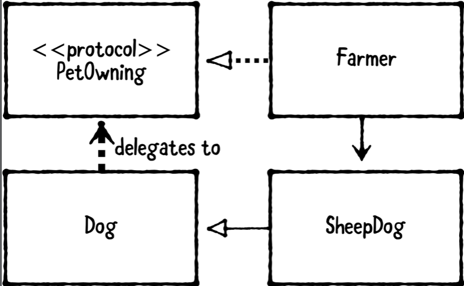
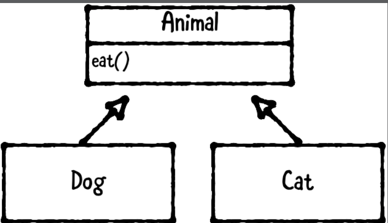
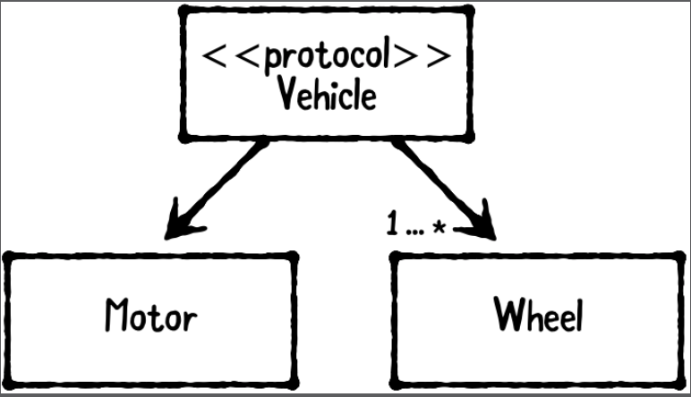
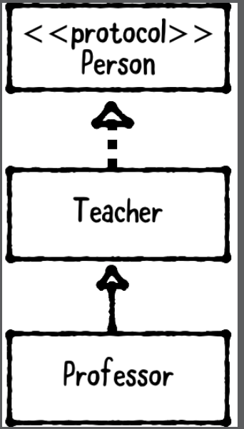

# Chapter 2: How to Read a Class Diagram

------

## 大綱

- [What’s in a class diagram?](#1)
- [Challenges](#2)
- [Key points](#3)

------

<h2 id="1">What’s in a class diagram?</h2>

- “inherits from,” read this as “is a”
  - SheepDog is a Dog.

- a Farmer has one or more Dogs

- a Farmer has a SheepDog that’s a Dog

- Farmer conforms to PetOwning

- indicate that Dog delegates to a PetOwning object

- a Farmer that has a SheepDog, which is a Dog that delegates to a PetOwning object

  

  

------

<h2 id="2">Challenges</h2>

- Dog and Cat inherit from Animal, which defines an eat method.

- Vehicle protocol has one Motor and one or more Wheel objects.

- Professor is a Teacher and conforms to a Person protocol.

------

<h2 id="3">Key points</h2>

- Class diagrams give a visual representation of class and protocol types, showing their properties and methods.
- Class diagrams also show the relationship between the object types.
- Class diagrams can be drawn in any other orientation; the direction of the arrows define the meaning.
- Boxes denote classes, and lines denote relationships: “implements,” “has a,” “uses“ and “conforms to” are the most common relations.
- Boxes can also denote protocols, which is indicated by <<protocol>> before the name.