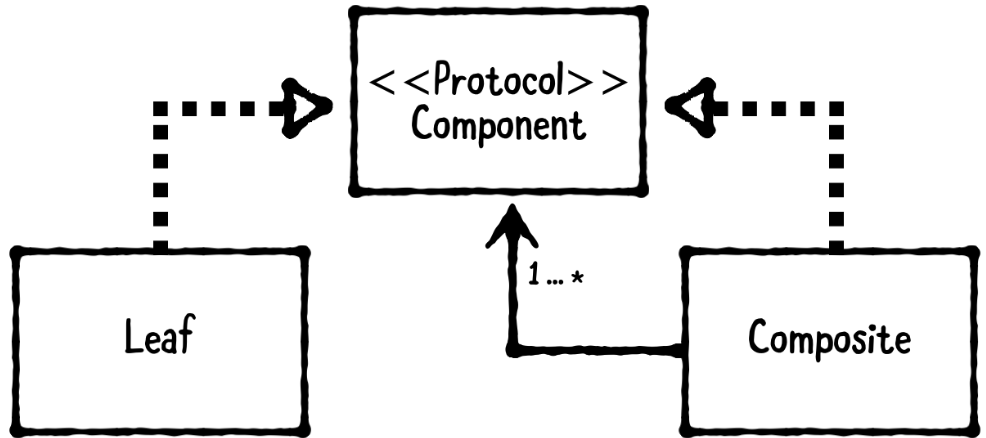

# Chapter 20: Composite Pattern

------

## 大綱

- [When should you use it?](#1)
- [Playground example](#2)
- [What should you be careful about?](#3)
- [Tutorial project](#4)
- [Key points](5)

------

<h2 id="1">When should you use it?</h2>

- The composite pattern is a structural pattern that **groups a set of objects into a tree structure** so that they may be manipulated as though they were one object.

  - The component protocol**: ensures all constructs in the tree can be treated the same way.
  - **A leaf**: a component of the tree that does not have child elements.
  - **A composite**: a container that can hold leaf objects and composites.
  - Both composites and leaf nodes derive from the component protocol. 
  - Even have several different leaf classes held in a composite object.

  

- **When should you use it?**

  - If your app’s class hierarchy forms **a branching pattern**, trying to create two types of classes for branches and nodes can make it difficult for those classes to communicate.


------

<h2 id="2">Playground example</h2>

- 目標:  make an app about files and folders. 
  - All .mp3 and .jpeg files, as well as folders, share a lot of functions: “open”, “move to trash,” “get info,” “rename,” etc. You can move and store groups of different files, even if they aren’t all the same type,

```Swift
let psychoKiller = Music(name: "Psycho Killer", artist: "The Talking Heads")
let rebelRebel = Music(name: "Rebel Rebel", artist: "David Bowie")
let blisterInTheSun = Music(name: "Blister in the Sun", artist: "Violent Femmes")

let justKids = eBook(name: "Just Kids", author: "Patti Smith")

let documents = Folder(name: "Documents")
let musicFolder = Folder(name: "Great 70s Music")

documents.addFile(file: musicFolder) 
documents.addFile(file: justKids)

musicFolder.addFile(file: psychoKiller)
musicFolder.addFile(file: rebelRebel)

blisterInTheSun.open()
justKids.open()

documents.open()
musicFolder.open()
```

- Step1: Created a component protocol, which all the leaf objects and composites will conform to.

```swift
protocol File {
  var name: String { get set }
  func open()
}
```

- Step2: Add a couple of leaf objects

```Swift
final class eBook: File {
  var name: String
  var author: String
  
  init(name: String, author: String) {
    self.name = name
    self.author = author
  }
  
  func open() {
    print("Opening \(name) by \(author) in iBooks...\n")
  }
}

final class Music: File {
  var name: String
  var artist: String
  
  init(name: String, artist: String) {
    self.name = name
    self.artist = artist
  }
  
  func open() {
    print("Playing \(name) by \(artist) in iTunes...\n")
  }
}
```

- Step3: Created a composite.
  -  Folder object is a composite, and it has an array that can hold any object that conforms to the File protocol. This means that, not only can a Folder hold Music and eBook objects, it can also hold other Folder objects.

```Swift
final class Folder: File {
  var name: String
  lazy var files: [File] = []
  
  init(name: String) {
    self.name = name
  }
  
  func addFile(file: File) {
    self.files.append(file)
  }
  
  func open() {
    print("Displaying the following files in \(name)...")
    for file in files {
      print(file.name)
    }
    print("\n")
  }
}
```

------

<h2 id="3">What should you be careful about?</h2>

- Make sure your app has a branching structure before using the composite pattern. 
- Not all situations involving protocols will require a composite object.


------

<h2 id="4">Tutorial project</h2>

- 目標:  **Defeat Your ToDo List**
  - This app allows the user to add items to a to-do list. As the user checks items off, a warrior at the top of the screen moves closer to treasure at the end of a dungeon. The warrior reaches the end when the user completes 100% of the tasks.


------

<h2 id="5">Key points</h2>

- The composite pattern is a structural pattern that groups a set of objects into a tree so that they may be manipulated as though they were one object.
- If your app’s class hierarchy forms **a branching pattern**, you can treat branches and nodes as almost the same objects by conforming them to a component protocol. The protocol adds a layer of abstraction to your models, which reduces their complexity.
- This is a great pattern to help simplify apps that **have multiple classes with similar features**. With it, you can reuse code more often and reduce complexity in your classes.
- A file hierarchy is an everyday example of the composite pattern. All .mp3 and .jpeg files, as well as folders, share a lot of functions such as “open” and “move to trash.” You can move and store groups of different files, even if they aren’t all the same type, as they all conform to a component protocol.