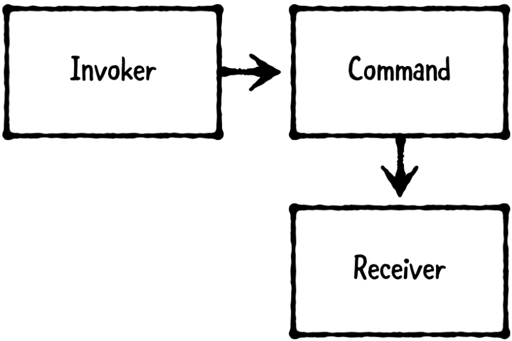

# Chapter 21: Command Pattern

------

## 大綱

- [When should you use it?](#1)
- [Playground example](#2)
- [What should you be careful about?](#3)
- [Tutorial project](#4)
- [Key points](#5)

------

<h2 id="1">When should you use it?</h2>

- The command pattern is a behavioral pattern that **encapsulates information to perform an action into a command** object.
  - **The invoker**: stores and executes commands.
  - **The command**: encapsulates the action as an object.
  - **The receiver**: is the object that’s acted upon by the command.



- **When should you use it?**
  - Use this pattern whenever you want to create actions that can be executed on receivers at a later point in time
  - 在有些场景下，任务的处理可能不是需要立即执行

------

<h2 id="2">Playground example</h2>

- 目標: a simple guessing game
  - a Doorman will open and close a Door a random number of times, and you’ll guess in advance whether the door will be open or closed in the end

```Swift
// 進行猜測
public let isOpen = true
print("You predict the door will be " +
  "\(isOpen ? "open" : "closed").")
print("")

// 透過Doorman對Door執行命令
let door = Door()
let doorman = Doorman(door: door)
doorman.execute()
print("")

// 判斷猜測結果
if door.isOpen == isOpen {
  print("You were right! :]")
} else {
  print("You were wrong :[")
}
print("The door is \(door.isOpen ? "open" : "closed").")

```

- Step1: 建立Receiver

```Swift
// MARK: - Receiver
// It will be opened and closed by setting its isOpen property
public class Door {
  public var isOpen = false
}
```

- Step2: 建立Command

```Swift
// MARK: - Command
// Define a class called DoorCommand, which acts at the command. This class is intended to be an abstract base class
public class DoorCommand {
  public let door: Door
  public init(_ door: Door) {
    self.door = door
  }
  public func execute() { }
}

public class OpenCommand: DoorCommand {
  public override func execute() {
    print("opening the door...")
    door.isOpen = true
  }
}

public class CloseCommand: DoorCommand {
  public override func execute() {
    print("closing the door...")
    door.isOpen = false
  }
}
```

- Step3: 建立Invoker

```Swift
// MARK: - Invoker
public class Doorman {
  // define two properties on Doorman: commands and door
  public let commands: [DoorCommand]
  public let door: Door
  
  public init(door: Door) {
    // set commands by iterating from 0 to commandCount and returning either an OpenCommand or CloseCommand based on whether or not the index is even
    let commandCount = arc4random_uniform(10) + 1
    self.commands = (0 ..< commandCount).map { index in
      return index % 2 == 0 ?
        OpenCommand(door) : CloseCommand(door)
    }
    self.door = door
  }
  
  public func execute() {
    print("Doorman is...")
    commands.forEach { $0.execute() }
  }
}
```

------

<h2 id="3">What should you be careful about?</h2>

- The command pattern can result in many command objects. Consequently, this can lead to code that’s harder to read and maintain. 
  - 需要针对每一个命令创建一个命令对象。如果系统中的命令过多，会造成系统中存在大量的命令类，提高系统的复杂度。
- If you don’t need to perform actions later, you may be better off simply calling the receiver’s methods directly.

------

<h2 id="4">Tutorial project</h2>

- 目標: RayWenToe
  - “Like TicTacToe, players place Xs and Os on a 3x3 gameboard. The first player is X, and the second player is O.
  - Unlike TicTacToe, each player secretly makes five selections at the beginning of the game, which may not be changed. Players then alternate placing Xs and Os on the gameboard in their preselected order.

------

<h2 id="5">Key points</h2>

- The command pattern encapsulates information to perform an action into a command object. It involves three types: an invoker, command and receiver.
- The **invoker** stores and executes commands; the **command** encapsulates an action as an object; and the **receiver** is the object that's acted upon.
- This pattern works best for **actions that need to be stored and executed later**. If you always intend to execute actions immediately, consider calling the methods directly on the receiver instead.