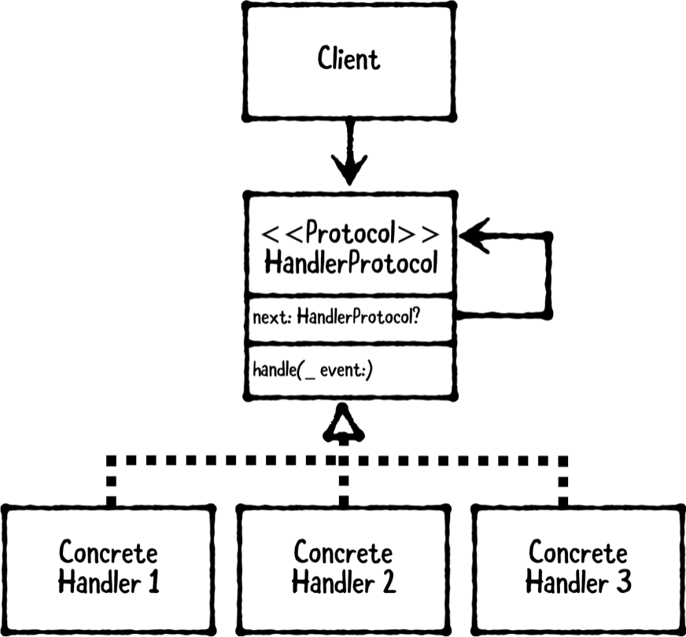

# Chapter 22: Chain of Responsibility

------

## 大綱

- [When should you use it?](#1)
- [Playground example](#2)
- [What should you be careful about?](#3)
- [Tutorial project](#4)
- [Key points](#5)

------

<h2 id="1">When should you use it?</h2>

- The chain-of-responsibility pattern is a behavioral design pattern that allows an event to be processed by one of many handlers.

- **The client** : accepts and passes events to an instance of a handler protocol. 

  - **Events** :  may be simple, property-only structs or complex objects, such as intricate user actions.

- **The handler protocol** :  defines required properties and methods that concrete handlers must implemen.

- **The first concrete handler** : implements the handler protocol, and **it’s stored directly by the client**. Upon receiving an event, it first attempts to handle it. If it’s not able to do so, **it passes the event on to its next handler**.

  - 将这些处理者组成责任链，在当前处理者无法处理或不符合当前条件时，将请求传递给下一个处理者.

  

  - **When should you use it?**
    - Use this pattern whenever you have a group of related objects that handle similar events but vary based on event type, attributes or anything else related to the event.

------

<h2 id="2">Playground example</h2>

- 目標 : 構建一個硬幣製造機

```Swift
// MARK: - Example
// 1. 先構建不同的hadler
let pennyHandler = CoinHandler(coinType: Penny.self)
let nickleHandler = CoinHandler(coinType: Nickel.self)
let dimeHandler = CoinHandler(coinType: Dime.self)
let quarterHandler = CoinHandler(coinType: Quarter.self)
// 2. 將不同的handler給chain起來
pennyHandler.next = nickleHandler
nickleHandler.next = dimeHandler
dimeHandler.next = quarterHandler
// 3. 構建client, 並指定first handler
let vendingMachine = VendingMachine(coinHandler: pennyHandler)

// 4. 製造penny
let penny = Penny()
vendingMachine.insertCoin(penny)
/*
Attempt to create Penny
Created Penny {diameter: 0.750,
  dollarValue: $0.01, weight: 2.500}
Accepted Coin: Penny {diameter: 0.750,
  dollarValue: $0.01, weight: 2.500}
Coins Total Value: $0.01
Coins Total Weight: 2.5 g
*/

// 5. 製造quarter
let quarter = Coin(diameter: Quarter.standardDiameter,
                   weight: Quarter.standardWeight)
vendingMachine.insertCoin(quarter)
/*
Attempt to create Penny
Invalid diameter
Attempt to create Nickel
Invalid diameter
Attempt to create Dime
Invalid diameter
Attempt to create Quarter
Created Quarter {diameter: 0.955,
  dollarValue: $0.25, weight: 5.670}
Accepted Coin: Quarter {diameter: 0.955,
  dollarValue: $0.25, weight: 5.670}
Coins Total Value: $0.26
Coins Total Weight: 8.17 g
*/

// 6. 製造無效的硬幣
let invalidDime = Coin(diameter: Quarter.standardDiameter,
                       weight: Dime.standardWeight)
vendingMachine.insertCoin(invalidDime)
/*
Attempt to create Penny
Invalid diameter
Attempt to create Nickel
Invalid diameter
Attempt to create Dime
Invalid diameter
Attempt to create Quarter
Invalid weight
Coin rejected: Coin {diameter: 0.955,
  dollarValue: $0.00, weight: 2.268}
*/

```

- Step1: 先構建所需要的model

```Swift
// Models
// 1. superClass
public class Coin {
  
  // 2. class properties
  public class var standardDiameter: Double {
    return 0
  }
  public class var standardWeight: Double {
    return 0
  }
  
  // 3. computed properties
  public var centValue: Int { return 0 }
  public final var dollarValue: Double { return Double(centValue) / 100 }
  
  // 4. stored properties
  public final let diameter: Double
  public final let weight: Double
  
  // 5. designated initializer
  public required init(diameter: Double, weight: Double) {
    self.diameter = diameter
    self.weight = weight
  }
  
  // 6. convenience initializer
  public convenience init() {
    let diameter = type(of: self).standardDiameter
    let weight = type(of: self).standardWeight
    self.init(diameter: diameter, weight: weight)
  }
}

// 7. 擴增description功能
extension Coin: CustomStringConvertible {
  public var description: String {
    return String(format:
      "%@ {diameter: %0.3f, dollarValue: $%0.2f, weight: %0.3f}",
                  "\(type(of: self))", diameter, dollarValue, weight)
  }
}

// 8. subclass Penny
public class Penny: Coin {
  
  public override class var standardDiameter: Double {
    return 0.75
  }
  public override class var standardWeight: Double {
    return 2.5
  }
  public override var centValue: Int { return 1 }
}

// 9. subclass Nickel
public class Nickel: Coin {
  
  public override class var standardDiameter: Double {
    return 0.835
  }
  public override class var standardWeight: Double {
    return 5.0
  }
  public override  var centValue: Int { return 5 }
}

// 10. subclass Dime
public class Dime: Coin {
  public override class var standardDiameter: Double {
    return 0.705
  }
  public override class var standardWeight: Double {
    return 2.268
  }
  public override  var centValue: Int { return 10 }
}

// 11. subclass Quarter
public class Quarter: Coin {
  
  public override class var standardDiameter: Double {
    return 0.955
  }
  public override class var standardWeight: Double {
    return 5.670
  }
  public override  var centValue: Int { return 25 }
}

```

- Step2: 建立handler protocol

```Swift
// MARK: - HandlerProtocol

public protocol CoinHandlerProtocol {
  var next: CoinHandlerProtocol? { get }
  func handleCoinValidation(_ unknownCoin: Coin) -> Coin?
}
```

- Step3: 建立handler class

```swift
// MARK: - Concrete Handler
public class CoinHandler {
  // 1. next用來chain下個handler
  public var next: CoinHandlerProtocol?
  // 2. coinType will be the specific Coin this instance will create.
  public let coinType: Coin.Type
  // 3. diameterRange and weightRange will be the valid range for this specific coin
  public let diameterRange: ClosedRange<Double>
  public let weightRange: ClosedRange<Double>
  
  // 4. designated initializer
  public init(coinType: Coin.Type,
              diameterVariation: Double = 0.01,
              weightVariation: Double = 0.05) {
    self.coinType = coinType
    
    let standardDiameter = coinType.standardDiameter
    self.diameterRange =
      (1-diameterVariation)*standardDiameter ...
      (1+diameterVariation)*standardDiameter
    
    let standardWeight = coinType.standardWeight
    self.weightRange =
      (1-weightVariation)*standardWeight ...
      (1+weightVariation)*standardWeight
  }
}
```

- Step4: 實作CoinHandlerProtocol

```swift
extension CoinHandler: CoinHandlerProtocol {
  
  // 1. first attempt to create a Coin via createCoin(from:) that is defined after this method.
  public func handleCoinValidation(_ unknownCoin: Coin) ->
    Coin? {
      guard let coin = createCoin(from: unknownCoin) else {
        // 2. If you can’t create a Coin, you give the next handler a chance to attempt to create one
        return next?.handleCoinValidation(unknownCoin)
      }
      return coin
  }
  
  // unknownCoin actually meets the requirements to create the specific coin given by coinType. Namely, the unknownCoin must have a diameter that falls within the diameterRange and weightRange.
  private func createCoin(from unknownCoin: Coin) -> Coin? {
    print("Attempt to create \(coinType)")
    guard diameterRange.contains(unknownCoin.diameter) else {
      print("Invalid diameter")
      return nil
    }
    guard weightRange.contains(unknownCoin.weight) else {
      print("Invalid weight")
      return nil
    }
    let coin = coinType.init(diameter: unknownCoin.diameter,
                             weight: unknownCoin.weight)
    print("Created \(coin)")
    return coin
  }
}
```

- Step5: 建立Client

```swift
// MARK: - Client
public class VendingMachine {
  
  // 1. VendingMachine doesn’t need to know that its coinHandler is actually a chain of handlers, but instead it simply treats this as a single object. You’ll use coins to hold onto all of the valid, accepted coins.
  public let coinHandler: CoinHandler
  public var coins: [Coin] = []
  
  // 2. Accept a passed-in coinHandler instance. VendingMachine doesn’t need to how a CoinHandler is set up, as it simply uses it.
  public init(coinHandler: CoinHandler) {
    self.coinHandler = coinHandler
  }
  
  public func insertCoin(_ unknownCoin: Coin) {
    // 3. first attempt to create a Coin by passing an unknownCoin to coinHandler. If a valid coin isn’t created, you print out a message indicating that the coin was rejected.
    guard let coin = coinHandler.handleCoinValidation(unknownCoin)
      else {
        print("Coin rejected: \(unknownCoin)")
        return
    }
    print("Coin Accepted: \(coin)")
    coins.append(coin)
    
    // 4. get the dollarValue for all of the coins and print this
    let dollarValue = coins.reduce(0, { $0 + $1.dollarValue })
    print("Coins Total Value: $\(dollarValue)")
    
    // 5. get the weight for all of the coins and print this
    let weight = coins.reduce(0, { $0 + $1.weight })
    print("Coins Total Weight: \(weight) g")
    print("")
  }
}
```


------

<h2 id="3">What should you be careful about?</h2>

- The chain-of-responsibility pattern works best for handlers that **can determine very quickly whether or not to handle an event.**
  -  Be careful about **creating one or more handlers that are slow to pass an event to the next handler.** 
  - 因为需要在责任链上传递责任，直到找到合适的对象来处理，所以可能会导致处理的延迟。因此在延迟不允许过高的场景下不适合使用责任链模式。
  - What happens if an event can’t be handled. What if you return nil, throw an error or something else? You should identify this upfront, so you can plan your system appropriately.
  - Consider whether or not **an event needs to be processed by more than one handler**. As a variation on this pattern, you can forward the same event to all handlers, instead of stopping at the first one that can handle it, and return an array of response objects.

------

<h2 id="4">Tutorial project</h2>

- 目標: RWSecret App

  - Task will be to set up a handler chain to perform decryption.

  

------

<h2 id="5">Key points</h2>

- **The chain-of-responsibility pattern** allows an event to be processed by one of many handlers. It involves three types: **a client, handler protocol, and concrete handlers**.
  - The **client** accepts events and passes them onto its **handler protocol** instance;
  - the handler protocol defines required methods and properties each concrete handler much implement
  - each concrete handler can accept an event and in turn either handle it or pass it onto the next handler.
- This pattern thereby defines a group of related handlers, which vary based on the type of event each can handle. If you need to handle new types of events, you simply create a new concrete handler.