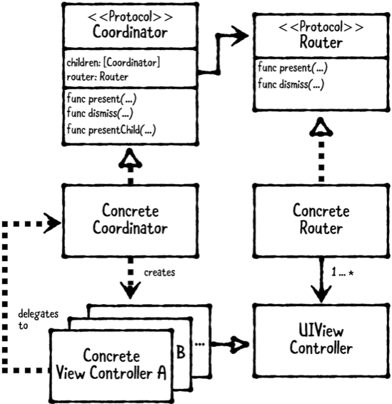

# Chapter 23: Coordinator Pattern

------

## 大綱

- [When should you use it?](#1)
- [Playground example](#2)
  - Creating the Router Protocol
  - Creating the Concrete Router
  - Creating the Coordinator
  - Creating the Concrete Coordinator
- [What should you be careful about?](#3)
- [Tutorial project](#4)
- [Key points](#5)

------

<h2 id="1">When should you use it?</h2>

- The coordinator pattern is a structural design pattern for organizing flow logic between view controllers.

  - **The coordinator**:  a protocol that defines the methods and properties all concrete coordinators must implement.
  - **The concrete coordinator**: implements the coordinator protocol.
  - **The router**: a protocol that defines methods all concrete routers must implement
  - **The concrete router**: knows how to present view controllers, but it doesn’t know exactly what is being presented or which view controller will be presented next. 
  - **The concrete view controllers**: typical UIViewController subclasses found in MVC. However, they don’t know about other view controllers.

  

- **When should you use it?**

  - Use this pattern to decouple view controllers from one another. The only component that knows about view controllers directly is the coordinator. 


------

<h2 id="2">Playground example</h2>

- 目標: 

```Swift
// 建立起始畫面
let homeViewController = HomeViewController.instantiate()
let navigationController = UINavigationController(rootViewController: homeViewController)

// 利用起始畫面建立router
let router = NavigationRouter(navigationController: navigationController)
// 利用router建立coordinator
let coordinator = HowToCodeCoordinator(router: router)

// homeViewController告訴coordinator說button已被觸發，由coordinator來進行UI的流程轉換
homeViewController.onButtonPressed = { [weak coordinator] in
  coordinator?.present(animated: true, onDismissed: nil)
}

// 讓playground設立起始畫面
PlaygroundPage.current.liveView = navigationController
```

- **Creating the Router Protocol**

```swift
public protocol Router: class {
  // 1. define two present methods. The only difference is one takes an onDismissed closure, and the other doesn’t.
  func present(_ viewController: UIViewController, animated: Bool)
  func present(_ viewController: UIViewController,
               animated: Bool,
               onDismissed: (()->Void)?)
  // 2. declare dismiss(animated:). This will dismiss the entire router.
  func dismiss(animated: Bool)
}

extension Router {
  // 3. define a default implementation for present(_:animated:)
  public func present(_ viewController: UIViewController,
                      animated: Bool) {
    present(viewController, animated: animated, onDismissed: nil)
  }
}
```

- **Creating the Concrete Router**

```swift
// 1. declare NavigationRouter as a subclass of NSObject
public class NavigationRouter: NSObject {
  
  // used to push and pop view controllers.
  private let navigationController: UINavigationController
  // set to the last view controller on the navigationController
  private let routerRootController: UIViewController?
  // a mapping from UIViewController to on-dismiss closures.
  private var onDismissForViewController:
    [UIViewController: (() -> Void)] = [:]
  
  // 2. create an initializer that takes a navigationController
  public init(navigationController: UINavigationController) {
    self.navigationController = navigationController
    self.routerRootController = navigationController.viewControllers.first
    super.init()
    navigationController.delegate = self
  }
}

// MARK: - Router
extension NavigationRouter: Router {
  
  // 3. set the onDismissed closure for the given viewController and then push the view controller onto the navigationController to show it.
  public func present(_ viewController: UIViewController,
                      animated: Bool,
                      onDismissed: (() -> Void)?) {
    onDismissForViewController[viewController] = onDismissed
    navigationController.pushViewController(viewController,
                                            animated: animated)
  }
  
  // you verify that routerRootController is set. If not, you simply call popToRootViewController(animated:) on the navigationController.
  public func dismiss(animated: Bool) {
    guard let routerRootController = routerRootController else {
      navigationController.popToRootViewController(animated: animated)
      return
    }
    // Otherwise, you call performOnDismissed(for:) to perform the on-dismiss action and then pass the routerRootController into popToViewController(_:animated:) on the navigationController.
    performOnDismissed(for: routerRootController)
    navigationController.popToViewController(routerRootController,
                                             animated: animated)
  }
  
  // you guard that there’s an onDismiss for the given viewController. If not, you simply return early. Otherwise, you call onDismiss and remove it from onDismissForViewController.
  private func performOnDismissed(for viewController: UIViewController) {
    guard let onDismiss = onDismissForViewController[viewController]
      else {
        return
    }
    onDismiss()
    onDismissForViewController[viewController] = nil
  }
}

// MARK: - UINavigationControllerDelegate
extension NavigationRouter: UINavigationControllerDelegate {
  
  public func navigationController(_ navigationController: UINavigationController,
                                   didShow viewController: UIViewController,
                                   animated: Bool) {
    
    // you get the from view controller from the navigationController.transitionCoordinator and verify it’s not contained within navigationController.viewControllers.
    guard let dismissedViewController = navigationController.transitionCoordinator?.viewController(forKey: .from),
      !navigationController.viewControllers.contains(dismissedViewController) else { return }
    
    // This indicates that the view controller was popped, and in response, you call performOnDismissed to do the on-dismiss action for the given view controller.
    performOnDismissed(for: dismissedViewController)
  }
}
```

- **Creating the Coordinator**

```swift
public protocol Coordinator: class {
  
  // use these properties to provide default implementations within an extension on Coordinator next.
  var children: [Coordinator] { get set }
  var router: Router { get }
  
  // declare required methods for present, dismiss and presentChild.
  func present(animated: Bool, onDismissed: (() -> Void)?)
  func dismiss(animated: Bool)
  func presentChild(_ child: Coordinator,
                    animated: Bool,
                    onDismissed: (() -> Void)?)
}

extension Coordinator {
  
  // dismiss a coordinator, you simply call dismiss on its router
  public func dismiss(animated: Bool) {
    router.dismiss(animated: true)
  }
  
  // presentChild, you simply append the given child to children, and then call child.present
  public func presentChild(_ child: Coordinator,
                           animated: Bool,
                           onDismissed: (() -> Void)? = nil) {
    children.append(child)
    child.present(animated: animated, onDismissed: { [weak self, weak child] in
      guard let self = self, let child = child else { return }
      self.removeChild(child)
      onDismissed?()
    })
  }
  
  private func removeChild(_ child: Coordinator) {
    guard let index = children.firstIndex(where:  { $0 === child })
      else {
        return
    }
    children.remove(at: index)
  }
}
```

- **Creating the Concrete Coordinator**

```swift
public class HowToCodeCoordinator: Coordinator {
  
  // MARK: - Instance Properties
  // declare properties for children and router, which are required to conform to Coordinator and Router respectively.
  public var children: [Coordinator] = []
  public let router: Router
  
  private lazy var stepViewControllers = [
    StepViewController.instantiate(
      delegate: self,
      buttonColor: UIColor(red: 0.96, green: 0, blue: 0.11, alpha: 1),
      text: "When I wake up, well, I'm sure I'm gonna be\n\n" +
      "I'm gonna be the one writin' code for you",
      title: "I wake up"),
    
    StepViewController.instantiate(
      delegate: self,
      buttonColor: UIColor(red: 0.93, green: 0.51, blue: 0.07, alpha: 1),
      text: "When I go out, well, I'm sure I'm gonna be\n\n" +
      "I'm gonna be the one thinkin' bout code for you",
      title: "I go out"),
    
    StepViewController.instantiate(
      delegate: self,
      buttonColor: UIColor(red: 0.23, green: 0.72, blue: 0.11, alpha: 1.0),
      text: "Cause' I would code five hundred lines\n\n" +
      "And I would code five hundred more",
      title: "500 lines"),
    
    StepViewController.instantiate(
      delegate: self,
      buttonColor: UIColor(red: 0.18, green: 0.29, blue: 0.80, alpha: 1.0),
      text: "To be the one that wrote a thousand lines\n\n" +
      "To get this code shipped out the door!",
      title: "Ship it!")
  ]
  
  // This will be the last view controller displayed and will simply show a button to “start over.
  private lazy var startOverViewController =
    StartOverViewController.instantiate(delegate: self)
  
  // MARK: - Object Lifecycle
  // a designated initializer
  public init(router: Router) {
    self.router = router
  }
  
  // MARK: - Coordinator
  public func present(animated: Bool, onDismissed: (() -> Void)?) {
    let viewController = stepViewControllers.first!
    router.present(viewController, animated: animated, onDismissed: onDismissed)
  }
}

// MARK: - StepViewControllerDelegate
extension HowToCodeCoordinator: StepViewControllerDelegate {
  
  public func stepViewControllerDidPressNext(_ controller: StepViewController) {
    if let viewController = stepViewController(after: controller) {
      router.present(viewController, animated: true)
    } else {
      router.present(startOverViewController, animated: true)
    }
  }
  
  private func stepViewController(after controller: StepViewController) -> StepViewController? {
    guard let index = stepViewControllers.firstIndex(where: { $0 === controller }),
      index < stepViewControllers.count - 1 else { return nil }
    return stepViewControllers[index + 1]
  }
}

// MARK: - StartOverViewControllerDelegate
extension HowToCodeCoordinator: StartOverViewControllerDelegate {
  
  public func startOverViewControllerDidPressStartOver(_ controller: StartOverViewController) {
    router.dismiss(animated: true)
  }
}
```


------

<h2 id="3">What should you be careful about?</h2>

- [IOS架构之--使用Coordinator提高VC/ViewModel复用性](https://www.jianshu.com/p/e8fc65bcf1c8)
- [http://khanlou.com/2015/01/the-coordinator/](http://khanlou.com/2015/01/the-coordinator/)

- Make sure you handle going-back functionality when using this pattern.
- Make sure you provide any required teardown code passed into onDismiss on the coordinator’s present(animated: onDismiss:).
  For very simple apps, the Coordinator pattern may seem like overkill. You’ll be required to create many additional classes upfront; namely, the concrete coordinator and routers. 
- For long-term or complex apps, the coordinator pattern can help you provide needed structure and increase view controllers’ reusability.

------

<h2 id="4">Tutorial project</h2>


------

<h2 id="5">Key points</h2>

- The coordinator pattern organizes flow logic between view controllers. It involves a coordinator protocol, concrete coordinator, router protocol, concrete router and view controllers.
- **The coordinator** defines methods and properties all concrete coordinators must implement.
- **The concrete coordinators** know how to create concrete view controllers and their order.
- **The router** defines methods all concrete routers must implement.
- **The concrete routers** know how to present view controllers.
- **The concrete view controllers** are typical view controllers, but they don’t know about other view controllers.
- This pattern can be adopted for only part of an app or used across an entire application.