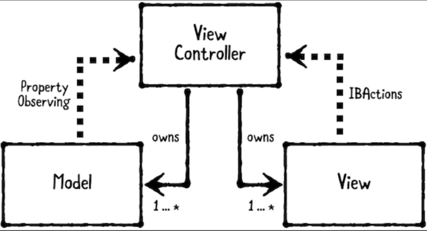

# Chapter 3: Model-View-Controller Pattern

------

## 大綱

- [When should you use it?](#1)
- [Playground example](#2)
- [What should you be careful about?](#3)
- [Tutorial project](#4)
- [Key points](#5)

------

<h2 id="1">When should you use it?</h2>

- **The model-view-controller (MVC**) pattern separates objects into three distinct types. 

  - MVC is very common in iOS programming, because it's the design pattern that Apple chose to adopt in UIKit
  - **Models** hold application data. They are usually structs or simple classes.
  - **Views** display visual elements and controls on screen. They are usually subclasses of UIView.
  - **Controllers** coordinate between models and views. They are usually subclasses of UIViewController.

  

------

<h2 id="2">Playground example</h2>

------

<h2 id="3">What should you be careful about?</h2>

- use MVC tend to have a lot of logic in the controllers. This can result in view controllers getting very big! There's a rather quaint term for when this happens, called **Massive View Controller.**

------

<h2 id="4">Tutorial project</h2>

------

<h2 id="5">Key points</h2>

- MVC separates objects into three categories: models, views and controllers.
- MVC promotes reusing models and views between controllers. Since controller logic is often very specific, MVC doesn't usually reuse controllers.
- The controller is responsible for coordinating between the model and view: it sets model values onto the view, and it handles IBAction calls from the view.
- MVC is a good starting point, but it has limitations. Not every object will neatly fit into the category of model, view or controller. You should use other patterns as needed along with MVC.