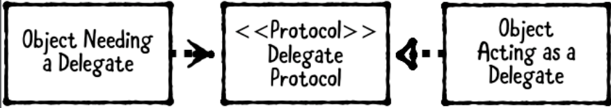

# Chapter 4: Delegation Pattern

------

## 大綱

- [When should you use it?](#1)
- [Playground example](#2)
- [What should you be careful about?](#3)
- [Tutorial project](#4)
- [Key points](#5)

------

<h2 id="1">When should you use it?</h2>

- **The delegation pattern** enables an object to use another “helper” object to provide data or perform a task rather than do the task itself.
  - **An object needing a delegate**, also known as the delegating object. It’s the object that has a delegate. 
    - The delegate is usually **held as a weak property to avoid a retain cycle** where the delegating object retains the delegate, which retains the delegating object.
- **A delegate protocol**, which defines the methods a delegate may or should implement.
- **A delegate**, which is the helper object that implements the delegate protocol.



- **When should you use it?**
  - Use this pattern to break up large classes or create generic, reusable components.
    - Apple frameworks commonly use the term **DataSource** to group delegate methods that **provide dat**a. For example, UITableViewDataSource is expected to provide UITableViewCells to display.
    - Apple frameworks typically use protocols named **Delegate** to group methods that **receive data or events**. For example, UITableViewDelegate is notified whenever a row is selected

------

<h2 id="2">Playground example</h2>

```swift
// 1. A delegate protocol
public protocol MenuViewControllerDelegate: class {
  func menuViewController(
    _ menuViewController: MenuViewController,
    didSelectItemAtIndex index: Int)
}

// 2. An object needing a delegate
public class MenuViewController: UIViewController {

  // 3. A delegate
  public weak var delegate: MenuViewControllerDelegate?

  @IBOutlet public var tableView: UITableView! {
    didSet {
      tableView.dataSource = self
      tableView.delegate = self
    }
  }
  
  private let items = ["Item 1", "Item 2", "Item 3"]
}

// MARK: - UITableViewDataSource
extension MenuViewController: UITableViewDataSource {
  
  public func tableView(_ tableView: UITableView,
                 cellForRowAt indexPath: IndexPath) -> UITableViewCell {
    let cell = tableView.dequeueReusableCell(withIdentifier: "Cell",
                                             for: indexPath)
    cell.textLabel?.text = items[indexPath.row]
    return cell
  }
  
  public func tableView(_ tableView: UITableView,
                 numberOfRowsInSection section: Int) -> Int {
    return items.count
  }
}

// MARK: - UITableViewDelegate
extension MenuViewController: UITableViewDelegate {
  
  public func tableView(_ tableView: UITableView,
                 didSelectRowAt indexPath: IndexPath) {
    // 4. 將events發送出去
    delegate?.menuViewController(self,
                                 didSelectItemAtIndex:  indexPath.row)
  }
}
```


------

<h2 id="3">What should you be careful about?</h2>

- Be careful about creating too many delegates for an object.
  - If an object needs several delegates, this may be an indicator that it’s doing too much. Consider breaking up the object’s functionality for specific use cases, instead of one catch-all class.
- You should also be **careful about creating retain cycles**. Most often, delegate properties should be weak. 

------

<h2 id="4">Tutorial project</h2>


------

<h2 id="5">Key points</h2>

- The delegation pattern has three parts: an object needing a delegate, a delegate protocol and a delegate.
- This pattern allows you to break up large classes and create generic, reusable components.
- Delegates should be weak properties in the vast majority of use cases.