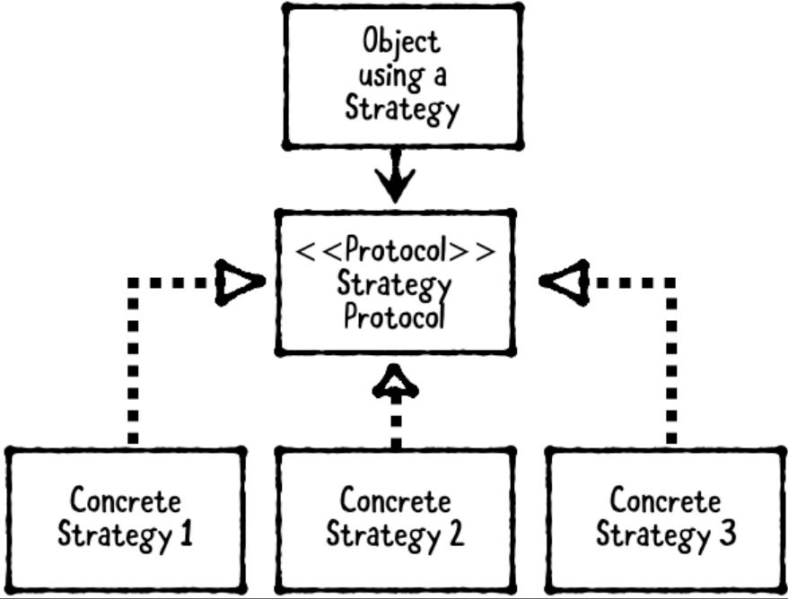

# Chapter 5: Strategy Pattern

------

## 大綱

- [When should you use it?](#1)
- [Playground example](#2)
- [What should you be careful about?](#3)
- [Tutorial project](#4)
- [Key points](#5)

------

<h2 id="1">When should you use it?</h2>

- **The strategy pattern** defines a family of interchangeable objects that can be set or switched at runtime. 
  - **The object** using a strategy. 
    - This is most often a view controller when the pattern is used in iOS app development, but it can technically be any kind of object that needs interchangeable behavior.
  - **The strategy protocol** defines methods that every strategy must implement.
  - **The strategies** are objects that conform to the strategy protocol.



- **When should you use it?**
  - Use the strategy pattern when you have **two or more different behaviors that are interchangeableExcerpt** .


------

<h2 id="2">Playground example</h2>

- 目標: an app that **uses several “movie rating services”** such as Rotten Tomatoes®, IMDb and Metacritic. 
  - Instead of writing code for each of these services directly within a view controller, and likely **having complex if-else statements** therein, you can **use the strategy pattern to simplify things by creating a protocol** that defines a common API for every service.
- The strategy protocol

```swift
public protocol MovieRatingStrategy {
  
  var ratingServiceName: String { get }
  
  func fetchRating(for movieTitle: String,
                   success: (_ rating: String, _ review: String) -> ())
}
```

- The strategies

```swift
public class RottenTomatoesClient: MovieRatingStrategy {
  public let ratingServiceName = "Rotten Tomatoes"
  
  public func fetchRating(
    for movieTitle: String,
    success: (_ rating: String, _ review: String) -> ()) {
    
    // In a real service, you'd make a network request...
    // Here, we just provide dummy values...
    let rating = "95%"
    let review = "It rocked!"
    success(rating, review)
  }
}

public class IMDbClient: MovieRatingStrategy {
  public let ratingServiceName = "IMDb"
  
  public func fetchRating(
    for movieTitle: String,
    success: (_ rating: String, _ review: String) -> ()) {
    
    let rating = "3 / 10"
    let review = """
      It was terrible! The audience was throwing rotten
      tomatoes!
      """
    success(rating, review)
  }
}
```

- The object

```swift
public class MoviewRatingViewController: UIViewController {
  
  // MARK: - Properties
  public var movieRatingClient: MovieRatingStrategy!
  
  // MARK: - Outlets
  @IBOutlet public var movieTitleTextField: UITextField!
  @IBOutlet public var ratingServiceNameLabel: UILabel!
  @IBOutlet public var ratingLabel: UILabel!
  @IBOutlet public var reviewLabel: UILabel!
  
  // MARK: - View Lifecycle
  public override func viewDidLoad() {
    super.viewDidLoad()
    ratingServiceNameLabel.text =
      movieRatingClient.ratingServiceName
  }
  
  // MARK: - Actions
  @IBAction public func searchButtonPressed(sender: Any) {
    guard let movieTitle = movieTitleTextField.text
      else { return }
    // The determination of which MovieRatingStrategy to use can be deferred until runtime, and this could even be selected by the user if your app allowed that.
    movieRatingClient.fetchRating(for: movieTitle) {
      (rating, review) in
      self.ratingLabel.text = rating
      self.reviewLabel.text = review
    }
  }
}
```


------

<h2 id="3">What should you be careful about?</h2>

- Be careful about overusing this pattern. In particular, if a behavior won’t ever change, it’s okay to put this directly within the consuming view controller or object context.
  -  The trick to this pattern is knowing when to pull out behaviors, 

------

<h2 id="4">Tutorial project</h2>


------

<h2 id="5">Key points</h2>

- The strategy pattern defines a family of interchangeable objects that can be set or switched at runtime.
- This pattern has three parts: an object using a strategy, a strategy protocol, and a family of strategy objects.
- The strategy pattern is similar to the delegation pattern: Both patterns use a protocol for flexibility. Unlike the delegation pattern, however, **strategies are meant to be switched at runtime, whereas delegates are usually fixed**.

