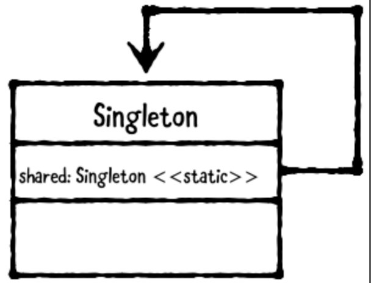

# Chapter 6: Singleton Pattern

------

## 大綱

- [When should you use it?](#1)
- [Playground example](#2)
- [What should you be careful about?](#3)
- [Tutorial project](#4)
- [Key points](#5)

------

<h2 id="1">When should you use it?</h2>

- **The singleton pattern** restricts a class to only one instance. 
  - This pattern is extremely common in iOS app development, as Apple makes extensive use of it.



- **When should you use it?**
  - Use the singleton pattern when having more than one instance of a class would cause problems, or when it just wouldn’t be logical.
  - **Use the singleton plus pattern** if a shared instance is useful most of the time, but you also want to allow custom instances to be created.
    -  An example of this is FileManager, which handles everything to do with filesystem access. There is a “default” instance which is a singleton, or you can create your own. You would usually create your own if you’re using it on a background thread.”

------

<h2 id="2">Playground example</h2>

- Singleton pattern

```Swift
let app = UIApplication.shared

public class MySingleton {
  static let shared = MySingleton()
  private init() { }
}

let mySingleton = MySingleton.shared
```

- Singleton Plus pattern

```swift
// MARK: - Singleton Plus
let defaultFileManager = FileManager.default
let customFileManager = FileManager()

public class MySingletonPlus {
  static let shared = MySingletonPlus()
  public init() { }
}

let singletonPlus = MySingletonPlus.shared
let singletonPlus2 = MySingletonPlus()
```

------

<h2 id="3">What should you be careful about?</h2>

- The singleton pattern is **very easy to overuse**.
- If you encounter a situation where you’re tempted to use a singleton, first consider other ways to accomplish your task.
  - For example, singletons are not appropriate if you’re simply trying to pass information from one view controller to another. Instead, consider passing models via an initializer or property.
- If you determine you actually do need a singleton, consider whether a singleton plus makes more sense.
  - Will having more than one instance cause problems? 
  - Will it ever be useful to have custom instances? 
  - Your answers will determine whether its better for you to use a true singleton or singleton plus.

------

<h2 id="4">Tutorial project</h2>


------

<h2 id="5">Key points</h2>

- The singleton pattern restricts a class to only one instance.
- The singleton plus pattern provides a “default” shared instance but also allows other instances to be created too.
- Be careful about overusing this pattern! Before you create a singleton, consider other ways to solve the problem without it. If a singleton really is best, **prefer to use a singleton plus over a singleton.**

