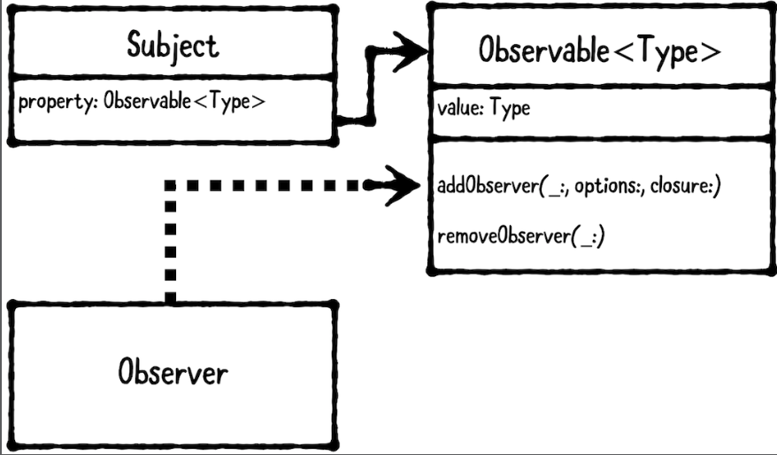

# Chapter 8: Observer Pattern

------

## 大綱

- [When should you use it?](#1)
- [Playground example](#2)
- [What should you be careful about?](#3)
- [Tutorial project](#4)
- [Key points](#5)

------

<h2 id="1">When should you use it?</h2>

- **The observer pattern** lets one object observe changes on another object. 
  - **The subject** is the object that’s being observed.
  - **The observer** is the object doing the observing.



- **When should you use it?**
  - Use the observer pattern whenever you want to receive changes made on another object.
    - This pattern is often used with MVC, where the view controller is the observer and the model is the subject. 

------

<h2 id="2">Playground example</h2>

- 目標：透過兩種不同方式建立observer pattern
  - Using key value observation (KVO)
  - Using an Observable wrapper
- Using key value observation (KVO)

```swift
// MARK: - KVO
@objcMembers public class KVOUser: NSObject {
  
  dynamic var name: String
  
  public init(name: String) {
    self.name = name
  }
}

print("-- KVO Example -- ")
let kvoUser = KVOUser(name: "Ray")
var kvoObserver: NSKeyValueObservation? =
  kvoUser.observe(\.name, options: [.initial, .new]) {
    (user, change) in
    
    print("User's name is \(user.name)")
}

kvoUser.name = "Rockin' Ray"
kvoObserver = nil // 移除kvoObserver
kvoUser.name = "Ray has left the building"  // 這個變化不會被觀察到, 因為已經將kvoObserver移除

// -- KVO Example -- 
// User's name is Ray
// User's name is Rockin' Ray
```

- Using an Observable wrapper

```swift
// MARK: - Observable Example
public class User {
  public let name: Observable<String>
  public init(name: String) {
    self.name = Observable(name)
  }
}

public class Observer { }

print("")
print("-- Observable Example--")

let user = User(name: "Madeline")

var observer: Observer? = Observer()
user.name.addObserver(observer!,
                      options: [.initial, .new]) {
                        name, change in
                        print("User's name is \(name)")
}

user.name.value = "Amelia"

observer = nil
user.name.value = "Amelia is outta here!" // 這個變化不會被觀察到, 因為已經將kvoObserver移除

// -- Observable Example--
// User's name is Madeline
// User's name is Amelia
```

- Observable wrapper實作

```Swift
// 1. a new generic class called Observable<Type>
public class Observable<Type> {
  
  // MARK: - Callback
  // 2. an embedded, fileprivate class called Callback. You’ll use this to associate the observer, options and closure.
  fileprivate class Callback {
    // 3. observer is a weak property, so it’s required to be a class. Therefore, you denote it as AnyObject
    fileprivate weak var observer: AnyObject?
    fileprivate let options: [ObservableOptions]
    fileprivate let closure: (Type, ObservableOptions) -> Void
    
    fileprivate init(
      observer: AnyObject,
      options: [ObservableOptions],
      closure: @escaping (Type, ObservableOptions) -> Void) {
      self.observer = observer
      self.options = options
      self.closure = closure
    }
  }
  
  // MARK: - Properties
  public var value: Type {
    // add a didSet property observer, which is called whenever value has been changed.
    didSet {
      removeNilObserverCallbacks()
      notifyCallbacks(value: oldValue, option: .old)
      notifyCallbacks(value: value, option: .new)
    }
  }
  
  private func removeNilObserverCallbacks() {
    callbacks = callbacks.filter { $0.observer != nil }
  }
  
  private func notifyCallbacks(value: Type,
                               option: ObservableOptions) {
    let callbacksToNotify = callbacks.filter {
      $0.options.contains(option)
    }
    callbacksToNotify.forEach { $0.closure(value, option) }
  }
  
  // MARK: - Object Lifecycle
  public init(_ value: Type) {
    self.value = value
  }
  
  // MARK: - Managing Observers
  private var callbacks: [Callback] = []
  
  // register an observer for the given options and closure.
  public func addObserver(
    _ observer: AnyObject,
    removeIfExists: Bool = true,
    options: [ObservableOptions] = [.new],
    closure: @escaping (Type, ObservableOptions) -> Void) {
    
    if removeIfExists {
      removeObserver(observer)
    }
    
    let callback = Callback(observer: observer,
                            options: options,
                            closure: closure)
    callbacks.append(callback)
    if options.contains(.initial) {
      closure(value, .initial)
    }
  }
  
  // unregister an observer and remove all related closures.
  public func removeObserver(_ observer: AnyObject) {
    callbacks = callbacks.filter { $0.observer !== observer }
  }
}

// MARK: - ObservableOptions
// ObservableOptions as an OptionSet, which is very similar to NSKeyValueObservingOptions from KVO
public struct ObservableOptions: OptionSet {
  
  public static let initial =
    ObservableOptions(rawValue: 1 << 0)
  public static let old = ObservableOptions(rawValue: 1 << 1)
  public static let new = ObservableOptions(rawValue: 1 << 2)
  
  public var rawValue: Int
  
  public init(rawValue: Int) {
    self.rawValue = rawValue
  }
}
```

------

<h2 id="3">What should you be careful about?</h2>

- Before you implement the observer pattern, define what you expect to change and under which conditions. 
  - If you can’t identify a reason for an object or property to change, you’re likely better off not implementing KVO/Observable immediately for it.

------

<h2 id="4">Tutorial project</h2>


------

<h2 id="5">Key points</h2>

- The observer pattern lets one object observe changes on another object. It involves two types: the subject and observer.
- The subject is the object that’s being observed, and the observer is doing the observing.
- One way to implement the observer pattern is **using KVO**. However, this requires you to **subclass NSObject**, which isn't always desirable.
- Another way to implement the observer pattern is using **an Observable wrapper class**. This isn’t provided by Swift, so you must write your own. However, **it doesn’t require you to depend on NSObject, Foundation or any other frameworks.**