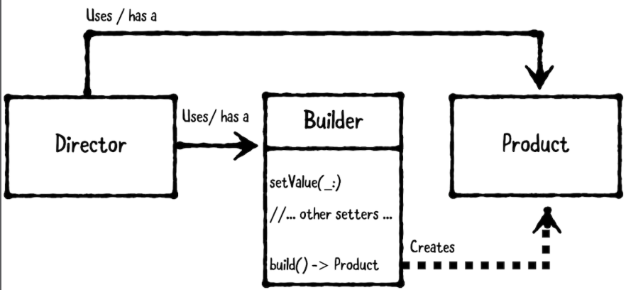

# Chapter 9: Builder Pattern

------

## 大綱

- [When should you use it?](#1)
- [Playground example](#2)
- [What should you be careful about?](#3)
- [Tutorial project](#4)
- [Key points](#5)

------

<h2 id="1">When should you use it?</h2>

- **The builder pattern** allows you to create complex objects by providing inputs step-by-step, instead of requiring all inputs upfront via an initializer. This pattern involves three main types:
  - **The director**: accepts inputs and coordinates with the builder. This is usually a view controller or a helper class that’s used by a view controller.
  - **The product**: is the complex object to be created. 
    - This can be either a struct or a class, depending on desired reference semantics. It’s usually a model, but it can be any type depending on your use case.
  - **The builder**: accepts step-by-step inputs and handles the creation of the product.
    -  This is often a class, so it can be reused by reference.”



- **When should you use it?**
  - Use the builder pattern when you want to create a complex object **using a series of steps**.
    This pattern works especially well when a product requires **multiple inputs**. 

------

<h2 id="2">Playground example</h2>

- 目標: **hamburger builder** 
  - The product could be a hamburger model, which has inputs such as meat selection, toppings and sauces. 
  - The director could be an employee object, which knows how to build hamburgers, or it could be a view controller that accepts inputs from the user.

```swift
// MARK: - Example
let burgerFlipper = Employee()

if let combo1 = try? burgerFlipper.createCombo1() {
  print("Nom nom " + combo1.description)
}
// Nom nom beef burger

if let kittenBurger = try?
  burgerFlipper.createKittenSpecial() {
  print("Nom nom nom " + kittenBurger.description)
} else {
  print("Sorry, no kitten burgers here... :[")
}
// request a kitten-special burger. Since kitten is sold out, you’ll see this printed to the console:
// Sorry, no kitten burgers here... :[
```

- Product

```swift
// MARK: - Product
public struct Hamburger {
  // Once a hamburger is made, you aren’t allowed to change its components, which you codify via let properties
  public let meat: Meat
  public let sauce: Sauces
  public let toppings: Toppings
}

extension Hamburger: CustomStringConvertible {
  public var description: String {
    return meat.rawValue + " burger"
  }
}

// Each hamburger must have exactly one meat selection
public enum Meat: String {
  case beef
  case chicken
  case kitten
  case tofu
}

// This will allow you to combine multiple sauces together
public struct Sauces: OptionSet {
  public static let mayonnaise = Sauces(rawValue: 1 << 0)
  public static let mustard = Sauces(rawValue: 1 << 1)
  public static let ketchup = Sauces(rawValue: 1 << 2)
  public static let secret = Sauces(rawValue: 1 << 3)
  
  public let rawValue: Int
  public init(rawValue: Int) {
    self.rawValue = rawValue
  }
}

// This will allow you to combine multiple Toppings together
public struct Toppings: OptionSet {
  public static let cheese = Toppings(rawValue: 1 << 0)
  public static let lettuce = Toppings(rawValue: 1 << 1)
  public static let pickles = Toppings(rawValue: 1 << 2)
  public static let tomatoes = Toppings(rawValue: 1 << 3)
  
  public let rawValue: Int
  public init(rawValue: Int) {
    self.rawValue = rawValue
  }
}
```

- Builder

```swift
public class HamburgerBuilder {
  
  public enum Error: Swift.Error {
    case soldOut
  }
  
  // Unlike a Hamburger, you declare these using var to be able to change them. You also specify private(set) for each to ensure only HamburgerBuilder can set them directly.
  public private(set) var meat: Meat = .beef
  public private(set) var sauces: Sauces = []
  public private(set) var toppings: Toppings = []
  
  private var soldOutMeats: [Meat] = [.kitten]
  
  // Since you declared each property using private(set), you need to provide public methods to change them.
  public func addSauces(_ sauce: Sauces) {
    sauces.insert(sauce)
  }
  
  public func removeSauces(_ sauce: Sauces) {
    sauces.remove(sauce)
  }
  
  public func addToppings(_ topping: Toppings) {
    toppings.insert(topping)
  }
  
  public func removeToppings(_ topping: Toppings) {
    toppings.remove(topping)
  }
  
  // If a meat is sold out, you’ll throw an error whenever setMeat(_:) is called.
  public func setMeat(_ meat: Meat) throws {
    guard isAvailable(meat) else { throw Error.soldOut }
    self.meat = meat
  }
  
  public func isAvailable(_ meat: Meat) -> Bool {
    return !soldOutMeats.contains(meat)
  }
  
  // build() to create the Hamburger from the selections.
  public func build() -> Hamburger {
    return Hamburger(meat: meat,
                     sauce: sauces,
                     toppings: toppings)
  }
}
```

- Director

```Swift
public class Employee {
  
  public func createCombo1() throws -> Hamburger {
    let builder = HamburgerBuilder()
    // build流程
    try builder.setMeat(.beef)
    builder.addSauces(.secret)
    builder.addToppings([.lettuce, .tomatoes, .pickles])
    return builder.build()
  }
  
  public func createKittenSpecial() throws -> Hamburger {
    let builder = HamburgerBuilder()
    // build流程
    try builder.setMeat(.kitten)
    builder.addSauces(.mustard)
    builder.addToppings([.lettuce, .tomatoes])
    return builder.build()
  }
}

```

------

<h2 id="3">What should you be careful about?</h2>

- The builder pattern works best for creating complex products that **require multiple inputs using a series of steps**. 
  - If your product doesn’t have several inputs or can’t be created step by step, the builder pattern may be more trouble than it’s worth.
  - Instead, consider **providing convenience initializers to create the product**.

------

<h2 id="4">Tutorial project</h2>


------

<h2 id="5">Key points</h2>

- The builder pattern is great for creating complex objects in a step-by-step fashion. It involves three objects: the director, product and builder.
- The director accepts inputs and coordinates with the builder; the product is the complex object that’s created; and the builder takes step-by-step inputs and creates the product.