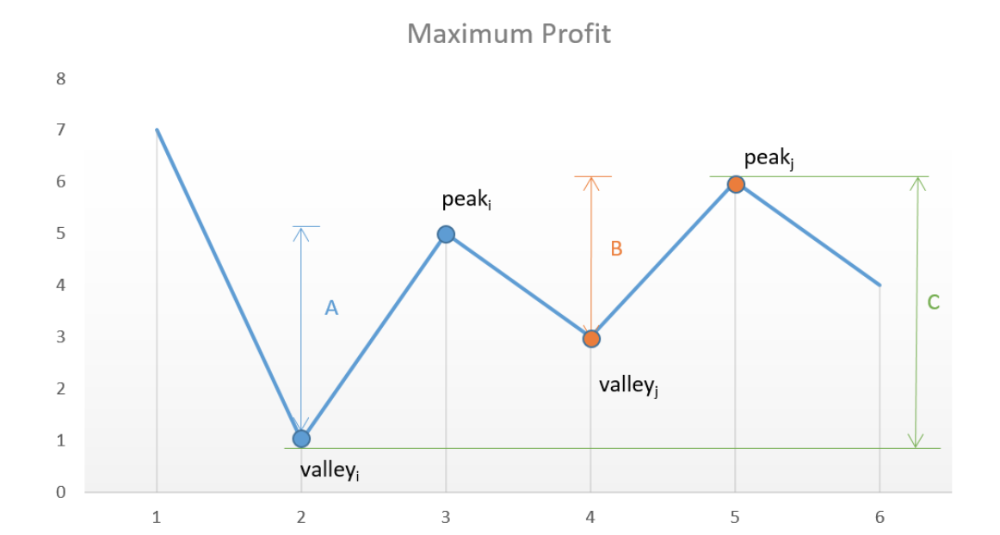

# Best Time to Buy and Sell Stock II

#### 題目

Say you have an array for which the *i*th element is the price of a given stock on day *i*.

Design an algorithm to find the maximum profit. You may complete as many transactions as you like (i.e., buy one and sell one share of the stock multiple times).

**Note:** You may not engage in multiple transactions at the same time (i.e., you must sell the stock before you buy again).

- 表示你可以今天賣一次，再買一次

- 老實說，這題真的很不優，因為跟現實的情境不太一樣，很容易讓人誤導。
  - Array裡面的內容，可以說是stock的歷史紀錄，也就是說你是知道未來stock的價錢，因此當你看到未來有一天的價錢比較高時，就可以進行買入。

**Example 1:**

```
Input: [7,1,5,3,6,4]
Output: 7
Explanation: Buy on day 2 (price = 1) and sell on day 3 (price = 5), profit = 5-1 = 4.
             Then buy on day 4 (price = 3) and sell on day 5 (price = 6), profit = 6-3 = 3.
```

**Example 2:**

```
Input: [1,2,3,4,5]
Output: 4
Explanation: Buy on day 1 (price = 1) and sell on day 5 (price = 5), profit = 5-1 = 4.
             Note that you cannot buy on day 1, buy on day 2 and sell them later, as you are
             engaging multiple transactions at the same time. You must sell before buying again.
```

**Example 3:**

```
Input: [7,6,4,3,1]
Output: 0
Explanation: In this case, no transaction is done, i.e. max profit = 0.
```

------

#### 思路

- 暴力法
  - 計算array中所有的配對可能
  - Example 1 => [7,1] [7,5] [7,3] [7,6] [7,6] || [1,5] [1,3] [1,6] [1,4] || ......
- 觀察

  

- 只要找到下一個目前買入的高，就可以賣出，把差價加到利潤中，若明日價格還要更高，我們也可以今天再買入，明日賣出。
- 多段式的賣出的利潤，一定大於整段賣出, 也就是說A+B 永遠會大於等於 C。

------

#### 程式

```swift
// 暴力法
func maxProfit(_ prices: [Int]) -> Int {
    return calculate(prices, 0)
}

func calculate(_ prices: [Int], _ s: Int) -> Int {
    // 遞迴終止條件, 表示已經找到array末端了
    if (s >= prices.count) { return 0 }

    var max = 0
    for start in s..<prices.count {
        var maxprofit = 0
        for i in start+1..<prices.count {
            // 有獲利
            if (prices[start] < prices[i]) {
                // price[i] - prices[start] = 當前獲利
                // calculate(price, i + 1) 遞迴，繼續找下組成功配對
                let profit = calculate(prices, i + 1) + prices[i] - prices[start]
                if (profit > maxprofit) {
                    // 這一會合的最大獲利
                    maxprofit = profit
                }
            }
        }
        // 跟當前幾回合的最大獲利比較
        if (maxprofit > max) {
            max = maxprofit
        }
    }

    return max
}
```


```swift
func maxProfit(_ prices: [Int]) -> Int {
  // 邊界條件
  if (prices.count <= 1 ) { return 0 }
  
  var maxprofit = 0
  for i in 0..<prices.count-1 {
    // 有獲利
    if prices[i] < prices[i + 1] {
      let profit = prices[i + 1] - prices[i]
      maxprofit += profit
    }
  }
  return maxprofit
}
```

------

#### 複雜度

- 暴力法
  - 時間: O(n^n),  遞迴function跑了n^n 次
  - 空間: O(n), 遞迴的深度n
- 觀察法
  - 時間: O(n), 跑一個loop
  - 空間: O(1), maxprofit

