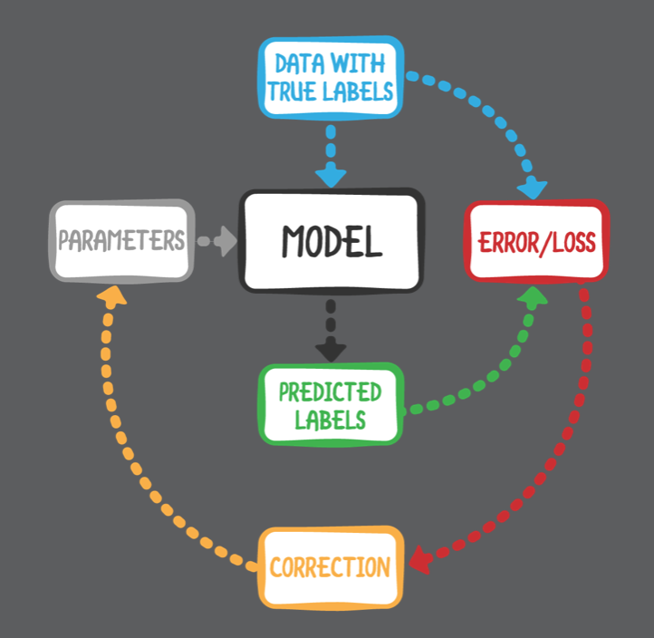

# Chapter 1:  Machine Learning, iOS & You

------

In this introduction chapter, you’ll learn what machine learning is all about. You’ll touch on everything from, the difference between supervised and unsupervised learning, to what transfer learning is. You’ll even go over the ethics of machine learning, and how bias can affect models

------

## 大綱

- [What is machine learning?](#1)

  - [Learning without explicit programming](#2)

- [Deep learning](#3)

  - [Artificial intelligence](#4)
  - [What can you do with machine learning?](#5)

- [ML in a nutshell](#6)

  - [Supervised learning](#7)
  - [You need data... a lot of it](#8)
  - [It’s all about the features](#9)
  - [The training loop](#10)
  - [What does the model actually learn?](#11)
  - [Transfer learning: Just add data](#12)

- [Can mobile devices really do machine learning?](#13)

  - [Why not in the cloud?](#14)

- [Frameworks, tools and APIs](#15)

  - [Apple’s task-specific frameworks](#16)

  - [Core ML ready-to-use models](#17)
  - [Convert existing models with coremltools](#18)
  - [Transfer learning with Create ML and Turi Create](#19)
  - [Turi Create’s statistical models](#20)
  - [Build your own model in Keras](#21)
  - [Gettin’ jiggy with the algorithms](#22)
  - [Third-party frameworks](#23)

- [ML all the things?](#24)

- [The ethics of machine learning](#25)

  - [Biased data, biased model](#26)
  - [Explainable/interpretable/transparent AI](#27)

- [Key points](#28)

------

<h2 id="1">What is machine learning?</h2>

- ML的定義
  - In 1959, Arthur Samuel defined machine learning as the field of study that **gives computers the ability to learn without being explicitly programmed.**

------

<h2 id="2">Learning without explicit programming</h2>

- 透過大量資料，讓電腦自己學會rules，而不是由工程師定義一堆規則。
  - It’s possible, though time-consuming, to **feed a computer a lot of knowledge in the form of such rules**, then program it to mimic what people do consciously, meaning to reason logically with the rules or knowledge, or to apply heuristics, meaning strategies or rules of thumb.

------

<h2 id="3">Deep learning</h2>

- 神經網路 neural networks
  - Neural networks are made up of layers of nodes (neurons) in an attempt to mimic how the human brain works
- 深度學習 deep learning
  - uses neural networks with a high number of layers, and a high number of neurons at each layer as its learning algorithm.

------

<h2 id="4">Artificial intelligence</h2>

- 圖靈測試
  - A famous example from AI is the **Turing test**: **If a human cannot distinguish between responses from a machine and a human, the machine is intelligent.**

------

<h2 id="5">What can you do with machine learning?</h2>

- **Four main data input types** you can use for machine learning **on mobile**: **cameras, text, speech and activity data**.
  - **Cameras:** Analyze or augment photos and videos captured by the cameras, or use the live camera feed, to detect objects, faces and landmarks in photos and videos; recognize handwriting and printed text within images; search using pictures; track motion and poses; recognize gestures; understand emotional cues in photos and videos; enhance images and remove imperfections; automatically tag and categorize visual content; add special effects and filters; detect explicit content; create 3D models of interior spaces; and implement augmented reality.
  - **Text:** Classify or analyze text written or received by the user in order to understand the meaning or sentence structure; translate into other languages; implement intelligent spelling correction; summarize the text; detect topics and sentiment; and create conversational UI and chatbots.
  - **Speech:** Convert speech into text, for dictation, translation or Siri-type instructions; and implement automatic subtitling of videos.
  - **Activity:** Classify the user’s activity, as sensed by the device’s gyroscope, accelerometer, magnetometer, altimeter and GPS.”

------

<h2 id="6">ML in a nutshell</h2>

- One of the central concepts in machine learning is that of a **model**.
  - **To create the model**, you first need to choose an algorithm – for example, a neural network — and then you need to train the model by showing it a lot of examples of the problem that you want it to solve.

------

<h2 id="7">Supervised learning</h2>

- The most common type of machine learning practiced today, and the main topic of this book, is supervised learning, in **which the learning process is guided by a human**
- The two sub-areas of supervised learning are **classification and regression**.
  - **Regression techniques predict continuous responses**, 
    - such as changes in temperature, power demand or stock market prices. The output of a regression model is one or more floating-point numbers. To detect the existence and location of a face in a photo, you’d use a regression model that outputs four numbers that describe the rectangle in the image that contains the face.
  - **Classification techniques predict discrete responses or categories**, 
    - such as whether an email is spam or whether this is a photo of a good dog
- **Unsupervised learning**
  - which does not involve humans in the learning process. A typical example is clustering, in which the algorithm is given a lot of unlabeled data, and its job is to find patterns in this data. 
- **Reinforcement learning**
  -  where an agent learns how to act in a certain environment and is rewarded for good behavior but punished for bad.

------

<h2 id="8">You need data... a lot of it</h2>

- First, you need to collect training data, which consists of examples and labels
- The labels are what you want the model to learn from the examples

------

<h2 id="9">It’s all about the features</h2>

- The training examples are made up of the **features** you want to train on
- For many kinds of machine-learning tasks, you can **organize your training data into a set of features** that are quite apparent. 
  - This kind of training data is often provided **in the form of a CSV or JSON** table, and the features are the columns in that table.
  - **Feature engineering** is the art of deciding which features are important and useful for solving your problem, and it is an important part of the daily work of a machine-learning practitioner or data scientist.

------

<h2 id="10">The training loop</h2>

- Using some fancy mathematics called **back-propagation**, the training process uses this loss value to slightly tweak the parameters of the model so that it will make better predictions next time.
- Usually people keep training until the model reaches either some **minimum acceptable accuracy**, **up to a maximum number of iterations**, or until they run out of patience.

------

<h2 id="11">What does the model actually learn?</h2>

- Most other machine-learning algorithms **don’t learn rules directly**, but a set of numbers called the learned **parameters**, or just “parameters”, of the mode.
- one of the major challenges of machine learning is **overfitting**, which happens when the model does start to remember specific training examples.

------

<h2 id="12">Transfer learning: Just add data</h2>

- Transfer learning has the huge advantage that it is **much faster than training the whole model from scratch**, plus your dataset can be much smaller. Instead of millions of images, you now only need a few thousand or even a few hundred.
  - Apple provides two tools that do transfer learning: **Create ML and Turi Create**.

------

<h2 id="13">Can mobile devices really do machine learning?</h2>

- The benefits of on-device inference:
  - **Faster response times:** It’s more responsive than sending HTTP requests, so doing real-time inference is possible, making for a better user experience.
  - **It’s also good for user privacy**: The user’s data isn’t sent off to a backend server for processing, and it stays on the device.
  - **It’s cheaper** since the developer doesn’t need to pay for servers and electricity
- Mobile devices still have some important **limitations**. 
  - **Training a machine-learning model** takes a lot of processing power and, except for small models, simply is out of reach of most mobile devices at this point. 

------

<h2 id="14">Why not in the cloud?</h2>

- 1) You’re using a canned service that is often not tailored to your own data
- 2) If your app needs to do machine learning in real-time (such as on a video), then sending HTTP requests is going to be way too slow
- 3) Convenience has a price: You have to pay for using these services and, once you’ve chosen one, it’s hard to migrate your app away from them

------

<h2 id="15">Frameworks, tools and APIs</h2>

------

<h2 id="16">Apple’s task-specific frameworks</h2>

- Apple provides several Swift frameworks for doing specific machine-learning tasks:
- **Vision**: 
  - Detect faces and face landmarks, rectangles, bar codes and text, and to track objects. Vision also makes it easier to use Core ML image models, taking care of formatting the input images correctly.
- **Natural Language**:
  -  Analyze text to identify the language, part of speech, as well as specific people, places or organizations.
- **Speech**:
  -  Convert speech to text, and optionally retrieve answers using Apple’s servers or an on-device speech recognizer. Apple sets limits on audio duration and daily number of requests.
- **SiriKit**: 
  - Handle requests from Siri or Maps for your app’s services by implementing an Intents app extension in one of a growing number of Intent Domains: messaging, lists and notes, workouts, payments, photos and more.
- **GameplayKit**: 
  - Evaluate decision trees that contain questions, possible answers and consequent actions.

------

<h2 id="17">Core ML ready-to-use models</h2>

- Core ML is not just a framework but also an open file format for sharing machine-learning models.
- Larger models use more battery power and are slower than smaller models.
- A model has more parameters doesn’t necessarily mean it is more accurate. 

------

<h2 id="18">Convert existing models with coremltools</h2>

- There are many popular open-source packages for training machine-learning models. To name a few:

- you can convert that model to Core ML format using **coremltools** so that you can run the model from your iOS app.

  - Apache MXNet

  - Caffe (and the relatively unrelated Caffe2)
  - Keras
  - PyTorch
  - scikit-learn
  - TensorFlow

------

<h2 id="19">Transfer learning with Create ML and Turi Create</h2>

- Create ML and Turi Create **use transfer learning** to let you customize pre-trained base models with your own data.
  - **Turi Create** was Apple’s first transfer-learning tool, but it requires you to work in the alien environment of Python.
  - **Create ML**, which is essentially a Swift-based subset of Turi Create, to give you transfer learning for image and text classification using Swift and Xcode
- Turi Create and Create ML **are task-specific, rather than model-specific**.
- Turi Create has **seven** task-focused toolkits:
  - Image classification: Label images with labels that are meaningful for your app.
  - Image similarity: Find images that are similar to a specific image; an example is the Biometric Mirror project described at the end of this chapter.
  - Recommender system: Provide personalized recommendations for movies, books, holidays etc., based on a user’s past interactions with your app.
  - Object detection: Locate and classify objects in an image.
  - Style transfer: Apply the stylistic elements of a style image to a new image.
  - Activity classification: Use data from a device’s motion sensors to classify what the user is doing, such as walking, running, waving, etc.
  - Text classifier: Analyze the sentiment — positive or negative — of text in social media, movie reviews, call center transcripts, etc.
- **Create ML currently has only two of these toolkits**: image classification and text classification.

------

<h2 id="20">Turi Create’s statistical models</h2>

- Turi Create includes these general-purpose models:
  - Classification: Boosted trees classifier, decision tree classifier, logistic regression, nearest neighbor classifier, random forest classifier, and Support Vector Machines (SVM).
  - Clustering: K-Means, DBSCAN (density based).
  - Graph analytics: Pagerank, shortest path, graph coloring and more.
    Nearest neighbors.
  - Regression: Boosted trees regression, decision tree regression, linear regression and random forest regression.
    Text analysis.
- Turi Create **picks suitable statistical models based on its analysis of your data**.

------

<h2 id="21">Build your own model in Keras</h2>

- if you can’t create an accurate model with Create ML or Turi Create, you have to build your own model from scratch.
- Learn about all these new terms and how to use **Keras** to configure and train your own deep-learning networks.

------

<h2 id="22">Gettin’ jiggy with the algorithms</h2>

- These are more low-level than Core ML, and you’d only use them if Core ML is not good enough for your app.
  - **Metal Performance Shaders**: 
    - Metal is the official framework and language for programming the GPU on iOS devices. It’s fairly low-level and not for the faint of heart, but it does give you ultimate control and flexibility. For the best performance, Metal is the right choice but it takes more effort to get going than Core ML.
  - **Accelerate**: 
    - All iOS devices come with this underappreciated framework. It lets you write heavily optimized CPU code. Where Metal lets you get the most out of the GPU, Accelerate does the same for the CPU. There is a neural-networking library, BNNS (Basic Neural Networking Subroutines), but it also has optimized code for doing linear algebra and other mathematics. If you’re implementing your own machine-learning algorithms from scratch, you’ll probably end up using Accelerate.

------

<h2 id="23">Third-party frameworks</h2>

- **Google ML Kit**: 
  - This is Google’s answer to the Vision framework. With ML Kit you can easily add image labeling, text recognition, face detection, and other tasks to your apps. ML Kit can run in the cloud but also on the device, and supports both iOS and Android.
- **TensorFlow-Lite**: 
  - TensorFlow, Google’s popular machine-learning framework, also has a version for mobile devices, TF-Lite. The main advantage of TF-Lite is that it can load TensorFlow models, although you do need to convert them to “lite” format first. Recently support for GPU acceleration on iOS was added, but as of this writing, TF-Lite cannot yet take advantage of the Neural Engine. The API is in C++, which makes it hard to use in Swift.

------

<h2 id="24">ML all the things?</h2>

- Machine learning, especially deep learning, has been very successful in problem domains such as image classification and speech recognition, but it can’t solve everything. 

------

<h2 id="25">The ethics of machine learning</h2>

- Machine learning is a powerful tool, extending the reach of artificial intelligence into everyday life. Using trained models can be fun, time-saving or profitable, but the misuse of AI can be harmful.

------

<h2 id="26">Biased data, biased model</h2>

- If the training data was biased for or against some group of people: The data might be racist or sexist.

------

<h2 id="27">Explainable/interpretable/transparent AI</h2>

- Many deep learning models are so complex, even their creators can’t explain individual predictions.

------

<h2 id="28">Key points</h2>

- Machine learning isn’t really that hard to learn — Stick with this book and you’ll see!
- Access to large amounts of data and computing power found online has made machine learning a viable technology.
- At its core, machine learning is all about models; creating them, training them, and inferring results using them.
- Training models can be an inexact science and an exercise in patience. However, easy-to-use transfer learning tools like Create ML and Turi Create can help improve the experience in specific cases.
- Mobile devices are pretty good at inferring results. As for creating models on device, we’re not quite there yet.
- Don’t confuse machine learning with Artificial Intelligence. Machine learning can be a great addition to your app, but knowing its limitations is equally important.