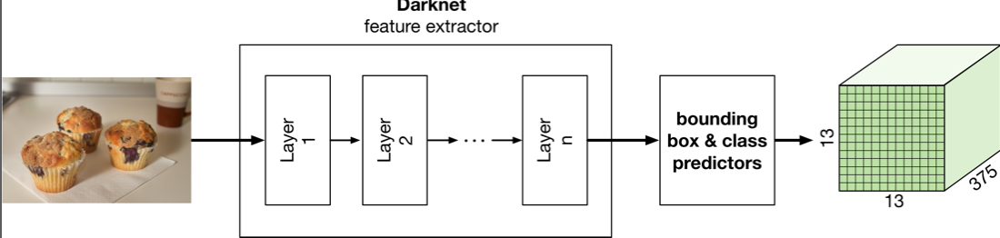
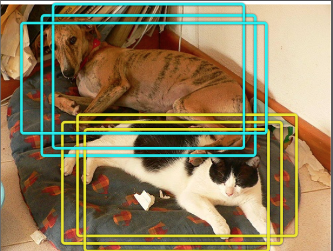
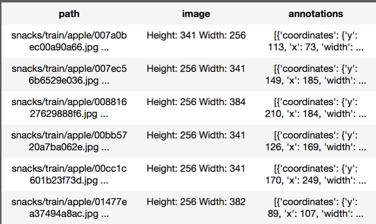
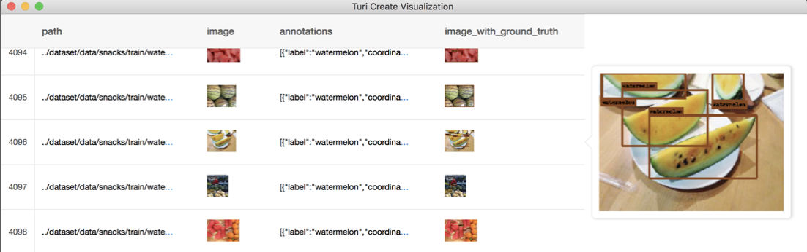
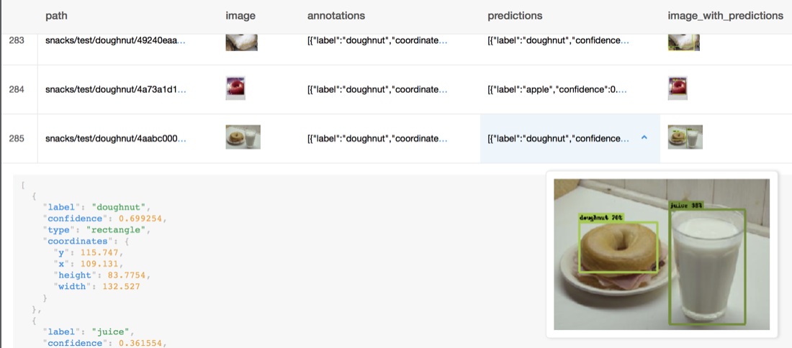
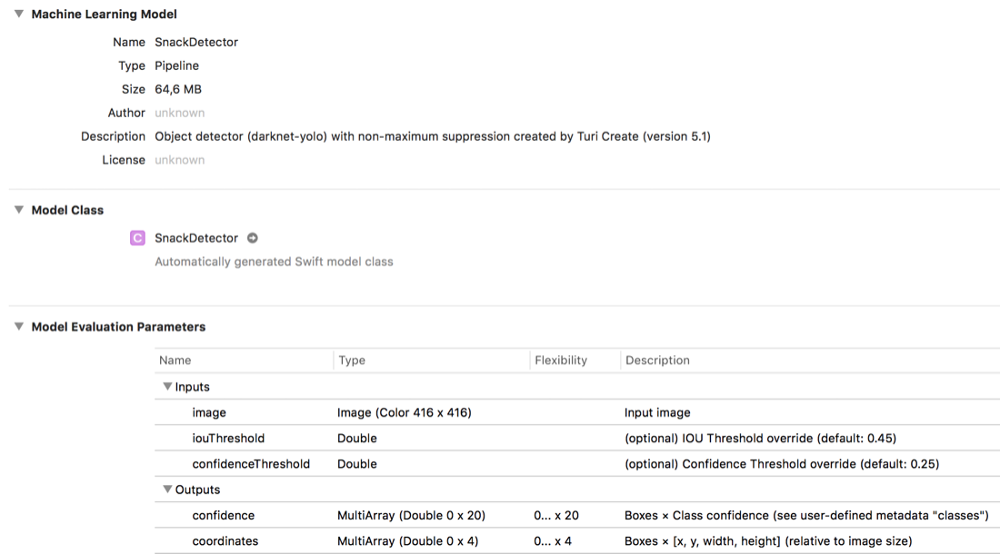
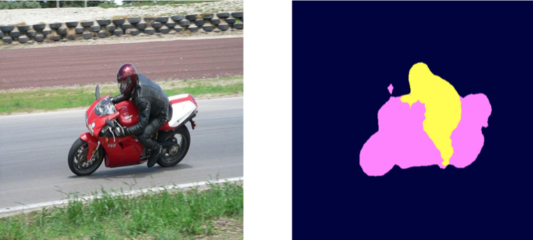
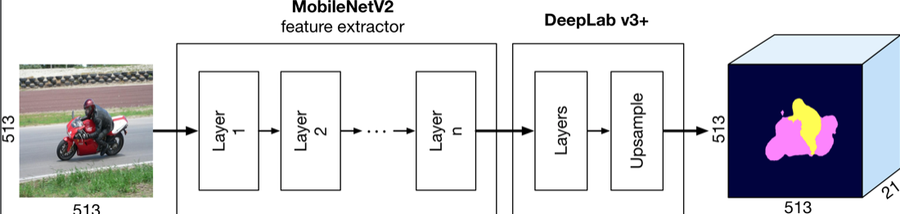
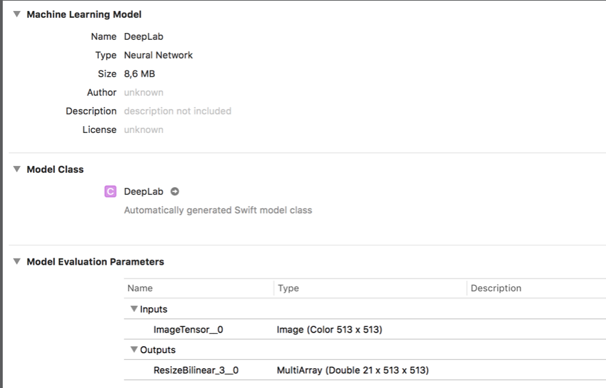
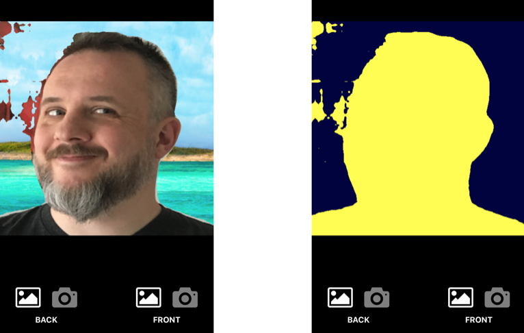

# Chapter 10: YOLO & Semantic Segmentation

------

In this final chapter, you’ll learn about some advanced localization models. You’ll learn about one-shot detectors like YOLO and SSD and how they can be used to identify multiple objects in an image. You’ll also learn about how machine learning can be used for segmentation to separate an object from its background.

------

## 大綱

- [One-shot detectors](#1)
- [Hello Turi, my old friend](#2)
  - [Training the model](#3)
  - [How good is it?](#4)
  - [The demo app](#5)
- [Semantic segmentation](#6)
  - [Converting the model](#7)
  - [The demo app](#8)
- [Key points](#9)

------


<h2 id="1">One-shot detectors</h2>

- These model types **just run the classifier once on the input image and do all of the work in a single pass.**
  - YOLO (You Only Look Once), SSD (Single Shot multi-box Detector) and DetectNet.



- [YOLO](https://github.com/htaiwan/note-andrew-deep-learning/blob/master/Note/4-3.md#3.5.2):

  - Feature extractor: Darknet

    - Darknet consists of convolution layers, followed by batch normalization and the ReLU activation function, with pooling layers in between

  - Input: 416×416 pixel image

  - Output: a three-dimensional tensor of size 13 × 13 × 375 that we’ll refer to as the grid

    - There are **five pooling layers** in Darknet that **each halve the spatial dimension**s of the image, for **a total reduction factor of 32**. Since 416/32 = 13, the final grid is 13×13 pixels

    - 13×13 = 169 different bounding box predictors

      - Each grid cell has not just one but 15 different predictors, for a total of 169×15 = 2,535 bounding box 
      - To filter out these overlapping predictions, a post-processing technique called n**on-maximum suppression or NMS** is used to remove such duplicates.

      

    -  375 = 15 * 25 

      - Each grid cell has 15 predictors that each output 25 numbers
      - 25 = 20 + 4 + 1
        - our snack classes, so that’s 20 numbers
        - 4: bounding box coordinates.
        - 1: confidence score for the bounding box


------

<h2 id="2">Hello Turi, my old friend</h2>

- 資料整理

  - 目標: 整理出下列格式

  

  

- Step1: Load data

```python
import os, sys, math
import pandas as pd
import turicreate as tc

def load_images_with_annotations(images_dir, annotations_file):
    # Load the images into a Turi SFrame.
    data = tc.image_analysis.load_images(images_dir, with_path=True)

    # Load the annotations CSV file into a Pandas dataframe.
    csv = pd.read_csv(annotations_file)
```

- Step2: Combine these two sources of data into a single SFrame that Turi can use for training. 
  - the CSV file stores the coordinates as normalized numbers between 0 and 1, but Turi wants them in pixel space
  - Turi describes the bounding boxes using a center coordinate and a width and height


```python
all_annotations = []
    for i, item in enumerate(data):
        # Grab image info from the SFrame.
        img_path = item["path"]
        img_width = item["image"].width
        img_height = item["image"].height

        # Find the corresponding row(s) in the CSV's dataframe.
        # use os.path.basename to get the name
        image_id = os.path.basename(img_path)[:-4]
        rows = csv[csv["image_id"] == image_id]
        
        img_annotations = []
        for row in rows.itertuples():
            xmin = int(round(row[2] * img_width))
            xmax = int(round(row[3] * img_width))
            ymin = int(round(row[4] * img_height))
            ymax = int(round(row[5] * img_height))

            # Convert to center coordinate and width/height:
            width = xmax - xmin
            height = ymax - ymin
            x = xmin + math.floor(width / 2)
            y = ymin + math.floor(height / 2)
            class_name = row[6]

            img_annotations.append({"coordinates":
                  {"height": height, "width": width, "x": x, "y": y},
                  "label": class_name})”
```

- Step3: 處理資料缺失
  - If there were no annotations, you still need to append something to all_annotations, so that this list has exactly the same number of rows as the SFrame

```python
if len(img_annotations) > 0:
            all_annotations.append(img_annotations)
        else:
            all_annotations.append(None)
```

- Step4: 整合到SFrame中
  - put this into an SArray object and assign it to a new column in the SFrame named "annotations"

```python
data["annotations"] = tc.SArray(data=all_annotations, dtype=list)
    return data.dropna()
```

- 使用

```python
data_dir = "snacks"
train_dir = os.path.join(data_dir, "train")

train_data = load_images_with_annotations(train_dir,
                    data_dir + "/annotations-train.csv")

train_data["image_with_ground_truth"] =
    tc.object_detector.util.draw_bounding_boxes(train_data["image"],
                                                train_data["annotations"])
train_data.explore()
```

------

<h2 id="3">Training the model</h2>

- If this is your first time training this kind of model, Turi Create will first download the pre-trained weights for the Darknet feature extractor. And then it starts training
- Use your Mac’s AMD GPU if you have a recent Mac running macOS Mojave. 
- About eight seconds per iteration, doing 13,000 iterations would need about 29 hours.


```python
model = tc.object_detector.create(train_data, feature="image",
                                  annotations="annotations")
model.save("SnackDetector.model")
model.export_coreml("SnackDetector.mlmodel")
```

------

<h2 id="4">How good is it?</h2>

```python
model = tc.load_model("SnackDetector.model")

test_dir = os.path.join(data_dir, "test")
test_data = load_images_with_annotations(test_dir,
                   data_dir + "/annotations-test.csv")

scores = model.evaluate(test_data)
```

- In the previous chapter, you used the **IOU or Intersection-over-Union metric** to determine how good the predictions were
- Turi uses a different metric. It computes **the average precision for each class**, as well as **the overall average of these average precisions** — yes, you read that right — known as the **mean average precision**, or mAP.

```python
{'average_precision_50': {
  'apple': 0.52788541232511876,
  'banana': 0.41939129680862453,
  'cake': 0.38973319479991153,
  'candy': 0.36857447872282678,
  ...
  'watermelon': 0.37970409310715819},
 'mean_average_precision_50': 0.38825907147323535}
```

- 觀察單一數據

```python
test_data["predictions"] = model.predict(test_data)
test_data["image_with_predictions"] =
    tc.object_detector.util.draw_bounding_boxes(test_data["image"],
                                                test_data["predictions"])
test_data.explore()
```



------

<h2 id="5">The demo app</h2>

- 先觀察CoreML model的內容

  - The model description: Object detector using Darknet and YOLO, with non-maximum suppression.
    - The type of the model is not a neural network but a **pipeline**. 
    - Pipeline is several models that are glued together so that the output of one model is used as the input for the next model in the pipeline. In this case, the **object detection model** is followed by a **non-maximum suppression (NMS) model**.

  

  - SnackDetector model has **three inputs and two outputs**.

    - Input: 
      - regular image input for a 416×416 color image
      - iouThreshold (used by NMS )
      - confidenceThreshold (used by NMS )
    - Output:
      - Core ML model actually has two outputs. That’s because the Core ML pipeline applies NMS to the predictions from YOLO and only outputs the best bounding boxes. 
      - That’s also why the first dimension is 0, or unknown because NMS will return a different number of boxes depending on how many objects are in the image

  - Vision framework

    - Don’t have to worry about these inputs and outputs because you’re going to be using this model through the Vision framework.
    - **VNRecognizedObjectObservation**
      - This is a new class that was added to Vision with **iOS 12**, and it exists specifically to handle the results from Turi Create’s YOLO model
      - **labels property** containing a list of familiar VNClassificationObservation instances, sorted from highest probability to lowest
      - **boundingBox property**, a CGRect object that tells you where in the image the object is located. 
        - This uses normalized coordinates again, but with the origin of the CGRect in the lower-left corner. 
        - Need to transform the normalized coordinates to screen coordinates and also flip the y-axis.

  - The YOLO models built with Turi Create aren’t compatible with iOS 11, but there are also Keras versions of YOLO available. For an example of [how to do run a YOLO model on iOS 11](github.com/hollance/YOLO-CoreML-MPSNNGraph)

    

------

<h2 id="6">Semantic segmentation</h2>

- Semantic segmentation: make a separate classification prediction for each individual pixel in the image.



- [DeepLab v3+](https://www.jianshu.com/p/d54082022445)




------

<h2 id="7">Converting the model</h2>

- Using [a pre-trained version of DeepLab](github.com/tensorflow/models/tree/master/research/deeplab) that is made freely available as part of the TensorFlow Models repository
  - can recognize the following 20 classes: person, bird, cat, cow, dog, horse, sheep, aeroplane, bicycle, boat, bus, car, motorbike, train, bottle, chair, dining table, potted plant, sofa and tv/monitor.
- Download the pre-trained model file.
  - [mobilenetv2_coco_voc_trainval](download.tensorflow.org/models/deeplabv3_mnv2_pascal_trainval_2018_01_29.tar.gz)
  - unzip the download, look for the file frozen_inference_graph.pb. 
    - The extension **pb stands for protobuf, which is the format that TensorFlow models**
    - Netron can open such pb files
- coremltools可以把keras model轉成coreML model, 但沒辦法轉tensorFlow model, 要利用**tfcoreml**
  - Need to tell tf-coreml what the model’s input and output tensors are. 
  - For DeepLab, those are "ImageTensor:0" and "ResizeBilinear_3:0", respectively. See if you can find these tensors in the graph using Netron.
  - **:0** in the name tells TensorFlow that you want to use the tensor from the operator’s first output.
  - **image_input_names** is used to inform Core ML that it should treat the input as a proper image instead of an array of numbers

```python
$ pip3 install -U tfcoreml 
# If using the one from pip gives errors, here’s a handy trick for installing the very latest version straight from GitHub: 
$ pip3 install -U git+https://github.com/apple/coremltools.git
```

```python
# convert_deeplab.py
import tfcoreml as tf_converter

input_path = "deeplabv3_mnv2_pascal_trainval/frozen_inference_graph.pb"
output_path = "DeepLab.mlmodel"
input_tensor = "ImageTensor:0"
input_name = "ImageTensor__0"
output_tensor = "ResizeBilinear_3:0"

tf_converter.convert(tf_model_path=input_path,
         mlmodel_path=output_path,
         output_feature_names=[output_tensor],
         input_name_shape_dict={input_tensor : [1, 513, 513, 3]},
         image_input_names=input_name)
```

- Run this script from a Terminal

```
$ python3 convert_deeplab.py
```

- DeepLab’s output is a MultiArray of size 21×513×513.
  -  Multi-array is the term that Core ML uses for tensor. When you need to deal with tensor objects in Core ML
  - Notice that Core ML puts the number of channels (21) at the front of the tensor. 一般來說channel是放最後面，但在這裡是放在最前面，在處理時需要多注意。 




------

<h2 id="8">The demo app</h2>




------

<h2 id="9">Key points</h2>

- To create a model that can detect multiple objects, it’s not enough to just add extra bounding box predictors. One-shot detectors like YOLO and SSD put the predictors into a grid so that they only look at specific portions of the input image. They also train different predictors to specialize in various object shapes and sizes.

- **Non-maximum suppression (NMS)** is a post-processing step **used to only keep the best bounding box predictions**. The YOLO model that is trained by Turi Create will automatically apply NMS.

- **Semantic segmentation** lets you make a unique class prediction for every pixel in the image. Instead of a single probability distribution, this predicts as many probability distributions as there are pixels.”

  