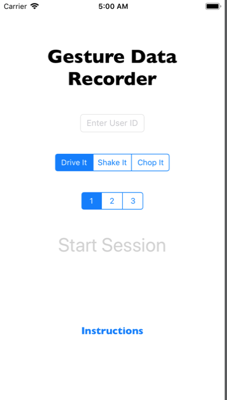
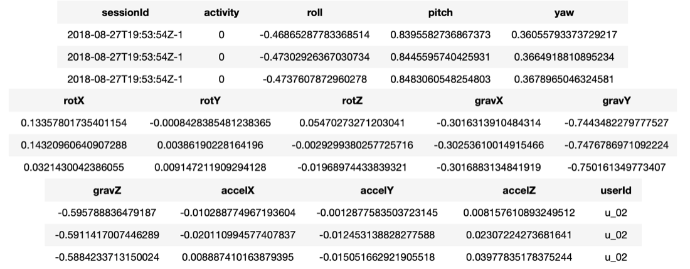
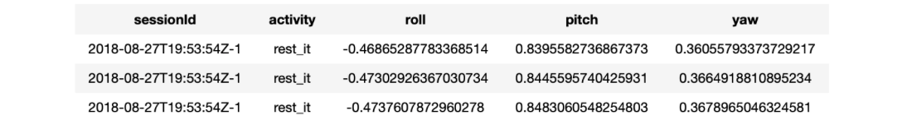
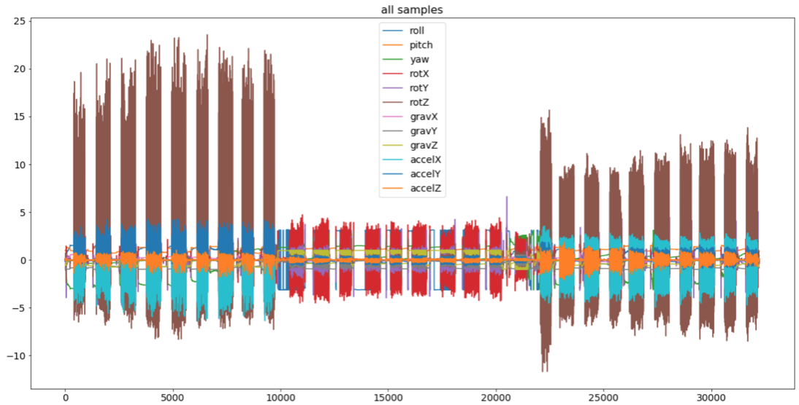
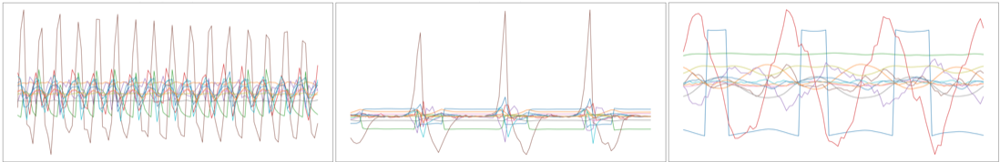
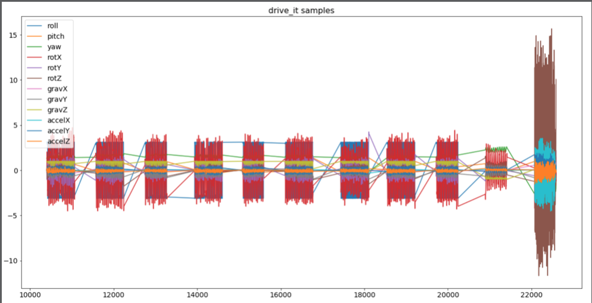
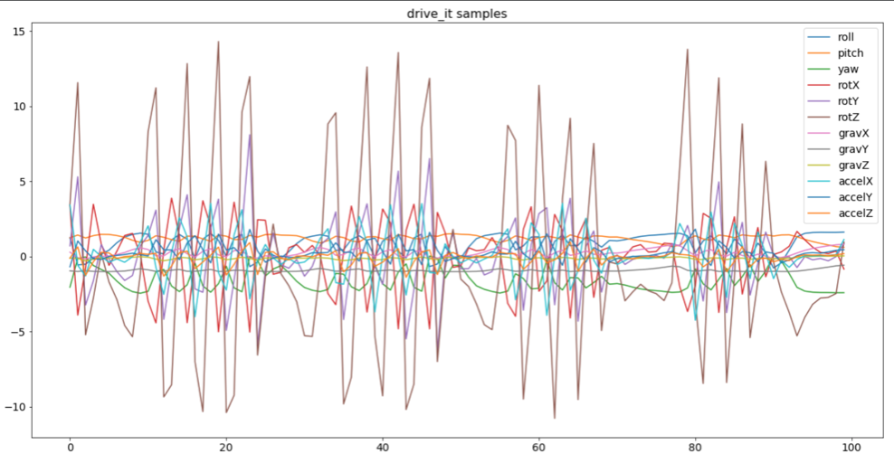
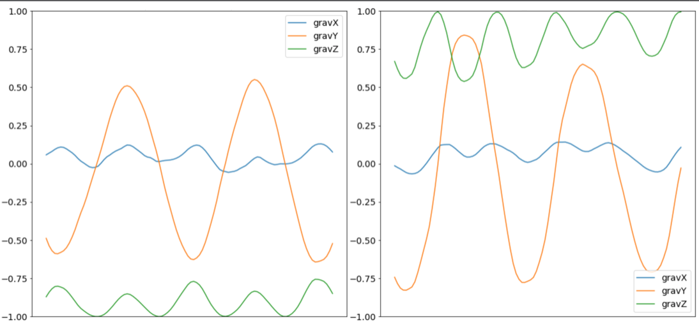
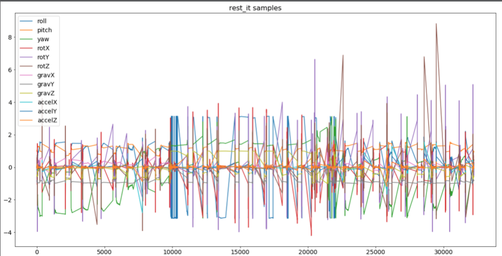
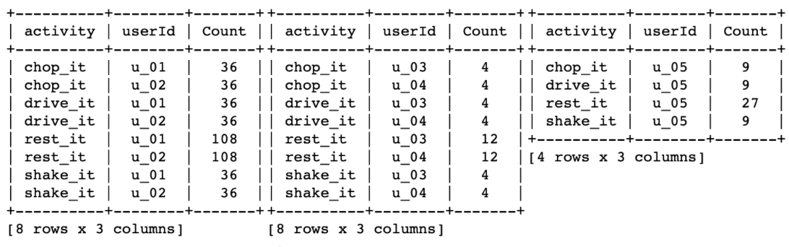

# Chapter 11: Data Collection for Sequence Classification

------

In this chapter, you’ll learn how working with sequences differs from working with discrete data like individual images. You’ll learn how to collect iPhone sensor data, as well as what it takes to build a good training dataset.

------

## 大綱

- [Building a dataset](#1)
  - [Accessing device sensors with Core Motion](#2)
  - [Collecting some data](#3)
- [Analyzing and preparing your data](#4)
  - [Removing bad data](#5)
  - [Optional: Removing non-activity data](#6)
  - [Balancing your classes](#7)
- [Key points](#8)

------


<h2 id="1">Building a dataset</h2>

- Learn how to collect sensor data from Apple devices and prepare it for use training a machine learning model

- 線上的現成資源 

  - Google Dataset Search
  - Kaggle

- **GestureDataRecorder APP**

  

  - It’s just a utility app that records sensor data. Users enter their ID, choose what activity and how many short sessions of that activity to record, and then hit Start Session to begin collecting data
  - Why require a user ID? 
    - you need some way to distinguish between samples
    - it expects users to provide a unique identifier and then saves data for each user in separate files.
    - ensure no two users enter the same ID on different devices.


------


<h2 id="2">Accessing device sensors with Core Motion</h2>

- Use Core Motion to access readings from the phone’s motion sensors.
- Add the key Privacy - Motion Usage Description to info.plist
- Create a CMMotionManager to access the device’s motion data
- Use queue to keep sensor update callbacks off the main thread.
- Tell motionManager how often to produce sensor data
  - Set samplesPerSecond to 25, which you’ll use later to specify you want the device to send you 25 sensor updates every second
  - Shouldn’t you just use the max? 
    - More updates means more data processing, which means less CPU available for whatever else your app needs to do.
    - That requires more complex ML models, which run more slowly
    - Higher frequency updates increase battery usage

- Store all the collected sensor data in memory and then write it out to disk at the end of the recording session.

```Swift
import CoreMotion

let motionManager = CMMotionManager()
let queue = OperationQueue()

static let samplesPerSecond = 25.0

var activityData: [String] = []

try self.activityData.appendLinesToURL(fileURL: dataURL)
```

- **processMotionData**: 處理從sensor取到的資料
  - SessionId: a timecode created when recording starts, and the number of which recording the user is currently doing.
  - Turi Create seems to prefer a lot of sessions. So instead of fewer, longer sessions, this app opts for creating more, shorter ones. 

```swift
func processMotionData(_ motionData: CMDeviceMotion) {
  // 1. 取得當前資料的label
  let activity = isRecording ? currActivity : .none
  // 2. 將motionData的資料和UI上的相關資料轉成字串
  let sample = """
  \(sessionId!)-\(numActionsRecorded),\
  \(activity.rawValue),\
  \(motionData.attitude.roll),\
  \(motionData.attitude.pitch),\
  \(motionData.attitude.yaw),\
  \(motionData.rotationRate.x),\
  \(motionData.rotationRate.y),\
  \(motionData.rotationRate.z),\
  \(motionData.gravity.x),\
  \(motionData.gravity.y),\
  \(motionData.gravity.z),\
  \(motionData.userAcceleration.x),\
  \(motionData.userAcceleration.y),\
  \(motionData.userAcceleration.z)
  """
  // 3. 記錄到array中，等會一起記錄到disk中
  activityData.append(sample)
}
```

- **enableMotionUpdates**: 如何利用core Motion來讓sensor發送資料出來

```Swift
func enableMotionUpdates() {
  // 1. update every 0.04 seconds, or 25 times per second
  motionManager.deviceMotionUpdateInterval =
    1.0 / Config.samplesPerSecond
  // 2. Initialize activityData to an empty array 
  activityData = [String]()
  // 3. MotionManager to start sending device motion updates, passing a block to execute on queue for each update.
  motionManager.startDeviceMotionUpdates(
    using: .xArbitraryZVertical,
    to: queue, withHandler: { [weak self] motionData, error in
      // 4. This guard statement ensures the callback received motion data 
      guard let self = self, let motionData = motionData else {
        if let error = error {
          print(
            "Device motion update error: \(error.localizedDescription)")
        }
        return
      }
      // 5. Extract features from the sensor data and append them to activityData. 
      self.processMotionData(motionData)
  })
} 
```

- App uses the finished utterance to determine what to do next. In the case of the sessionStart message, it enables motion updates and calls queueNextActivity to get the recording started.
  - You’ve started motion updates, so you’ll need to stop them at some point. 


```swift
...
case Utterances.sessionStart:
  // TODO: enable Core Motion
  enableMotionUpdates()
  queueNextActivity()
...

...
case Utterances.sessionComplete:
  disableMotionUpdates()
...

func disableMotionUpdates() {
  motionManager.stopDeviceMotionUpdates()
}
```

------


<h2 id="3">Collecting some data</h2>

- Go collect some data, ideally from multiple people.
- Performing activities incorrectly while recording data will reduce your model’s performance
  - The device’s orientation affects the data you collect
  - Instruct users to position their devices a specific way
- **File Sharing** area in iTunes. 
  - This works because the starter project’s **Info.plist** includes the keys **Application supports iTunes file sharing** and **Supports opening documents** in place, both with values of YES.
- Create the three datasets you’ll use when building your model: train, validation and test

  - You should put data from most people in data/train, while putting data from about 10% of your users in each of the other two folders.

------


<h2 id="4">Analyzing and preparing your data</h2>

- 清理有問題的data
  - **Mislabeled data**: sensor數據正確但label錯誤
  - **Poorly collected data**: lable正確，但device的方向錯誤
  - **Source errors**：Sometimes the data source introduces errors, such as a damaged or malfunctioning device reporting bad data
  - **Incorrect data types**. For example, strings where there should be numbers.
  - **Missing values**
  - **Outliers**: Some variation is required to make a good dataset, but there are cases when a few samples may be too rare to be worth including in your dataset
- Step1: 讀取資料
  -  **activity_detector_utils.py**: some helper functions


```python
%matplotlib inline
import turicreate as tc
import activity_detector_utils as utils

train_sf = utils.sframe_from_folder("data/train")
valid_sf = utils.sframe_from_folder("data/valid")
test_sf = utils.sframe_from_folder("data/test")

train_sf.head()
```

- For example, all data read from a file named “bob-data.csv” would be assigned a userId value of “bob.
- activity: activity types as numeric values. 



- Step2: 轉換activity格式

```python
# 1: create a dictionary that maps numeric activity values to strings 
activity_values_to_names = {
  0 : ’rest_it’,
  1 : ’drive_it’,
  2 : ’shake_it’,
  3 : ’chop_it’
}
# 2: use the activity column’s apply function to run a lambda function on the value in each row 
def replace_activity_names(sframe):
  sframe[’activity’] = sframe[’activity’].apply(
    lambda val: activity_values_to_names[val])
# 3: replace_activity_names for each of your dataset SFrames
replace_activity_names(train_sf)
replace_activity_names(valid_sf)
replace_activity_names(test_sf)
```



- Step3: 將數據轉換成圖

```python
utils.plot_gesture_activity(test_sf)

# plot data for a single activity by specifying its name
utils.plot_gesture_activity(test_sf, activity="drive_it")

# zoom in on chunks of data by specifying a slice of the dataset
utils.plot_gesture_activity(
  test_sf[11950:12050], activity="drive_it")
```



- Showing slices of 100 samples for each of the three gestures in the test set:
  - Each gesture appears as a clearly discernable pattern” 





------

<h2 id="5">Removing bad data</h2>

- Plot all the drive_it activity data in the test set, you’ll see a plot something like the one on the next page.
  - While much of this data looks similar, some of it stands out as different. Particularly, the last two blocks of activity seem odd. 



- 仔細觀察第二個異常部分

```python
utils.plot_gesture_activity(
  test_sf[22200:22300], activity="drive_it")
```

- 這個pattern比較像shack而不是drive, 所以可能是label錯誤了



- 觀察另外一種異常
  - if you look closely you may notice an area of **green at the top of the data** — green that you don’t see in any of the other drive_it data

```python
utils.plot_gesture_activity(
  test_sf[21200:21500], activity="drive_it",
  features=["gravX", "gravY", "gravZ"])
```

- The patterns are the same, but the values are negative in the left example and positive in the right one.
  -  This indicates the user was not holding the phone in the correct orientation while performing the motion — the screen was facing up instead of down.



- You should spend time thoroughly exploring all three of your datasets, both to clean up problems and to better understand your data. **And don’t neglect any particular dataset**


------

<h2 id="6">Optional: Removing non-activity data</h2>

- Unlike with the gestures you plotted earlier, the resting data shows no clear pattern

```python
utils.plot_gesture_activity(test_sf, activity="rest_it")
```



- 在這個例子，rest_it雖然沒有固定的pattern，但因為rest_it跟其他activity的pattern差異度很大，所以模型仍可以學習區分其差異。
  - In many cases — such as this one — the model will learn to recognize both resting and activities. 
  - This is probably because the sequences **related to the other gestures are so much more distinct**. That is, it will likely learn to classify the other gestures well, and then learn that anything else is resting.
- If you ever want to try removing that data, you can do so with the following code:
  - Much like how you removed the bad sessions, this would create new SFrames that do not contain any samples whose activity value was rest_it.

```python
train_sf = train_sf.filter_by(
  ["rest_it"], ’activity’, exclude=True)
test_sf = test_sf.filter_by(
  ["rest_it"], ’activity’, exclude=True)
valid_sf = valid_sf.filter_by(
  ["rest_it"], ’activity’, exclude=True)
```


------

<h2 id="7">Balancing your classes</h2>

- 計算各sample數量

```python
utils.count_activities(train_sf)
utils.count_activities(valid_sf)
utils.count_activities(test_sf)
```

- If any gesture or user is overrepresented in the training set, your model may bias itself toward those samples.  
  - unbalanced validation or test sets can be a problem, too, because they’ll skew your evaluation results, making it more difficult to judge your model.
  - 每個user在每個gesture提供的sample數量勁量月均衡越好，不然model的學習結果，可能會偏向某個user的gesture的行為。




------

<h2 id="8">Key points</h2>

- Core Motion provides access to motion sensors on iOS and WatchOS devices.
- When building a dataset, prefer collecting **less data from more sources** over more data from fewer sources.
- **Inspect and clean your data before training any models** to avoid wasting time on potentially invalid experiments. Be sure to check all your data — training, validation and testing.
- Try isolating data from a single source into one of the train, validation or test sets.
- **Prefer a balanced class representation**. In cases where that’s not possible, evaluate your model with techniques other than accuracy, such as precision and recall.