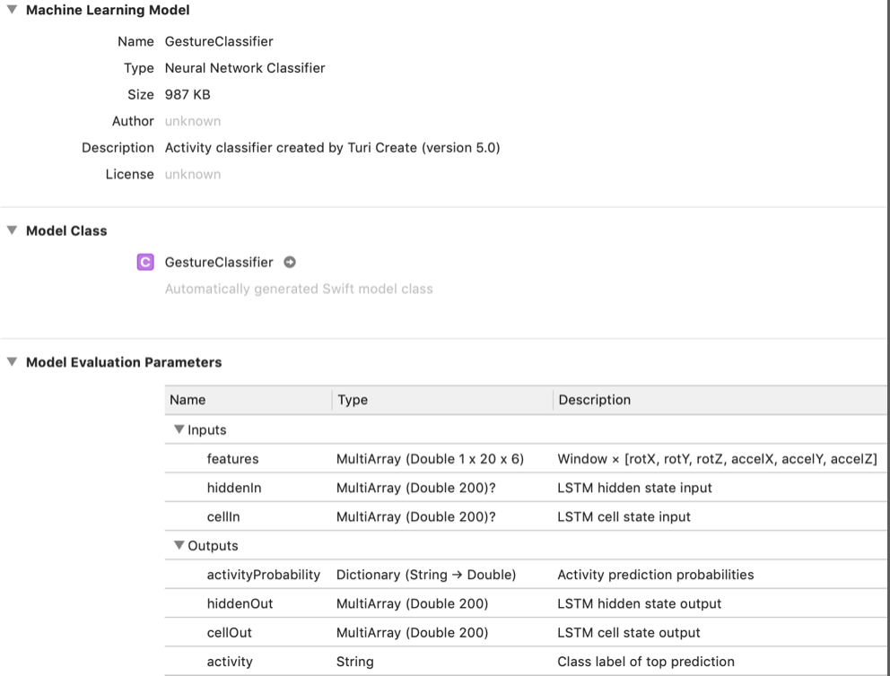
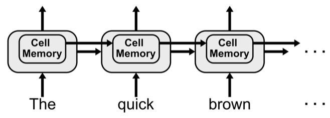

# Chapter 12: Training a Model for Sequence Classification

------

In this chapter, you’ll learn about neural networks designed to work with sequences. You’ll also learn how to use Turi Create to train an activity classification model using data from the previous chapter.

------

## 大綱

- [Creating a model](#1)
  - [Splitting sequential data](#2)
  - [But sometimes…](#3)
  - [Training the model](#4)
- [Getting to know your model](#5)
  - [Recurrent neural networks](#6)
  - [Long short-term memory](#7)
- [Turi Create’s activity classifier](#8)
- [A note on sequence classification](#9)
- [Key points](#10)

------


<h2 id="1">Creating a model</h2>

- How to use Turi Create’s task-focused API to train a model for activity detection.
- **Step1: 讀取資料**

```python
import turicreate as tc
import activity_detector_utils as utils

train_sf = tc.SFrame("data/cleaned_train_sframe")
valid_sf = tc.SFrame("data/cleaned_valid_sframe")
test_sf = tc.SFrame("data/cleaned_test_sframe")
```

- 一般來說，訓練分類model, 就先把資料分成train, valid, test三部分，但在處理sequences model有特別需要注意的東西。

------


<h2 id="2">Splitting sequential data</h2>

- **法則1: training with sequences: keep samples related to individual sequences grouped together and in order.** 

  - Trained an image classifier, you may have divided the images into training, validation and test sets **randomly**.
  - 但訓練sequences classifier model不可以直接利用randomly
    - The very nature of sequences is that samples do relate to each other. Order and grouping both matter — that’s what makes them sequences! 

- **法則2: use data from as many sources as possible.**

  - 從單一source所得到sequences data 有可能跟另外source所得到sequences data所得到pattern有很大差別，在訓練時要盡量達到source多樣化，避免model只學到某個source的pattern,

  - 1000 recordings from one person VS **10 recordings from 100 people(好)**

    These two plots show similar values for several features, but some features are quite different between users

    

- **法則3: don’t split your datasets by sequence, split them by source**

  - 如果從某個人那邊拿到10 recordings, 那就全部放到train, validation or test 其中一個set中，而不要把這個10 recordings按比例分配到所有set中ex. train(3), validation(3) test(4) 

  - Make sure you know the source of each of your data samples, and try to put all the data from any particular source into the same set: train, validation or test.

    

------


<h2 id="3">But sometimes…</h2>

- 在實作上，通常不會有這麼多的data, 讓我們分成train, validation, test, 因此會先分成train, test, 每次再從train中隨機抓取一些當作validation.
  - For example, the one provided with the chapter contains data from just two people. You’d lose too much training data if you separated these users, so you’d need to accept training and validating on data from both of them.
- Divides an SFrame randomly into two smaller SFrames, while still maintaining proper sequence groupings. 
  - it splits data based on session IDs, which means it keeps sequences organized together


```python
train, valid =
  tc.activity_classifier.util.random_split_by_session(
    train_sf, session_id=’sessionId’, fraction=0.9)
```

- if you see a particularly bad split — especially when you know the original data was well balanced — then you should try splitting it again.


------


<h2 id="4">Training the model</h2>

- It’s good to first take a small portion of your training data and see if you can get the model to overfit it. 
  - Overfitting is usually a bad thing — it means your model is memorizing the training data instead of learning a more general solution 
  - but it also shows that the model is actually capable of learning something from your data
- Several problems you’ll need to address:
  - A bug in the model.
  - A model too simple to solve the problem.
  - A model architecture incapable of solving the problem
  - Poorly tuned hyperparameters
  - Maybe the problem is the problem itself. Machine learning isn’t the right solution to every problem
- **Step1: 準備開始訓練**
  - method參數
    - **dataset**: Your training dataset, stored as an SFrame.
    - **session_id**: The name of the column in dataset that stores the session ID associated with each row. 
      - create keeps data with the same session ID grouped together and in order, and then trains over it in chunks the size of prediction_window rows.
    - **target**: The name of the column that contains the labels you want the model to predict. In this case, it’s activity.
    - **features**: This is an optional list of columns to use for training. If you don’t supply it, then create uses all the columns as features except for the ones you specified for session_id and target. More on this in a bit.
    - **prediction_window**: How many samples (i.e. rows of data) the model looks at to make a prediction. More on this later.
    - **validation_set**:  if you don’t supply it, and dataset contains more than 100 sessions, then create will automatically make a validation set by randomly selecting sessions from dataset
    - **max_iterations**: The maximum number of epochs create will train over. 

```python
model = tc.activity_classifier.create(
  dataset=train_sf, session_id=’sessionId’, target=’activity’,
  features=[
    "rotX", "rotY", "rotZ", "accelX", "accelY", "accelZ"],
  prediction_window=20, validation_set=valid_sf,
  max_iterations=20)
```

- **features參數討論**
  - 不一定需要所有features，其實只要幾個features就可以足夠分辨不同pattern
  - There are still clearly visible patterns, even when using just these three features


- **prediction_window參數討論**
  - It specifies how many samples the model needs to look at each time it makes a prediction
  - If the prediction window is 50 and Core Motion sends the app 10 updates per second, it will take five seconds to collect enough data to make one prediction.
    - You collected data at 25 samples per second, so this window size of 20 means the model needs 0.8 seconds worth of data per prediction.

- **Step2: 開始進行訓練**


- 235057: 表示總共有235057列在training dataset.
- 400: training on sequences of 400 samples
  - 1 window有20個sample, Turi會批次進行連續20個window 
  - 20 window * 20 sample = 400
  - training with a prediction window of 20 samples, and Turi Create’s underlying implementation always trains in chunks of 20 consecutive windows. If a session doesn’t have enough samples available, the end of the sequence gets padded with zeros.
- 216: Finally, it reports the number of sessions in your training dataset. This matters most when you don’t supply a validation set, because create will use some of these sessions for validation if there are more than 100 sessions available
- 在訓練過程要繼續觀察是否有overfiiting的情況。
  - you need to check these updates for signs of overfitting. If the training accuracy continues to improve but the validation accuracy stalls or begins to decline, then the model has begun to overfit.

- **Step3: 觀察錯誤**

```python
metrics = model.evaluate(test_sf)
print(metrics[’accuracy’])

print(metrics)
```

- Accuracy isn’t everything, though. You have access to various other results, including precision, recall, a confusion matrix, and more.
- The confusion matrix is particularly useful here. It lets you know not just whether or not your model was correct, but where it made mistakes.


- 數字較大的部分都表示預測正確，數字較小就是預測錯誤的動作。
  - Ｐredictions with the highest counts: They are all correct predictions, with over 5,000 for each of the gestures and over 13,000 for rest_it. On the other hand, each of the incorrect predictions happened only a small number of times


- 錯誤分析
  - chopping is actually quite similar to shaking — if a person chops very quickly it might appear similar to a shake


**Step4: save model**

```python
model.export_coreml("GestureClassifier.mlmodel")
model.save("GestureClassifier")
```


------


<h2 id="5">Getting to know your model</h2>



- **features:** MLMultiArray of Doubles you’ll pass as input.
  -  If you haven’t seen MLMultiArray before, don’t worry, it’s nothing too new. It’s basically just a multidimensional array that Core ML uses to work efficiently with data. 
  - This one is sized to store a single prediction window’s worth of values for each of the features you used while training: rotation and acceleration due to the user around the X, Y and Z axes.
- **activityProbability**: Dictionary the model outputs that includes the probabilities assigned to predictions for each of the classes. In the case of this project, that means probabilities for the gesture types “rest_it,” “shake_it,” etc.
- **activity:** String the model outputs indicating the activity class predicted with the highest probability.
- other things: hiddenIn, cellIn, hiddenOut and cellOut? And what’s this mysterious new acronym “LSTM” mentioned in all their descriptions?

------


<h2 id="6">Recurrent neural networks</h2>

- [上課筆記](https://app.gitbook.com/@cheng-htaiwan/s/deep-learning-specialization/course-5-sequence-models/week-1-recurrent-neural-networks/recurrent-neural-networks)


------


<h2 id="7">Long short-term memory</h2>

[上課筆記](https://app.gitbook.com/@cheng-htaiwan/s/deep-learning-specialization/course-5-sequence-models/week-1-recurrent-neural-networks/recurrent-neural-networks/long-short-term-memory-lstm)



------


<h2 id="8">Turi Create’s activity classifier</h2>

- ### [ConvLSTM]([https://medium.com/@xiaosean5408/convlstm%E7%B0%A1%E4%BB%8B-convolutional-lstm-network-a-machine-learning-approach-for-precipitation-nowcasting-84fa4541cb46](https://medium.com/@xiaosean5408/convlstm簡介-convolutional-lstm-network-a-machine-learning-approach-for-precipitation-nowcasting-84fa4541cb46))


- **hiddenOut** is the output from the LSTM itself
- **cellOut** is the LSTM’s internal memory state after making the prediction. 
- **hiddenIn and cellIn** are the inputs you use to pass to the model those outputs from the previous prediction. 
- to indicate the start of a new sequence, you’ll pass nil to the model for both hiddenIn and cellIn.
- take the hiddenOut and cellOut values from the previous prediction and pass those back to the model as hiddenIn and cellIn


------


<h2 id="9">A note on sequence classification</h2>


------


<h2 id="10">Key points	</h2>

- Turi Create’s activity classification API can help you easily make models capable of recognizing human activity from motion data. However, it can be used for more than just human activity detection — it’s basically a generic classifier for numeric sequences.
- Try isolating data from a single source into one of the train, validation or test sets.
- Prefer a balanced class representation. In cases where that’s not possible, evaluate your model with techniques other than accuracy, such as precision and recall.
- Sample/shuffle sequential data as full sequences, not as individual rows.
- First train on just a small portion of your training set and make sure you can get the model to overfit. That’s the best way to find problems with your model, because if it can’t overfit to a small dataset, then you likely need to make changes before it will be able to learn at all.
- Train multiple models and run multiple experiments until you find what works best for your app.
- RNNs process data serially, so they’re slower than CNNs, both when training and performing inference.
- One-dimensional convolutions are commonly used to extract temporal features from sequences prior to passing them into RNNs.
- RNNs are a good choice for sequential data, with LSTMs being the most commonly used variant because they train (relatively) easily and perform well. However, they are not the only models that work well for sequences.
