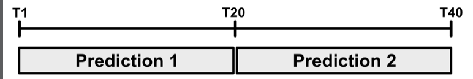
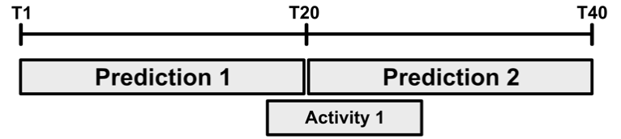
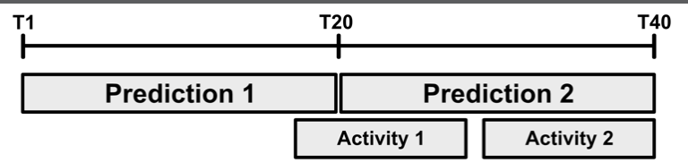
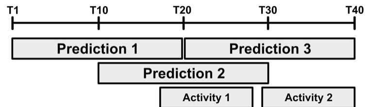
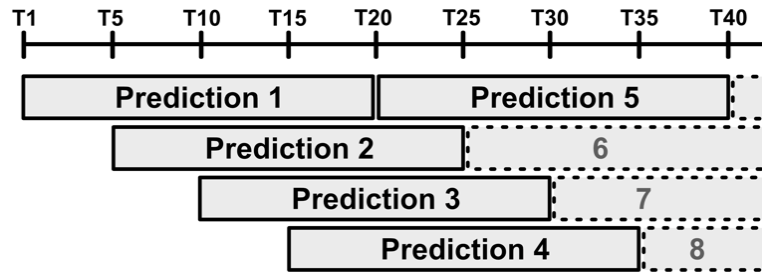
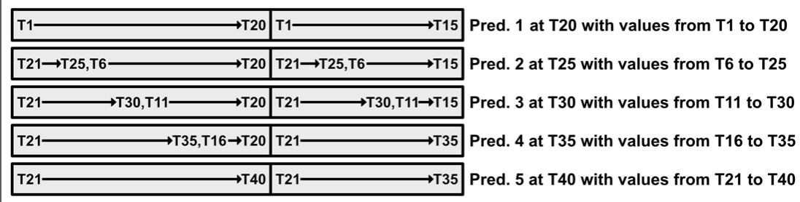

# Chapter 13: Sequence Classification

------

In this chapter, you’ll learn how to pass real-time sequential data captured from a device’s motion sensors into your Core ML model. You’ll learn some tricks to help keep your apps responsive and accurate while processing sequences of streaming data.

------

## 大綱

- [Classifying human activity in your app](#1)
  - [Overlapping prediction windows](#2)
  - [Buffering motion data](#3)
  - [Making predictions with your model](#4)
- [Key points](#5)

------


<h2 id="1">Classifying human activity in your app</h2>

- Step1: imort framework

```Swift
import CoreML
```

- Step2: 宣告重要參數
  - 這些參數必須跟訓練model所設置的參數相同

```Swift
static let samplesPerSecond = 25.0
static let numFeatures = 6
static let windowSize = 20
```

- Step3: 利用剛剛的參數，告訴motionManager多久要傳送一次資料

```swift
motionManager.deviceMotionUpdateInterval = 1.0 / Config.samplesPerSecond
```

- Step4: 將對於MLMultiArray的形式進行獨立處理

```swift
static private func makeMLMultiArray(numSamples: Int) -> MLMultiArray? {
  return try? MLMultiArray(
      shape: [1, numSamples, Config.numFeatures] as [NSNumber],
      dataType: MLMultiArrayDataType.double)
}

let modelInput: MLMultiArray! =
  GameViewController.makeMLMultiArray(numSamples: Config.windowSize)
```


------


<h2 id="2">Overlapping prediction windows</h2>

- 為什麼需要Overlapping prediction
  - 有時候activity並不會剛剛好都在一個time區間內被完整的預測，可能剛好跨在不同的time區間
- Case1: 完美清況



- Case2: activity1剛好落在前後兩個區間，這樣的情況，有可能導致兩個區間的predition都產生錯誤



- Case2: activity2雖然完整落在後區間，但有可能因為夾雜activity1導致兩個區間的predition也都產生錯誤



- 利用Overlapping的方式，增加多次prediction, 提升prediction的正確率



- 將overlapping細切window offset = 5, 原本T1~T20只會產生一次prediction, 現在會變成4次predition



- 原本一個MLMultiArray是對應一個window的資料, 但現在變成4個，若產生4個MLMultiArray來處理多次的preditions這樣會需要很多memory空間，利用buffer的方式，來暫存等會所需的資料。
  - 概念: buffer的空間 = windowSize + windowOffset * (numWindows - 1) = 20 + 5 * (4 - 1) = 20 + 15
  - T1~T20, 此時完成第一個預測，同時buffer內存了T1~T15的資料
  - 當T21~T25資料來了，window和buffer拋棄掉T1~T5的資料，同時完成T6~T25第二個預測



```swift
static let bufferSize =
  windowSize + windowOffset * (numWindows - 1)

let dataBuffer: MLMultiArray! =
  GameViewController.makeMLMultiArray(numSamples: Config.bufferSize)
var bufferIndex = 0
var isDataAvailable = false
```


------


<h2 id="3">Buffering motion data</h2>

- Step5: 確保modelInput 和dataBuffer都不為空

```Swift
guard modelInput != nil, dataBuffer != nil else {
  displayFatalError(error: "Failed to create required memory storage")
  return
}
```

- Step6: 每次資料來時都要更新dataBuffer
  - @Inline: tells the Swift compiler to replace any calls to this function with the contents of the function itself, ensuring your code executes as quickly as possible.
  - That MLMultiArray is arranged as a 3-dimensional tensor, indexed as [batch, sample, feature]. The model’s batch size is always one, so the first index value here is always 0.

```swift
@inline(__always) func addToBuffer(
  _ sample: Int, _ feature: Int, _ value: Double) {
  dataBuffer[[0, sample, feature] as [NSNumber]] =
    value as NSNumber
} 
```

- Step7: Copies motion data into the correct locations in the large buffer backing the overlapping prediction windows described earlier.
  - This for loop ensures each value is stored at the position indexed by bufferIndex, as well as a position that is one window-span later in the buffer. The continue statement ensures that second write attempt is not outside the buffer’s bounds, which would crash the app. 
  - call addToBuffer repeatedly to save the relevant data from the CMDeviceMotion object passed to this method. **It’s extremely important to store only the features your model expects**, and in exactly the order it expects them. 


```swift
func bufferMotionData(_ motionData: CMDeviceMotion) {
  for offset in [0, Config.windowSize] {
    let index = bufferIndex + offset
    if index >= Config.bufferSize {
      continue
    }
    addToBuffer(index, 0, motionData.rotationRate.x)
    addToBuffer(index, 1, motionData.rotationRate.y)
    addToBuffer(index, 2, motionData.rotationRate.z)
    addToBuffer(index, 3, motionData.userAcceleration.x)
    addToBuffer(index, 4, motionData.userAcceleration.y)
    addToBuffer(index, 5, motionData.userAcceleration.z)
  }
}
```

- Step7: 到目前為止只是把資料放到buffer中, 最終是需要把資料放到dataInput讓模型進行預測

  - To make those copies as fast as possible, you’ll be using low level pointers to copy chunks of memory directly. 
  - calculate the number of bytes it takes to represent a prediction window within an MLMultiArray, 

  ```swift
  static let windowSizeAsBytes = doubleSize * numFeatures * windowSize
  static let windowOffsetAsBytes = doubleSize * numFeatures * windowOffset
  ```

  ```swift
  // 1. This value will be nil whenever the game is not expecting a gesture, and this guard statement ensures this method doesn’t process motion data in those cases.
  guard expectedGesture != nil else {
    return
  }
  // 2. pass it the CMDeviceMotion object given to this method, and it stores the motion data in the appropriate locations within dataBuffer 
  bufferMotionData(motionData)
  // 3. update bufferIndex to keep track of the next available space in the buffer
  bufferIndex = (bufferIndex + 1) % Config.windowSize
  // 4. update isDataAvailable to indicate you have at least one full window’s worth of data.
  if bufferIndex == 0 {
    isDataAvailable = true
  }
  // 5. This if-statement ensures you make predictions at the correct times. 
  if isDataAvailable &&
     bufferIndex % Config.windowOffset == 0 &&
     bufferIndex + Config.windowOffset <= Config.windowSize {
    // 6. determine which prediction window you’re working with 
    let window = bufferIndex / Config.windowOffset
    // 7. copy the samples for window from dataBuffer into modelInput
    memcpy(modelInput.dataPointer,
           dataBuffer.dataPointer.advanced(
             by: window * Config.windowOffsetAsBytes),
           Config.windowSizeAsBytes)
    // 8
    // TODO: predict the gesture
       predictGesture(window: window)
  }
  ```

  

------


<h2 id="4">Making predictions with your model</h2>

- Step8: Add your gesture recognition model into the app by initializing the following property with the other ML-related properties in GameViewController

```swift
let gestureClassifier = GestureClassifier()
```


- Step9: Maintain an array of GestureClassifierOutputs, so add the following property for that

```swift
var modelOutputs =
  [GestureClassifierOutput?](repeating: nil, count: Config.numWindows)
```


- Step10: To avoid reacting to low probability predictions, you’ll define a threshold that the probability must exceed to be considered sure enough to act upon

```swift
static let predictionThreshold = 0.9
```


- Step11: write the method that uses your trained model to recognize gestures.

```swift
“func predictGesture(window: Int) {
  // 1. 取得上個預測的結果的輸出值，並丟入這次的預測中(LSTM特秀)
  let previousOutput = modelOutputs[window]
  let modelOutput = try?
    gestureClassifier.prediction(
      features: modelInput,
      hiddenIn: previousOutput?.hiddenOut,
      cellIn: previousOutput?.cellOut)
  // 2. 將這次預測的結果存回，準備給下次預測時使用
  modelOutputs[window] = modelOutput
  // 3. 找出最高機率的activity
  if let prediction = modelOutput?.activity,
     let probability =
       modelOutput?.activityProbability[prediction] {
    // 4. 如果是rest it, 表示是未定義的動作
    if prediction == Config.restItValue {
      return
    }
    // 5. 如果此動作的機率大於Threshold
    if probability > Config.predictionThreshold {
      // 6. 此動作剛好是遊戲中我們目標期待的動作
      if prediction == expectedGesture {
        updateScore()
      } else {
        gameOver(incorrectPrediction: prediction)
      }
      // 7. resets expectedGesture to nil so that the app stops processing motion data for a while. The starter project’s existing game logic will set this to a new gesture when appropriate 
      expectedGesture = nil
    }
  }
}
```


------


<h2 id="5">Key points</h2>


- Use **overlapping prediction windows** to provide faster, more accurate responses.
- Call your model’s prediction method to classify data.
- Pass **multi-feature inputs to your models via MLMultiArray objects**.
- **Arrange input feature values in the same order you used during training**. The model will produce invalid results if you arrange them in any other order.
- When processing sequences over multiple calls to prediction, **pass the hidden and cell state outputs from one timestep as additional inputs to the next timestep.**
- Ignore predictions made with probabilities lower than some reasonable threshold. But keep in mind, models occasionally make incorrect predictions with very high probabilitity, so this trick won’t completely eliminate bad predictions.