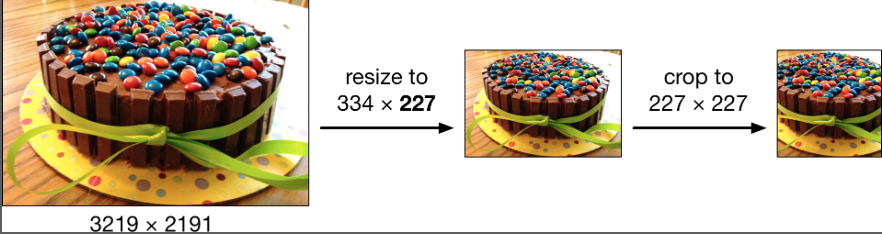
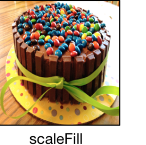
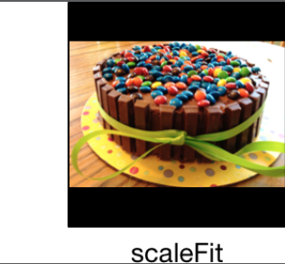
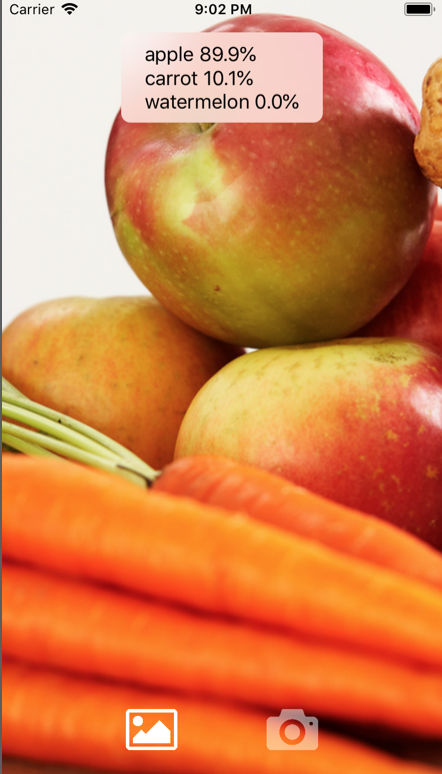

# Chapter 2: Getting Started with Image Classification

------

In this chapter, you’ll build your first iOS app by adding a CoreML model to detect whether a snack is healthy or unhealthy. You’ll focus on how machine learning can be used to solve classification problems such as trying to identify what an object might be.

------

## 大綱

- [Is that snack healthy?](#1)
- [Core ML](#2)
- [Vision](#3)
- [Creating the VNCoreML request](#4)
  - [Crop and scale options](#5)
- [Performing the request](#6)
  - [Image orientation](#7)
  - [Trying it out](#8)
- [Showing the results](#9)
  - [What if the image doesn’t have a snack?](#10)
  - [What if there’s more than one object in the image?](#11)
- [How does it work?](#12)
  - [Into the next dimension](#13)
  - [A concrete example](#14)
- [Multi-class classification](#15)
- [Key points](#16)

------

<h2 id="1">Is that snack healthy?</h2>

- **A classifier**:  a machine learning model that takes an input of some kind, in this case an image, and determines what sort of “thing” that input represents. 
  - **An image classifier** tells you which category, or class, the image belongs to.
- **Binary** means that the classifier is able to distinguish between two classes of objects. 
  - For example, you can have a classifier that will answer either “cat” or “dog” for a given input image, just in case you have trouble telling the two apart.
- In this chapter you’ll learn how to build **an image classifier that can tell the difference between healthy and unhealthy snacks**.
  - using a ready-made model that has already been trained
-  The image classifier
  - **Input**: an image 
  - **Output** : a probability distribution, a list of numbers between 0 and 1

------

<h2 id="2">Core ML</h2>

- Core ML models are packaged up in a **.mlmodel file**. 
  - This file contains both **the structural definition of the model** , **the learned parameters (or the “weights”)**.
- **The HealthySnacks model** type is Neural Network Classifier
  - this model was made using a tool called **Turi Create** and it uses **SqueezeNet v1.1**, a popular deep learning architecture for mobile apps.
  - The main benefit of SqueezeNet is that it’s small, about 5 MB.

- There is **only one** input, a color image that must be **227 pixels wide and 227 pixels tall.**
  - You cannot use images with other dimensions. The reason for this restriction is that the SqueezeNet architecture expects an image of exactly this size
- When you add an .mlmodel file to a project, Xcode does something smart behind the scenes: 
  - **It creates a Swift class** with all the source code needed to use the model in your app. 
- Most importantly that the images need to **be scaled to 227×227 pixels and placed into a CVPixelBuffer object** before you can call the prediction() method


------

<h2 id="3">Vision</h2>

- Vision helps with computer vision tasks.
  -  For example, it can detect rectangular shapes and text in images, detect faces and even track moving objects
- Vision makes it easy to run Core ML models that take images as input.
  - Vision will automatically resize and crop the image.
- Vision also performs a few other tricks, such as rotating the image so that it’s always right-size up, and matching the image’s color to the device’s color space.
- The way Vision works is that you create a **VNRequest** object, which describes the task you want to perform, and then you use a **VNImageRequestHandler** to execute the request. Since you’ll use Vision to run a Core ML model, the request is a subclass named **VNCoreMLRequest**. 


------

<h2 id="4">Creating the VNCoreML request</h2>

- 要建立VNCoreML request，需要先import 兩個重要framework

```swift
import CoreML
import Vision
```

- Don’t create a new request object every time you want to classify an image — that’s wasteful.
  - 利用lazy property來進行reuse, 不要每次都建立一個新的request物件。

```Swift
lazy var classificationRequest: VNCoreMLRequest = {
        do {
            // HealthySnacks是加入CoreML model後，Xcode自動產生的class
            let healthySnacks = HealthySnacks()
            // VNCoreMLModel是將coreML model跟Vision再作進一步封裝
            let visionModel = try VNCoreMLModel(for: healthySnacks.model)
            // 透過VNCoreMLRequest來將input image自動轉換成visionModel所需要的input
            // 227*227和CVPixelBuffer
            let request = VNCoreMLRequest(model: visionModel, completionHandler: { [weak self] (request, error) in
                // 處理預測完成的結果
                self?.processObservations(for: request, error: error)
            })
            // 設定所需要CropAndScaleOption的策略
            request.imageCropAndScaleOption = .centerCrop
            return request
        } catch {
            fatalError("無法建立VNCoreMLModel: \(error)")
        }
    }()
```

------

<h2 id="5">Crop and scale options</h2>

- Vision will automatically scale the image to the correct size. 

- For the best results you should set the request’s imageCropAndScaleOption property so that it uses the same method that was used during training.

- centerCrop:

  - The .centerCrop option first resizes the image so that the smallest side is 227 pixels, and then it crops out the center square:

  

- scaleFill:

  - scaleFill, the image gets resized to 227×227 without removing anything from the sides, so it keeps all the information from the original image — but if the original wasn’t square then the image gets squashed

  

- scaleFit:

  - scaleFit keeps the aspect ratio intact but compensates by filling in the rest with black pixels

  

------

<h2 id="6">Performing the request</h2>

```swift
  // 取得圖片進行預測分類
  func classify(image: UIImage) {
    // 先將UIImage轉換成CIImage
    guard let ciImage = CIImage(image: image) else {
        print("無法建立CIImage")
        return
    }
    // 取出image的方向屬性
    let orientation = CGImagePropertyOrientation(image.imageOrientation)
    DispatchQueue.global(qos: .userInitiated).async {
        // 建立VNImageRequestHandler, 將CIImage跟方向屬性傳入
        let handler = VNImageRequestHandler(ciImage: ciImage, orientation: orientation)
        do {
            // 讓requestHandler來執行剛剛定義好的request
            try handler.perform([self.classificationRequest])
        } catch {
            print("無法執行classification: \(error)")
        }
    }
  }
```

------

<h2 id="7">Image orientation</h2>

- iOS keeps track of the true orientation of the image with the **imageOrientation** property. 
- If you’re holding the phone **in portrait mode** and snap a picture, its imageOrientation will be **.right** to indicate the camera has been rotated 90 degrees clockwise. 0 degrees means that the phone was in landscape with the Home button on the right.
- **Core ML model does not take “image orientation” as an input**, so it will see only the “raw” pixels in the image buffer without knowing which side is up.
  - Image classifiers are typically trained to account for images being **horizontally flipped** so that they can recognize objects facing left as well as facing right, but they’re usually **not trained to deal with images that rotated by 90, 180 or 270 degrees**.
  - This is why **you need to tell Vision about the image’s orientation** so that it can properly rotate the image’s pixels before they get passed to Core ML.”


------

<h2 id="8">Trying it out</h2>


------

<h2 id="9">Showing the results</h2>

- The request parameter is of type VNRequest, the base class of VNCoreMLRequest. If everything went well, the **request’s results array contains one or more VNClassificationObservation objects**. 
- Vision **automatically sorts the results by confidence**, so results[0] contains the class with the highest confidence — the winning class. 

- 

```swift
 // 處理預測的結果
    func processObservations(for request: VNRequest, error: Error?) {
        DispatchQueue.main.async {
            if let results = request.results as? [VNClassificationObservation] {
                if results.isEmpty {
                    self.resultsLabel.text = "nothing found"
                } else {
                    self.resultsLabel.text = String(format: "%@ %.1f%%",
                                                    results[0].identifier,
                                                    results[0].confidence * 100)
                }
            } else if let error = error {
                self.resultsLabel.text = "error: \(error.localizedDescription)"
            } else {
                self.resultsLabel.text = "???"
            }
            
            self.showResultsView()
        }
    }
```

------

<h2 id="10">What if the image doesn’t have a snack?</h2>

- What happens when you show it a kind of snack that it has never seen before, or maybe even a totally different kind of object — maybe something that isn’t even edible?
- 那[VNClassificationObservation]中results[0]和results[1]的差異不會很大

```
element 0: healthy 51%
element 1: unhealthy 49%
```

- 針對此種case的處理方式，就是小於一定confidence就處理成不確定。

```swift
 // 處理預測的結果
    func processObservations(for request: VNRequest, error: Error?) {
        DispatchQueue.main.async {
            if let results = request.results as? [VNClassificationObservation] {
                if results.isEmpty {
                    self.resultsLabel.text = "nothing found"
                } else if results[0].confidence < 0.8 {
                  // 小於一定confidence就處理成不確定
                    self.resultsLabel.text = "not sure"
                } else {
                    self.resultsLabel.text = String(format: "%@ %.1f%%",
                                                    results[0].identifier,
                                                    results[0].confidence * 100)
                }
            } 
          ....
          ....
    }
```


------

<h2 id="11">What if there’s more than one object in the image?</h2>

- Image classification always looks at the **entire image and tries to find out what the most prominent object** in the image is.
- 這種case其實也是[VNClassificationObservation]中results[0]和results[1]的差異不會很大, 所以一樣處理的方式
  - 小於一定confidence就處理成不確定

------

<h2 id="12">How does it work?</h2>

- Convolutional neural network
- Core ML treats the **model as a black bo**x, where input goes into one end and the output comes out the other. Inside this black box it actually looks like a pipeline with multiple stages


------

<h2 id="13">Into the next dimension</h2>

- The input image is 227×227 pixels and is a color image, so you need 227 × 227 × 3 = 154,587 numbers to describe an input image
- 每張圖都是154,587特徵向量，CNN會透過特殊處理方式找到一條**decision boundary**來將圖片進行分類。

------

<h2 id="14">A concrete example</h2>

- To classify a new image, the neural network will apply all the **transformations** it has learned during training, and then it looks at which side of the line the transformed image falls. And that’s the secret sauce of neural network classification!


------

<h2 id="15">Multi-class classification</h2>

- a multi-class classifier that was trained on the exact same data as the binary healthy/unhealthy classifier but that can detect the **individual snacks**.
- 替換新的model

```swift
   lazy var classificationRequest: VNCoreMLRequest = {
        do {
            // MultiSnacks預測多分類的model
            let multiSnacks = MultiSnacks()
            // VNCoreMLModel是將coreML model跟Vision再作進一步封裝
            let visionModel = try VNCoreMLModel(for: multiSnacks.model)
            // 透過VNCoreMLRequest來將input image自動轉換成visionModel所需要的input
            // 227*227和CVPixelBuffer
            let request = VNCoreMLRequest(model: visionModel, completionHandler: { [weak self] (request, error) in
                // 處理預測完成的結果
                self?.processObservations(for: request, error: error)
            })
            // 設定所需要CropAndScaleOption的策略
            request.imageCropAndScaleOption = .centerCrop
            return request
        } catch {
            fatalError("無法建立VNCoreMLModel: \(error)")
        }
    }()
```

- 針對Multi-class classification取得top3預測

```swift
  // 處理預測的結果
    func processObservations(for request: VNRequest, error: Error?) {
        DispatchQueue.main.async {
            if let results = request.results as? [VNClassificationObservation] {
                if results.isEmpty {
                    self.resultsLabel.text = "nothing found"
                } else {
                  // 取得top3預測
                    let top3 = results.prefix(3).map { observation in
                        String(format: "%@ %.1f%%", observation.identifier,observation.confidence * 100)
                    }
                    self.resultsLabel.text = top3.joined(separator: "\n")
                }
            } else if let error = error {
                self.resultsLabel.text = "error: \(error.localizedDescription)"
            } else {
                self.resultsLabel.text = "???"
            }
            
            self.showResultsView()
        }
    }
```



------

<h2 id="16">Key points</h2>

- Obtain a trained .mlmodel file from somewhere. You can sometimes find pre-trained models on the web (Apple has a few on its website) but usually you’ll have to build your own. You’ll learn how to do this in the next chapter.
- Add the .mlmodel file to your Xcode project.
- Create the **VNCoreMLRequest** object (just once) and give it a **completion handler that looks at the VNClassificationObservation objects describing the results**.
- For every image that you want to classify, **create a new VNImageRequestHandler** object and tell it to **perform** the **VNCoreMLRequest**.

