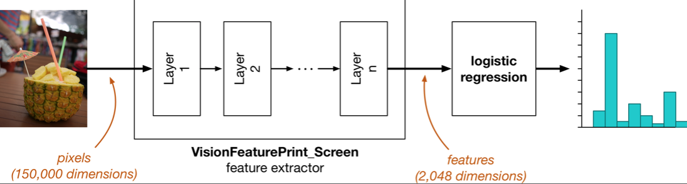
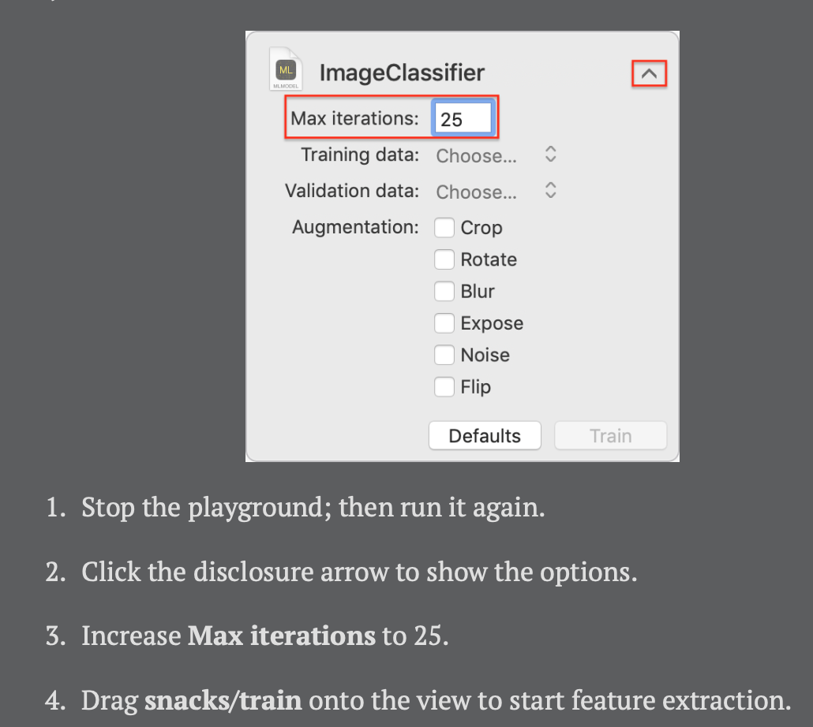

# Chapter 3: Training the Image Classifier

------

In this chapter, you’ll start to build your first machine learning model using Create ML. You’ll be introduced to the dataset used to create the model, along with how Create ML uses transfer learning to get amazing classification results. Moreover, you’ll learn what it means to evaluate the performance of your model.

------

## 大綱

- [The dataset](#1)
- [Create ML](#2)
- [How we created the dataset](#3)
- [Transfer learning](#4)
  - [A closer look at the training loop](#5)
  - [What is feature extraction?](#6)
- [Logistic regression](#7)
- [Looking for validation](#8)
  - [Overfitting happens](#9)
- [More metrics and the test set](#10)
  - [Precision and recall](#11)
- [Exporting to Core ML](#12)
  - [Classifying on live video](#13)
- [Recap](#14)
- [Key points](#15)

------

<h2 id="1">The dataset</h2>

- Machine learning is all about training a model to learn “rules” by looking at a lot of examples.
- Dataset架構
  - The dataset is split into three folders: **train, test and val**
  - **It’s important that you don’t use images from the validation set or test set for training**
- The name of the folder will be used as the class name — also called the **label or the target**.


------

<h2 id="2">Create ML</h2>

- Use Create ML to train a multi-class classifier
- **CreateMLUI** doesn’t work in an iOS playground, only for **macOS playground**.
- **Create ML** loads data into MLDataTable structures, which **keep only the image metadata in memory**, then loads the images themselves on demand. 
  - This means that you can have very large MLDataTables that contain a lot of data

------

<h2 id="3">How we created the dataset</h2>

- **Collecting good training data** can be very time consuming! It’s often considered to be the most expensive part of machine learning.
- Here are some of the things we had to do to **clean up the data** (只針對此model的圖片清理方式，其他不一定適用)
  - The pictures in Open Images often contain more than one object. We only kept images with just one main object.
  - Sometimes, the lines between categories are a little blurry. removed these ambiguous images from the dataset. 
  - We made sure the selected images were meaningful for the problem you’re trying to solve.
  - we included a variety of images. We did not only want to include “perfect” picturesㄡ
- **只有高品質的dataset才有機會訓練出高品質的model。**
  - Creating the dataset took quite a while, but it’s vital. If your dataset is not high quality, then the model won’t be able to learn what you want it to learn. 

------

<h2 id="4">Transfer learning</h2>

- Create ML is currently busy training your model using transfer learning.
- Underlying model used by Create ML is not SqueezeNet but **VisionFeaturePrint_Screen**, 
  - **a model that was designed by Apple specifically for getting high-quality results on iOS devices**.
- Transfer learning **only works successfully when features of your dataset are reasonably similar** to features of the dataset that was used to train the model
- **Create ML** takes a neural network that has already been successfully trained on a large dataset, and then it fine-tunes it on your own data.
  - Currently, Create ML’s image classifier a**lways uses the VisionFeaturePrint_Screen base model**
  - VisionFeaturePrint_Screen is part of iOS 12 and the Vision framework, so models built on this are tiny — kilobytes instead of megabytes, because they do not need to include the base model. 

- **Turi Create** analyzes your training data to **select the most suitable base model**. 

------

<h2 id="5">A closer look at the training loop</h2>


- Initialize the neural network’s “brain” with **small random numbers**. These numbers are known as the **weights or learned parameters** of the model. 
- Let the neural network **make predictions for all the training examples**. 
- **Compare the predictions to the expected answers**. The targets are used to **compute the “error” or loss**, a measure of how far off the predictions are from the expected answers
- To improve the weights and reduce the error, you **calculate the gradient of the loss function**. 
  - This gradient tells you how much each weight contributed to the loss. Using this gradient, you can correct the weights so that next time the loss is a little lower. 
  - This correction step is called **gradient descent**
- Go to step two to **repeat this process hundreds of times** for all the images in the training set. With each training step, the model becomes a tiny bit better

------

<h2 id="6">What is feature extraction?</h2>



- VisionFeaturePrint_Screen transforms the pixel features, which are hard to understand, into features that are much more descriptive of the objects in the images.
- For each input image, VisionFeaturePrint_Screen produces a list of 2,048 numbers
  - These new 2,048 features describe the objects in the images by their true characteristics, which are much more informative than pixel intensities. 
- We need to **transform the data one more time into the 20-dimensional space** that we can interpret as the probability distribution over our 20 types of snacks
- **Create ML** uses these 2,048 numbers as the input to a new machine learning model called **logistic regression**

------

<h2 id="7">Logistic regression</h2>

- The solver that Create ML trains is a classifier called logistic regression.
- Create ML actually uses a small variation of the algorithm — **multinomial logistic regression** — that handles more than two classes.
- “Yhis algorithm finds a straight line / hyperplane that separates the points belonging to different classes in the best way possible.


------

<h2 id="8">Looking for validation</h2>

- **Validation accuracy**

  - During training, it’s useful to periodically check how well the model is doing. 
  - Create ML sets aside a small portion of the training examples — **5%**, so about 240 images. **It doesn’t train the logistic classifier on these images**, but only uses them to evaluate how well the model does

- **Epoch**

  - This means Create ML has given the model a chance to look at all 4,582 training images once (or rather, the extracted feature vectors of all training images). If you do 10 iterations, the model will have seen each training image (or its feature vectors) 10 times.
  - By default, Create ML trains the logistic regression for up to **10 iterations**, but you can change this with the Max iterations setting

  

------

<h2 id="9">Overfitting happens</h2>

- It means that the model has started to remember specific training images.
- There are several ways to deal with overfitting. 
  - The best strategy is to train with **more data**. 
    - you can **augment** your image data by flipping, rotating, shearing or changing the exposure of images.
  - Another trick is adding **regularization** to the model
    - Penalizes large weights, because a model that gives a lot of weight to a few features is more likely to be overfitting.
- Overfitting isn’t the only reason why the validation accuracy can be lower than the training accuracy. 
  - **If your training images are different from your validation images in some fundamental way** (silly example: all your training images are photos taken at night while the validation images are taken during the day), then your model obviously won’t get a good validation score.
  - This is why Create ML **randomly picks 5% of the training images to use for validation**


------

<h2 id="10">More metrics and the test set</h2>

- **The validation set** is often also **used to tune the settings of the learning algorithm** — the so-called hyperparameters
- Evaluate your model only once on this test set, when you’re completely done training it.
  - Save the test set for last and evaluate on it as few times as possible.


------

<h2 id="11">Precision and recall</h2>

- [准确率(Accuracy), 精确率(Precision), 召回率(Recall)和F1-Measure](https://www.zhihu.com/question/19645541)
- Precision
  - 是针对我们**预测结果**而言的，它表示的是**预测为正的样本中有多少是真正的正样本**。
  - 那么预测为正就有两种可能了，一种就是把正类预测为正类(TP)，另一种就是把负类预测为正类(FP)，也就是
    ![[公式]](https://www.zhihu.com/equation?tex=P++%3D+%5Cfrac%7BTP%7D%7BTP%2BFP%7D)
- Recall
  - 是针对我们原来的**样本**而言的，它表示的是样本中的正例有多少被预测正确了。
  - 那也有两种可能，一种是把原来的正类预测成正类(TP)，另一种就是把原来的正类预测为负类(FN)。
    ![[公式]](https://www.zhihu.com/equation?tex=R+%3D+%5Cfrac%7BTP%7D%7BTP%2BFN%7D)

------

<h2 id="12">Exporting to Core ML</h2>

- A Core ML model normally combines **the feature extractor** with **the logistic regression classifier** into a single model
- **A VisionFeaturePrint_Screen-based Core ML model** doesn’t need to include the feature extractor, because it’s part of iOS 12. So the Core ML model is basically just the logistic regression classifier, and quite small!
- The model that’s currently in the Snacks app was created with SqueezeNet as the feature extractor — it’s 5MB. Your new model from Create ML is only **312KB**! 

------

<h2 id="13">Classifying on live video</h2>

- It works on live video from the camera. 
- The **VideoCapture** class uses **AVCaptureSession** to read video frames from the iPhone’s camera at 30 frames per second. 
- It uses Vision to make a prediction and then shows this on the screen in a label.

```swift
  lazy var visionModel: VNCoreMLModel = {
    do {
      let multiSnacks = MultiSnacks()
      return try VNCoreMLModel(for: multiSnacks.model)
    } catch {
      fatalError("Failed to create VNCoreMLModel: \(error)")
    }
  }()
```

```swift
func setUpVision() {
    for _ in 0..<ViewController.maxInflightBuffers {
      let request = VNCoreMLRequest(model: visionModel, completionHandler: {
        [weak self] request, error in
        self?.processObservations(for: request, error: error)
      })

      request.imageCropAndScaleOption = .centerCrop
      classificationRequests.append(request)
    }
  }
```

```swift
 // 從camera取得imag data準備傳送到model中進行預測
func classify(sampleBuffer: CMSampleBuffer) {
    if let pixelBuffer = CMSampleBufferGetImageBuffer(sampleBuffer) {
      // Tell Vision about the orientation of the image.
      let orientation = CGImagePropertyOrientation(UIDevice.current.orientation)

      // Get additional info from the camera.
      var options: [VNImageOption : Any] = [:]
      if let cameraIntrinsicMatrix = CMGetAttachment(sampleBuffer, key: kCMSampleBufferAttachmentKey_CameraIntrinsicMatrix, attachmentModeOut: nil) {
        options[.cameraIntrinsics] = cameraIntrinsicMatrix
      }

      // The semaphore is used to block the VideoCapture queue and drop frames
      // when Core ML can't keep up.
      semaphore.wait()

      // For better throughput, we want to schedule multiple Vision requests
      // in parallel. These need to be separate instances, and inflightBuffer
      // is the index of the current request object to use.
      let request = self.classificationRequests[inflightBuffer]
      inflightBuffer += 1
      if inflightBuffer >= ViewController.maxInflightBuffers {
        inflightBuffer = 0
      }

      // For better throughput, perform the prediction on a background queue
      // instead of on the VideoCapture queue.
      DispatchQueue.global(qos: .userInitiated).async {
        // 透過vison將image data轉成model所需要的格式
        let handler = VNImageRequestHandler(cvPixelBuffer: pixelBuffer, orientation: orientation, options: options)
        do {
          try handler.perform([request])
        } catch {
          print("Failed to perform classification: \(error)")
        }
        self.semaphore.signal()
      }
    }
  }
```

```swift
// 處理model預測回來的結果 
func processObservations(for request: VNRequest, error: Error?) {
    DispatchQueue.main.async {
      if let results = request.results as? [VNClassificationObservation] {
        if results.isEmpty {
          self.resultsLabel.text = "nothing found"
        } else {
          let top3 = results.prefix(3).map { observation in
            String(format: "%@ %.1f%%", observation.identifier, observation.confidence * 100)
          }
          self.resultsLabel.text = top3.joined(separator: "\n")
        }
      } else if let error = error {
        self.resultsLabel.text = "error: \(error.localizedDescription)"
      } else {
        self.resultsLabel.text = "???"
      }

      self.fpsCounter.frameCompleted()
      self.fpsLabel.text = String(format: "%.1f FPS", self.fpsCounter.fps)
    }
  }
}
```

------

<h2 id="14">Recap</h2>

- Training your own Core ML model with Create ML. 
- The default settings got only about 90% accuracy.
- Increasing max iterations increased training accuracy 
- Overfitting might be happening.
  -  Augmenting the data with flipped images reduced the gap between training and validation accuracies, but you’ll need more iterations to increase the accuracies.
- Data is king in machine learning, and who has the most of it usually ends up with a better model.
- **Turi Create** gives you more task-focused models to customize, and lets you get more hands-on with the training process

------

<h2 id="15">Key points</h2>

- You can use **macOS playgrounds to test out Create ML**, and play with the different settings, to create simple machine learning models.
- Create ML allows you to create small models that leverage the built-in Vision feature extractor already installed on iOS 12 devices.
- Ideally, you want the validation accuracy to be similar to the training accuracy.
- There are several ways to deal with overfitting: include **more images, increase training iterations, or augment your data.**
- **Precision and recall** are useful metrics when evaluating your model.