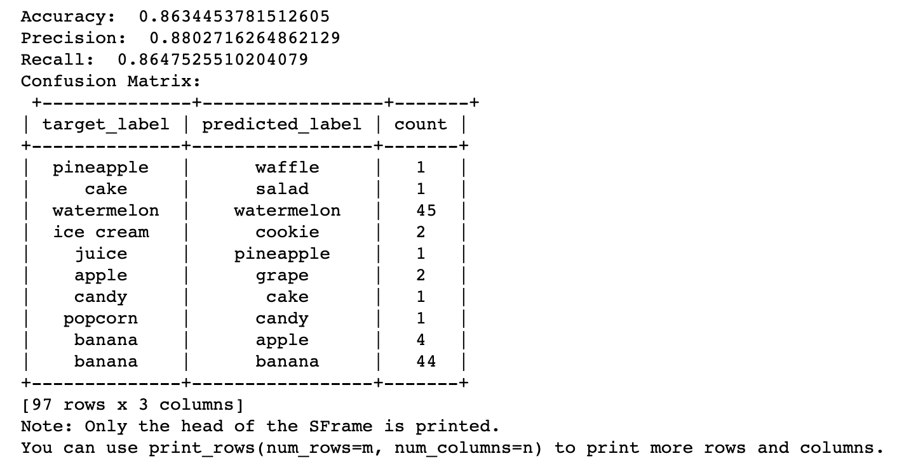

# Chapter 4: Getting Started with Python & Turi Create

------

In this chapter, you’ll get a quick primer on Python. You’ll learn how to setup your Python environment using Conda, and how to install external libraries. You’ll learn how to run and use Jupyter notebooks to iterate quickly with Python

------

## 大綱

- [Python](#1)
- [Packages and environments](#2)
  - [Conda](#3)
- [Installing Anaconda](#4)
  - [Using Anaconda navigator](#5)
- [Setting up a base ML environment](#6)
  - [Python libraries for data science](#7)
  - [Adding Jupyter to base ML environment](#8)
  - [An important note about package versions](#9)
- [Jupyter notebooks](#10)
  - [Starting Jupyter](#11)
  - [Pandas and Matplotlib](#12)
  - [Differences between Python and Swift](#13)
- [Transfer learning with Turi Create](#14)
  - [Creating a Turi Create environment](#15)
  - [List pip-installed packages](#16)
  - [Turi Create notebook](#17)
  - [Let’s do some training](#18)
  - [Validation](#19)
  - [Testing](#20)
  - [Exporting to Core ML](#21)
- [Shutting down Jupyter](#22)
  - [Deactivating the active environment](#23)
- [Useful Conda commands](#24)
- [Docker and Colab](#25)
  - [Docker](#26)
  - [Google Colaboratory](#27)
- [Key points](#28)

------

<h2 id="1">Python</h2>

- Python is the dominant programming language used for data science and machine learning. 
- Python community to support data science and machine learning development. These include
  - **Data science libraries**: Matplotlib, NumPy, Pandas, SciPy
  - **Machine learning libraries**: Caffe2, Keras, Microsoft Cognitive Toolkit, TensorFlow, Theano, scikit-learn
  - **ML-as-a-Service**: Amazon Machine Learning, Google ML Kit, IBM Watson, Microsoft Azure Machine Learning Studio, Turi Create
  - **Tools**: coremltools, virtualenv, pip, Anaconda, Docker, Jupyter notebooks, Google Colaboratory

------

<h2 id="2">Packages and environments</h2>

- Working on machine learning projects requires integrating the correct versions of numerous software libraries, also known as “**packages**”.
- Most people create **environments** where they install specific versions of Python and the packages they need.
  - the environment manager **virtualenv** 
  - the package manager **pip**

------

<h2 id="3">Conda</h2>

- **Conda** handles Python language versions, Python packages, and associated native libraries.
  - **Anaconda**: Includes all of the standard packages needed for machine learning

------

<h2 id="4">Installing Anaconda</h2>

-  https://www.anaconda.com/download/#macos, and download the **Python 3.7 version**
- prompted to **Change Install Location**..., select **Install for me only**. 
  - If it says you can’t install it there, click the Install on a specific disk... button, then click back to the Home button 


------

<h2 id="5">Using Anaconda navigator</h2>

- Anaconda comes with **a desktop GUI** that you can use to create environments and install packages in an environment
- From within Finder, locate and start ~/anaconda3/Anaconda Navigator. 
- Select the Environments tab to see the base (root)
- There are **three ML packages** needed that aren’t in the base environment:
  - **Keras**: A high-level toolkit for building neural networks that works with TensorFlow, Theano, and Microsoft Cognitive Toolkit.
  - **TensorFlow**: Google’s library for building computational graphs.
  - **Turi Create**: Apple’s ML-as-a-Service framework.

------

<h2 id="6">Setting up a base ML environment</h2>

- a quicker start, Import mlenv.yaml into the Navigator


------

<h2 id="7">Python libraries for data science</h2>

- Begin by creating a **custom base environment for ML**, with NumPy, Pandas, Matplotlib, SciPy and scikit-learn.
  - NumPy: Functions for working with multi-dimensional arrays.
  - Pandas: Data structures and data analysis tools.
  - Matplotlib: 2D plotting library.
  - Seaborn: Statistical data visualization library.
  - SciPy: Modules for statistics, optimization, integration, linear algebra, Fourier transforms, and more, using NumPy arrays.
  - scikit-learn: Machine learning library.
- Create a new environment named mlenv, with Python 3.6
- Add the scikit ML libraries: 
  - change Installed to Not installed, search for scikit, and check the checkboxes next to scikit-image and scikit-learn
- Add Seaborn library

------

<h2 id="8">Adding Jupyter to base ML environment</h2>

- Select the Home Tab. Notice the Applications on field contains mlenv, and every app displays an Install button
- Click the Jupyter Notebook Install button

------

<h2 id="9">An important note about package versions</h2>

- 不需盲目更新到最新版本
  - If your code works fine and you don’t need any of the new features or essential bug fixes, then keep your Python installation stable and only update your packages when you have a good reason.

------

<h2 id="10">Jupyter notebooks</h2>

- With Jupyter notebooks, which are a lot like Swift Playgrounds, you can write and run code, and you can write and render markdown to explain


------

<h2 id="11">Starting Jupyter</h2>

- In Anaconda Navigator’s Home tab, with mlenv selected, click the Jupyter Launch button.


------

<h2 id="12">Pandas and Matplotlib</h2>

```python
import numpy as np
import pandas as pd
import matplotlib.pyplot as plt
```

```python
data = pd.read_json('corpus.json', orient='records')
data.head()
data.describe()
data.sort_values(by='title')
```

```python
authors = data.author
freq = authors.value_counts()
freq
```

```python
plt.hist(freq, bins=100)
plt.show()
```

- 快速鍵
  - Help -> Edit Keyboard shortcut.
  - Shift-Tab-Tab: see documentation

------

<h2 id="13">Differences between Python and Swift</h2>

- A major syntax difference between Python and most other programming languages is the importance of **indentation**. With Python, indentation replaces {} to define blocks. ”


```python
if a == b:
    print('a and b are equal')
    if a > c:
        print('and a is also greater than c')
```

```python
if authors is None:
    print('authors is None')
else:
    print('authors is not None')
```

```python
def mysum(x, y):
  # There is no need to write let or var in Python
    result = x + y
    return result

print(mysum(1, 3))
```

```python
mylist = [1, 2]
mylist.append(3)
if mylist:
    print('mylist is not empty')

for value in mylist:
    print(value)

print('List length: %d' % len(mylist))

mylist is not empty
```

------

<h2 id="14">Transfer learning with Turi Create</h2>

- In this section, you’ll create the same HealthySnacks model as the previous chapter, except this time, you’ll use Turi Create


------

<h2 id="15">Creating a Turi Create environment</h2>

- Clone the mlenv environment to create turienv, then install **turicreate** in the new environment. 
- Anaconda doesn’t know about turicreate, so you’ll have to **pip install** it from within Terminal.

```
conda create -n turienv --clone mlenv
conda activate turienv
pip install -U turicreate 
```

------

<h2 id="16">List pip-installed packages</h2>

- In Terminal, use this command to list all of the packages in the active environment or a specific package:

```
conda list
conda list coremltools
```

------

<h2 id="17">Turi Create notebook</h2>

- 啟動notebook

```
jupyter notebook <drag the starter/notebook folder in Finder to here>
```

------

<h2 id="18">Let’s do some training</h2

```python
# Getting the class labels
# 從每個檔案的路徑名，找出對應的label
# ex. apple資料夾下都是放apple的照片，apple就是裡面所有照片的對應label
train_data["label"] = train_data["path"].apply(lambda path: os.path.basename(os.path.split(path)[0]))

# summary() only shows the top 10 classes
train_data["label"].summary()

# 想看多少，就看多少
train_data["label"].value_counts().print_rows(num_rows=20)

# Training
model = tc.image_classifier.create(train_data, target="label", model="VisionFeaturePrint_Screen", verbose=True, max_iterations=10)
```

------

<h2 id="19">Validation</h2>

- 大約在第20次iterations可以發現train_accuracy跟validation_accuracy的差異越來越大，表示model已經開始overfitting了, 根據觀察應該大約在第15次iterations，train_accuracy跟validation_accuracy的差異最接近。所以應該使用第15次iterations後的model。但Turi Create並不會紀錄每一次iterations的model結果，所以只能重新設定成15次，在訓練一次。這就是Keras的優勢，Keras會紀錄每一次iterations的model結果，所以不用在重新訓練一次。

------

<h2 id="20">Testing</h2>

- Accuracy, precision and recall are all similar to the final validation accuracy of the model. 
  - Unlike Create ML, Turi Create gives only overall values for precision and recall, and you need some code to get precision and recall for each class
- The confusion matrix shows only the first 10 rows: the model mistook one “ice cream” image for “candy,” three “apple” images for “banana,” etc. Presented this way, it doesn’t look much like a matrix.

```python
test_data = tc.image_analysis.load_images("snacks/test", with_path=True)
test_data["label"] = test_data["path"].apply(lambda path: os.path.basename(os.path.split(path)[0]))
len(test_data)

metrics = model.evaluate(test_data)
print("Accuracy: ", metrics["accuracy"])
print("Precision: ", metrics["precision"])
print("Recall: ", metrics["recall"])
print("Confusion Matrix:\n", metrics["confusion_matrix"])
```



------

<h2 id="21">Exporting to Core ML</h2>

```python
# displays information about the model 
model

# This saves the model in Turi Create’s own format, which allows you to load it back into the Python notebook later using tc.load_model()
model.save("HealthySnacks.model")

# get a Core ML model
model.export_coreml("HealthySnacks.mlmodel")
```


------

<h2 id="22">Shutting down Jupyter</h2>

- In the Terminal window that ran jupyter_mac.command ; exit;, **press Control-C-C** to stop the server.


------

<h2 id="23">Deactivating the active environment</h2>

```
conda deactivate
```

------

<h2 id="24">useful Conda commands</h2>

- [Conda cheat sheet](https://conda.io/docs/_downloads/conda-cheatsheet.pdf)
- [Conda user guide: Tasks](https://conda.io/en/latest/user-guide/tasks/index.html)

```
# Create a new environment:
conda create -n <env name>

#Clone an existing environment to create a new environment:
conda create -n <new env name> --clone <existing env name>

#Create a new environment from a YAML file:
conda env create -f <.yaml file>

#Activate an environment:
conda activate <env name>

#Install packages in an active environment:
conda install <pkg names>

#Install packages in a non-active environment:
conda install -n <env name> <pkg names>

#Install non-conda packages or TensorFlow and Keras in an active environment: Use pip install instead of conda install. To install multiple packages, create a requirements.txt file listing the packages, one per line, then run this command:
pip install -r requirements.txt

#Start Jupyter from the active environment [in a specific directory]:
jupyter notebook <directory path>

#Shutdown Jupyter: Logout in the Jupyter web pages, then press Control-C-C in terminal window where server is running.

#Deactivate an environment: Run this command in the terminal window where you activated the environment:
conda deactivate

#Remove an environment:
conda remove -n <env name> --all
conda env remove -n <env name>

#Listing environments or packages
List environments; * indicates currently active environment:
conda info --envs
conda env list

#List packages or a specific package:
(activeenv)...$ conda list
(activeenv)...$ conda list <package name>

#In a non-active environment:
conda list -n <non-active env name>
conda list -n <non-active env name> <package name>

```

------

<h2 id="25">Docker and Colab</h2>

- There are two other high-level tools for supporting machine learning in Python: Docker and Google Colaboratory. 


------

<h2 id="26">Docker</h2>

- Docker images can be useful to share pre-defined environments with colleagues, or peers, but at some point they will require an understanding of how to write Docker images


------

<h2 id="27">Google Colaboratory</h2>

- Google Research’s Colaboratory at [colab.research.google.com](colab.research.google.com) is a Jupyter Notebook environment that runs in a browser. 


------

<h2 id="28">Key points</h2>

- Get familiar with **Python**. Its widespread adoption with academics in the machine learning field means if you want to keep up to date with machine learning, you’ll have to get on board.
- Get familiar with **Conda**. It will make working with Python significantly more pleasant. It allows you to try Python libraries in a controlled environment without damaging any existing environment.
- Get familiar with **Jupyter notebooks**. Like Swift playgrounds, they provide a means to quickly test all things Python especially when used in combination with Conda