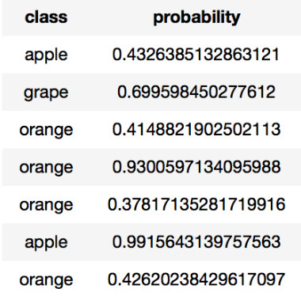
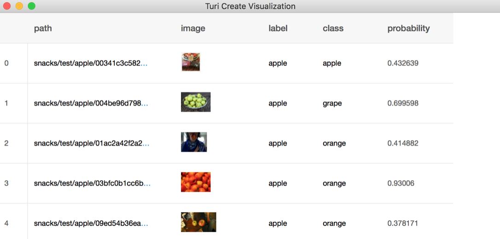
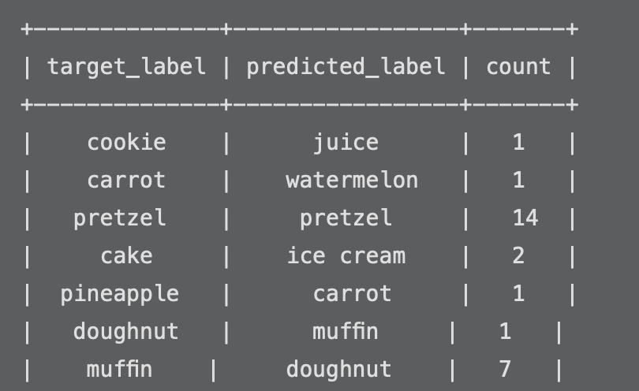
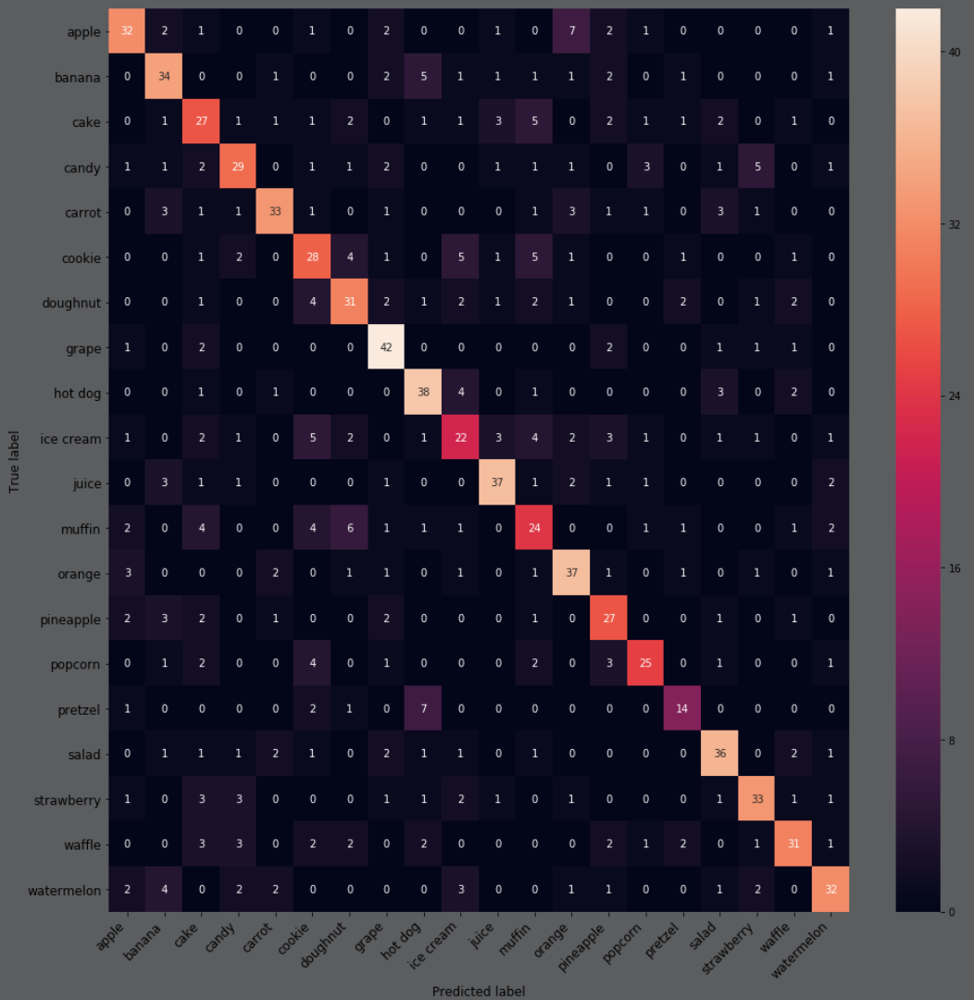
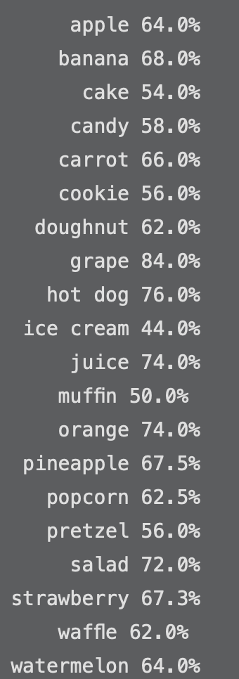
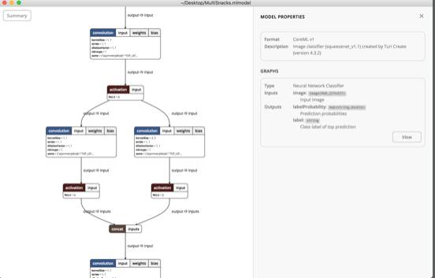

# Chapter 5: Digging Deeper Into Turi Create

------

In this chapter, you’ll learn to use Turi Create to build a classification model. You’ll use the snacks dataset to create your model. You’ll learn how to analyze your model’s performance, and how to go under the hood with Turi Create in order to improve your model.

------

## 大綱

- [Transfer learning with SqueezeNet](#1)
- [Getting individual predictions](#2)
  - [Predicting and classifying](#3)
  - [Sorting the prediction probabilities](#4)
- [Increasing max iterations](#5)
- [Confusing apples with oranges?](#6)
  - [Computing recall for each class](#7)
- [Wrangling Turi Create code](#8)
  - [Using a fixed validation dataset](#9)
  - [Saving the extracted features](#10)
  - [Inspecting the extracted features](#11)
  - [Training the classifier with regularization](#12)
  - [Saving the model](#13)
- [A peek behind the curtain](#14)
- [Key points](#15)

------

<h2 id="1">Transfer learning with SqueezeNet</h2>

- 在訓練過程會發現validation accuracy的準確度會不斷亂飄，這是因為Turi Create跟Create ML一樣，每一回合訓練都是從training set隨機挑選5%當作validation set, 所以每次validation set都不同。盡可能讓validation set都保持固定的內容，也比較可以保持validation accuracy的準確度的穩定。
- 訓練SqueezeNet model會比VisionFeaturePrint_Screen model快是因為SqueezeNet的input跟output都比VisionFeaturePrint_Screen小。
  - SqueezeNet extracts only 1000 features from 227×227-pixel images, compared with VisionFeaturePrint_Screen’s 2,048 features from 299×299 images.

```python
import turicreate as tc
import matplotlib.pyplot as plt
import os

# 讀取data
train_data = tc.image_analysis.load_images("snacks/train", with_path=True)
test_data = tc.image_analysis.load_images("snacks/test", with_path=True)

# 增加label欄位
train_data["label"] = train_data["path"].apply(lambda path: 
                                               os.path.basename(os.path.split(path)[0]))
test_data["label"] = test_data["path"].apply(lambda path: 
                                             os.path.basename(os.path.split(path)[0]))
# 開始訓練
model = tc.image_classifier.create(train_data, target="label", 
                                   model="squeezenet_v1.1",
                                   verbose=True, max_iterations=100)

# 檢視model指標
metrics = model.evaluate(test_data)
print("Accuracy: ", metrics["accuracy"])
print("Precision: ", metrics["precision"])
print("Recall: ", metrics["recall"])
```

------

<h2 id="2">Getting individual predictions</h2>

- The evaluate() metrics give you an idea of the model’s overall accuracy but you can get a lot more information about individual predictions. 
- Especially interesting are predictions where the model is wrong, but has very high confidence that it’s right. 
- Knowing **where the model is wrong can help you improve your training dataset**.

------

<h2 id="3">Predicting and classifying</h2>

- predict(): this command displays the actual prediction for each individual image

```python
model.predict(test_data)
```

- classify():gets the probability for each prediction, but only the highest-probability value, which is the model’s confidence in the class it predicts

```swift
output = model.classify(test_data)
```



- The first command adds the output columns to the original test_data columns. Then you display the merged SFrame with explore(). **The label column** is the correct class, and **class** is the model’s highest-confidence prediction:

```python
imgs_with_pred = test_data.add_columns(output)
imgs_with_pred.explore()
```



- The first command filters the test_data + output SFrame to include only those rows with high-probability wrong predictions
  - You can learn a lot about how your model sees the world by looking **at these confident-but-wrong predictions**


```python
imgs_filtered = imgs_with_pred[(imgs_with_pred["probability"] > 0.9) & (imgs_with_pred["label"] != imgs_with_pred["class"])]
imgs_filtered.explore()
```



------

<h2 id="4">Sorting the prediction probabilities</h2>

- The probabilities are sorted alphanumerically by name of the class in the training set.
  - the first value is for “apple,” the second is “banana,” the third is “cake” ... Ack


```python
predictions = model.predict(test_data, output_type='probability_vector')
print("Probabilities for 2nd image", predictions[1]) # 預設排序方式是根據字母


labels = test_data["label"].unique().sort() # 加入class labels
preds = tc.SArray(predictions[1])
# merge the two SArrays into an SFrame, then sort it on the preds column, in descending order (ascending = False)
tc.SFrame({'preds': preds, 'labels': labels}).sort([('preds', False)])
```

------

<h2 id="5">Increasing max iterations</h2>

- 100回訓練出來的model似乎還不夠好，利用max_iterations改成200回
  - 跟Create ML一樣, Turi Create還是要再重新訓練一次，並不會紀錄第100回狀態，然後只要多訓練101至200。
  - 觀察數據後，發現160回的效果最好，200回的效果會導致overfitting。
  - 此時，為了要得到160回的model，必須要再將max_iterations改成160回在訓練一次。

```python
model200 = tc.image_classifier.create(train_data, target="label",
                                   model="squeezenet_v1.1",
                                   verbose=True, max_iterations=200)
```

------

<h2 id="6">Confusing apples with oranges?</h2>

- **Confusion matrix**: This matrix plots the predicted classes versus the images’ real class labels, so you can see where the model tends to make its mistakes

```python
print("Confusion Matrix:\n", metrics["confusion_matrix"])
```

- **Heatmap**: Ideally, **you want everything to be zero except the diagonal.**

  - It may be a little misleading from the picture since at first glance it appears that there aren’t that many mistakes. But all the small numbers in the dark squares add up to 340 misclassified images out of 952 total, or 36% wrong.

  ```python
  import numpy as np
  import seaborn as sns
  
  def compute_confusion_matrix(metrics, labels):
      num_labels = len(labels)
      label_to_index = {l:i for i,l in enumerate(labels)}
  
      conf = np.zeros((num_labels, num_labels), dtype=np.int)
      for row in metrics["confusion_matrix"]:
          true_label = label_to_index[row["target_label"]]
          pred_label = label_to_index[row["predicted_label"]]
          conf[true_label, pred_label] = row["count"]
  
      return conf
  
  def plot_confusion_matrix(conf, labels, figsize=(8, 8)):
      fig = plt.figure(figsize=figsize)
      heatmap = sns.heatmap(conf, annot=True, fmt="d")
      heatmap.xaxis.set_ticklabels(labels, rotation=45,
                                   ha="right", fontsize=12)
      heatmap.yaxis.set_ticklabels(labels, rotation=0,
                                   ha="right", fontsize=12)
      plt.xlabel("Predicted label", fontsize=12)
      plt.ylabel("True label", fontsize=12)
      plt.show()
      
  conf = compute_confusion_matrix(metrics200, labels)
  plot_confusion_matrix(conf, labels, figsize=(16, 16))
  ```

  

------

<h2 id="7">Computing recall for each class</h2>

- Turi Create’s evaluate() function gives you the overall test dataset

-  **Recall metrix**: This gives you the percentage of each class that the model classified correctly — for example, how many “apple” images did the model find among the total number of “apple” image”

  ```python
  for i, label in enumerate(labels):
      correct = conf[i, i] # matrix中對角元素
      images_per_class = conf[i].sum() # 某一行的總和
      print("%10s %.1f%%" % (label, 100. * correct/images_per_class))
  ```

  

------

<h2 id="8">Wrangling Turi Create code</h2>

- One of the appealing benefits of Turi Create is that, once you have your data in an SFrame, **it takes only a single line of code to train the model.** The downside is that the Turi Create API gives you **only limited control over the training process**
- 如何進行hyperparameters tuning
  - **Regularization helps to prevent overfitting**, but the Turi Create image_classifier.create() function doesn’t provide access to change this hyperparameter.

------

<h2 id="9">Using a fixed validation dataset</h2>

- Use your own validation set. **By using a set of validation images that is always the same, you can control your experiments better and get reproducible results**.

```python
val_data = tc.image_analysis.load_images("snacks/val", with_path=True)
val_data["label"] = val_data["path"].apply(lambda path:
      os.path.basename(os.path.split(path)[0]))
len(val_data)
```


------

<h2 id="10">Saving the extracted features</h2>

- How to save the intermediate SFrame to disk, and reload it, just before experimenting with the classifier.

```python
# names starting with an underscore are considered to be private, but you can still import them.
from turicreate.toolkits import _pre_trained_models
from turicreate.toolkits import _image_feature_extractor

ptModel = _pre_trained_models.MODELS["squeezenet_v1.1"]()
feature_extractor = _image_feature_extractor.MXFeatureExtractor(ptModel)

# using the MXFeatureExtractor object to extract the SqueezeNet features from the training dataset
train_features = feature_extractor.extract_features(train_data, 
                                          "image", verbose=True)

# combining the features of each image with its respective label into a new SFrame.
extracted_train_features = tc.SFrame({
    "label": train_data["label"],
    '__image_features__': train_features,
    })

# saving extracted_train_features to a file. 
extracted_train_features.save("extracted_train_features.sframe")
```

```python
# Run this the next time you open this notebook
extracted_train_features = tc.SFrame("extracted_train_features.sframe")
```


------

<h2 id="11">Inspecting the extracted features</h2>

-  what these features actually look like — enter and run this command:

```python
extracted_train_features.head()

# # This is a list of 1,000 numbers, features that SqueezeNet has determined to be important
extracted_train_features[0]["__image_features__"] 
```

------

<h2 id="12">Training the classifier with regularization</h2>

- This is the Turi Create code that creates and trains the **logistic regression model** using the **extracted_train_features** SFrame as the input data, and **extracted_val_features** for validation.
- Setting the **convergence_threshold** to a very small value means that the training won’t stop until it has done all 200 iterations
- **l2_penalty and l1_penalty** are **hyperparameters** that add regularization to **reduce overfitting.**
- Overfitting can happen when the model gives too much weight to some features, by giving them very large coefficients. 
  - **Setting l2_penalty greater than 0** penalizes large coefficients, encouraging the model to learn smaller coefficients. **Higher values of l2_penalty** reduce the size of coefficients, but can also reduce the training accuracy.
  - **Setting l1_penalty greater than 0** also penalizes large coefficients. In addition, it discards features that have very small coefficients, **by setting these to 0**. 
  - Typically, you’d use either l2_penalty or l1_penalty, **but not both in the same training session.**
- you can train the classifier several times, trying out **different values for l2_penalty and l1_penalty**: this is called **hyperparameter tuning**

- 

```python
lr_model = tc.logistic_classifier.create(extracted_train_features,
                             features=['__image_features__'],
                             target="label",
                             validation_set=extracted_val_features,
                             max_iterations=200,
                             seed=None,
                             verbose=True,
                             l2_penalty=10.0, 
                             l1_penalty=0.0,
                             convergence_threshold=1e-8)
```

------

<h2 id="13">Saving the model</h2>

- Combine the base model with the classifier you trained into the state structure, and create an ImageClassifier object from this.


```python
from turicreate.toolkits.image_classifier import ImageClassifier

state = {
    'classifier': lr_model,
    'model': ptModel.name,
    'max_iterations': lr_model.max_iterations,
    'feature_extractor': feature_extractor,
    'input_image_shape': ptModel.input_image_shape,
    'target': lr_model.target,
    'feature': "image",
    'num_features': 1,
    'num_classes': lr_model.num_classes,
    'classes': lr_model.classes,
    'num_examples': lr_model.num_examples,
    'training_time': lr_model.training_time,
    'training_loss': lr_model.training_loss,
}
model = ImageClassifier(state)

model.save("HealthySnacks_regularized.model")
model.export_coreml("HealthySnacks_regularized.mlmodel")

# This shows you some high-level information about the model and its training:
model

# “This shows you information about the classifier portion of the model:
model.classifier
```

------

<h2 id="14">A peek behind the curtain</h2>

- There is a cool free tool called **Netron** (github.com/lutzroeder/Netron) that creates a nice visualization of the model architecture.
- **Netron** works with any Core ML model, as well as models from many other machine learning frameworks.



------

<h2 id="15">Key points</h2>

- In this chapter, you’ve gotten a taste of training your own Core ML model with **Turi Create**. In fact, this is exactly how the models were trained that you used in chapter 2, “Getting Started with Image Classification”.
- **Turi Create** is pretty easy to use, especially from a **Jupyter notebook**. It only requires a little bit of Python code. However, we weren’t able to create a super accurate model. This is partly due to the limited dataset.
- **More images is better**. We use 4,800 images, but 48,000 would have been better, and 4.8 million would have been even better. However, there is a real cost associated with finding and annotating training images, and for most projects, a few hundred images or at most a few thousand images per class may be all you can afford. Use what you’ve got — you can always retrain the model at a later date once you’ve collected more training data. **Data is king in machine learning**, and who has the most of it usually ends up with a better model.
- Another reason why Turi Create’s model wasn’t super is that SqueezeNet is a small feature extractor, which makes it fast and memory-friendly, but this also comes with a cost: It’s not as accurate as bigger models. But it’s not just SqueezeNet’s fault — instead of training a basic logistic regression on top of SqueezeNet’s extracted features, it’s possible to create more powerful classifiers too.
- **Turi Create does not offer a lot of control over tweaking the training process, so we can’t get a good grip on the overfitting**. Lastly, Turi Create does not allow us to fine-tune the feature extractor or use data augmentation. Those are more advanced features, and they result in slower training times, but also in better models.


<h2 id="18"></h2>