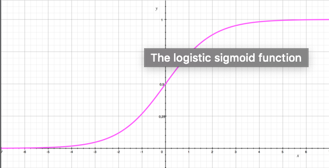
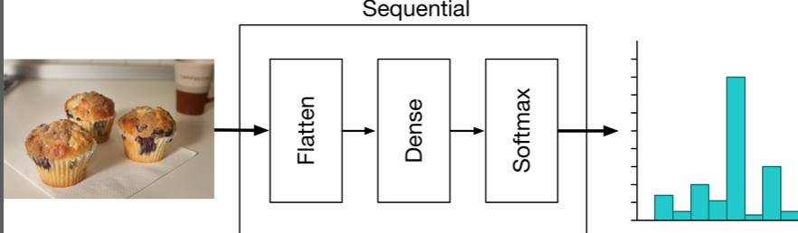
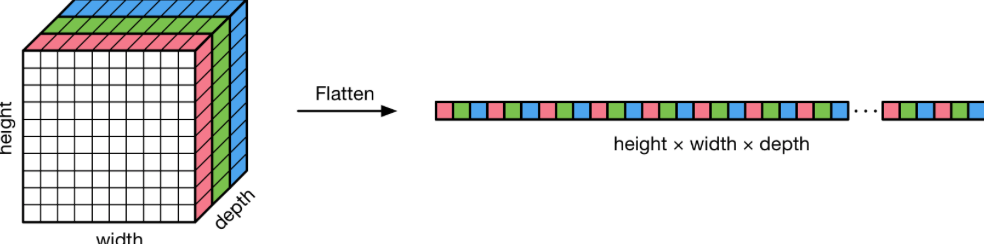
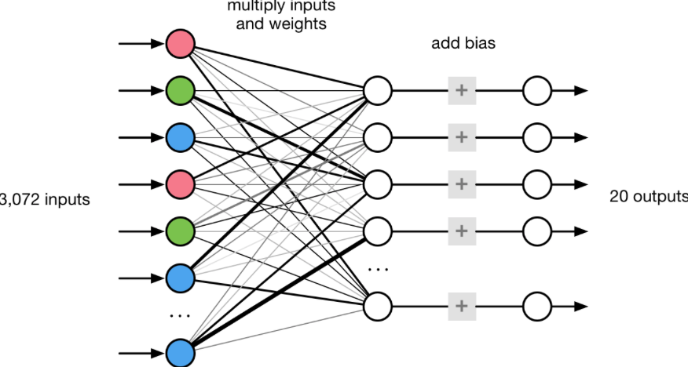
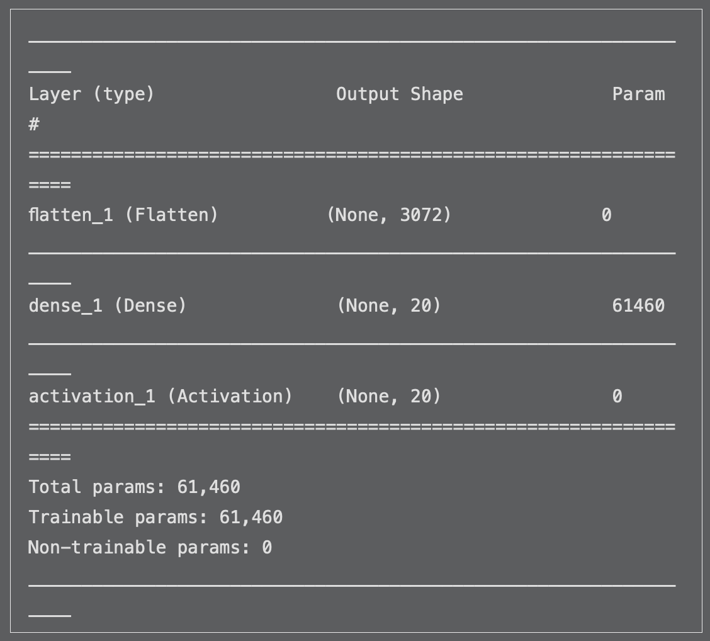

# Chapter 6: Taking Control of Training with Keras

------

In this chapter, you’ll learn to how to take control of your model’s training with Keras. You’ll design your first neural network, and how to pass your dataset into Keras for training.

------

## 大綱

- [Back to basics with logistic regression](#1)

  - [Let’s talk math](#2)

  - [Into the 150,000th dimension](#3)

  - [From linear to logistic](#4)

    [Not everything is black and white](#5)

- [Building the model](#6)

- [Loading the data](#7)

  - [Too soon to start making predictions?](#8)
  - [Using generators](#9)
  - [The first evaluation](#10)

- [Training the logistic regression model](#11)

  - [What happens during training?](#12)
  - [Hey, it’s progress!](#13)
  - [It could be better](#14)

- [Your first neural network](#15)

- [Key points](#16)

------

<h2 id="1">Back to basics with logistic regression</h2>

- Transfer learning**: a logistic regression model is trained **on top of features extracted from the training images。
  - Transfer learning是利用已經萃取出來的特徵在進行logistic regression。
- we also claimed that this approach of using a feature extractor works better than training the logistic regression classifier on the image pixels directly.
  - 直接在image pixel上進行logistic regression的效果一定比在萃取特徵上在進行logistic regression來得差。

------

<h2 id="2">Let’s talk math</h2>

- **Logistic regression is a small modification of linear regression**, so it makes sense that we look at the linear regression formula first.
- **Linear regression**
  - **y**:  is the name we use for the predictions made by the model
  - **b** : in machine learning it is called the **bias**.
  - **a[0] and a[1]**:  are still slopes, but now of a plane instead of a simple line, and b is the height of this plane at the origin.

```python
y = a*x + b 
y = a[0]*x[0] + a[1]*x[1] + b
```

- The coefficients a[0] and a[1] are constants. b is also a constant. In fact, what logistic regression learns during training is the values of these constants. Therefore, we call those **the learned parameters** of the model.
- By the way, when programmers say **parameters**, we often refer to the values that we pass into functions. Mathematicians call these **arguments**. 

```swift
func formula(x0, x1) -> Double {
  let a0 = 1.2
  let a1 = -1.5
  let b = 0.2
  return a0*x0 + a1*x1 + b
}
```

------

<h2 id="3">Into the 150,000th dimension</h2>

- the **dot product**. You can treat a and x as arrays — or vectors in math

```python
y = a[0]*x[0] + a[1]*x[1] + a[2]*x[2] + ... + a[149999]*x[149999] + b
y = dot(a, x) + b
```

- Linear regression, usually just called regression, is **statistical model** and machine-learning technique that is used to **find the relationship between two or more variables**.

------

<h2 id="4">From linear to logistic</h2>

- To turn the linear regression formula into a classifier, you extend the formula to make it **logistic regression**.
  - The sigmoid function, also known as the logistic sigmoid
  - the output of the logistic sigmoid function is usually interpreted as being a **probability**

```python
probability = sigmoid(dot(a, x) + b)
sigmoid(x) = 1 / (1 + exp(-x))
```



- **logistic regression is just linear regression with the sigmoid function applied to it. This sigmoid function turns the value of y into a value between 0 and 1 that we can interpret as being a probability percentage.**

------

<h2 id="5">Not everything is black and white</h2>

- **Multinomial logistic regression**
  - If you have K classes, you end up with K different logistic regressions
  - Each class now has its own decision boundary that separates its data points from the data points of all other classes. 
    - This is also known as a “**one-vs.-all” or “one-vs.-rest**” classifier.
  - All of these individual slopes are combined into a big matrix called the **weights matrix**. 
    - This matrix has size **N×K**, where **N is the number of elements in the input vector x and K is the number of classes.** 
    - The **matmul()** function performs a matrix multiplication between the input x and the weight matrix W and then adds the bias vector b.
  - **output**, contains K different values, one for each class.
  - It’s now possible for more than one class to be chosen, since these K probabilities are independent from one another. This is known as a **multi-label classifier**. 

```python
  probability_A = sigmoid(dot(a_A, x) + b_A)
  probability_B = sigmoid(dot(a_B, x) + b_B)
  probability_C = sigmoid(dot(a_C, x) + b_C)
  probability_D = sigmoid(dot(a_D, x) + b_D)
  ...and so on...
  
  output = matmul(W, x) + b
  
  probability_A = sigmoid(output[0])
  probability_B = sigmoid(output[1])
  probability_C = sigmoid(output[2])
  ...and so on...
```

- you want to choose **the best class amongst the K different ones**. You can do that by applying a different function instead of the logistic sigmoid, called **softmax**
  - the result of this operation is that now all the numbers are between 0 and 1, and together they sum up to 1.0

```python
  probabilities = softmax(matmul(W, x) + b)
```

- In practice, you’ll see **both sigmoid (multi-label) and softmax (multi-class) used with multinomial logistic regression**, depending on the problem that’s being solved. If you’re just interested in the best class, use the softmax.

------

<h2 id="6">Building the model</h2>

- Use images of **32×32** pixels as input. 

  - The SqueezeNet model from Turi Create used 227×227 images. You could certainly use 227×227 here, or any size really, but it will make the model much larger and slower to train.

- The model makes predictions for **20** different types of objects

- **Flatten layer**: which takes the three-dimensional image input and turns it into a one-dimensional vector.

- **Dense layer**: This performs the matrix multiplication between the 3,072 inputs and the 20 outputs

  - The Dense layer also adds a bias value for each output
  - Dense layers are also known as **fully connected layers**

- **Activation function**: is some non-linear operation that gets applied to the output of a layer from the model. 

  - There are many different types of activation functions, but the one at the end of the model is usually the softmax function, at least for classifiers.

- **Compile() function** :takes three important arguments:

  - **Loss function**: Recall from the introduction that the loss function is used to determine how good — or rather, how bad — the model is at making predictions
  - **Optimizer**: This is the object that implements the Stochastic Gradient Decent or SGD process that finds the best values for the weights and biases. 
    - As the loss function computes how wrong the model is at making predictions, 
    - the optimizer uses that loss and tweaks the learnable parameters in the model to make the model slightly better. 
    - Mathematically speaking, **the optimizer finds the parameters that minimize the loss.**
  - **Metrics**: As it is training your model, Keras will always **print out the loss value**, but you’re also interested in the accuracy of the model as that is an easier metric to interpre

  

```python
import numpy as np
import keras
from keras.models import Sequential
from keras.layers import *
from keras import optimizers

image_width = 32
image_height = 32
num_classes = 20

model = Sequential()
model.add(Flatten(input_shape=(image_height, image_width, 3)))
model.add(Dense(num_classes))
model.add(Activation("softmax"))

model.summary()

model.compile(loss="categorical_crossentropy",
              optimizer=optimizers.Adam(lr=1e-3),
              metrics=["accuracy"])”
 
```







- **By adding the softma**x, the model becomes **a multinomial logistic regression classifier** that tells you which classes the data points belong to
- Keras automatically adds a dimension to the front of the layer’s output, which is the **batch dimension**.
  - This extra dimension is used during training, so that **you can train on multiple images at the same time**.
  - If you were to train on a typical batch size of 64 images at once, the output shape of the Flatten layer is actually a (64, 3072) tensor. 
  - Typically, you don’t specify the batch size yet when you construct the model, which is why Keras shows it as **None**.



- **What the !%#& is a tensor?**
  - **Tensor is a fancy word for multi-dimensional array.**
    - Since “multi-dimensional array” is a mouthful, we like to use the word “tensor” instead
  - In machine learning, you often use multi-dimensional arrays to store your data.
  - This is where **TensorFlow** gets its name from: **it describes the data flow** — what we’ve been calling a pipeline — between tensors.
  - In math terminology, we call 
    - a one-dimensional array a **vector**
    - a two-dimensional array a **matrix**
    - anything with more dimensions a **tensor** 
  - The number of dimensions is the **rank** of the tensor. 
    - A vector is a tensor of rank 1,
    - A matrix is a tensor of rank 2,
    - An image is a tensor of rank 3, 
    - A batch of images is a tensor of rank 4
    - Scalars or single numbers are tensors of rank 0, or zero-dimensional arrays.

------

<h2 id="7">Loading the data</h2>

- The **%matplotlib** inline directive tells Jupyter to show the image inside the notebook. Without this, it will open in a new window.
- **Normalizing or feature scaling** means that the data will have an average value or mean of 0 and usually also a standard deviation of 1. This is important when different features are not all in the same numerical range. 
- **The np.expand_dims()** function **added a new dimension to the front**, to turn this single image into a **batch of images** with batch size 1

```python
images_dir = "snacks"
train_data_dir = images_dir + "/train/"
val_data_dir = images_dir + "/val/"
test_data_dir = images_dir + "/test/”

from keras.preprocessing import image
img = image.load_img(train_data_dir + "apple/cecd90f5d46f57b0.jpg", 
                     target_size=(image_width, image_height))" 

%matplotlib inline
import matplotlib.pyplot as plt
plt.imshow(img)

x = image.img_to_array(img)

def normalize_pixels(image):
    return image / 127.5 - 1

x = normalize_pixels(x)
x = np.expand_dims(x, axis=0)

x.shape # (1, 32, 32, 3) batch of images
```

```python
# 0~255 pixels data
array([[[215., 215., 217.],
        [211., 211., 211.],
        [207., 207., 207.],
        ...,
        [152., 150., 137.],
        [148., 146., 133.],
        [149., 147., 132.]], ...


# normalize
array([[[[ 0.6862745 ,  0.6862745 ,  0.7019608 ],
         [ 0.654902  ,  0.654902  ,  0.654902  ],
         [ 0.62352943,  0.62352943,  0.62352943],
         ...,
         [ 0.19215691,  0.17647064,  0.07450986],
         [ 0.16078436,  0.14509809,  0.04313731],
         [ 0.1686275 ,  0.15294123,  0.03529418]], ...”
```

------

<h2 id="8">Too soon to start making predictions?</h2>

- This outputs an array with 20 values, one probability for each class
  - Most of these values are pretty close to 1/20 or 0.05.
  - If you add them all up with pred.sum(), it will print out 1.0. 
  - basically a random guess
- **np.max() function** returns the actual maximum value, while **np.argmax()** returns **the index** of the element with the maximum value.
- It’s useful to run model.predict() before training, to make sure that your model actually predicts what you’d expect — in this case, something close to average probability for each class


```python
pred = model.predict(x)
print(pred) 

np.argmax(pred)
```

```python
[[0.04173137 0.00418671 0.02269506 0.02889681 0.08140159 0.03577968
  0.03044504 0.04758682 0.07940029 0.07274284 0.04531444 0.0115772
  0.17158438 0.02129039 0.0233359  0.1150756  0.00603842 0.08578367
  0.03525693 0.03987688]] 
```

------

<h2 id="9">Using generators</h2>

- Keras has a useful helper class called **ImageDataGenerator** that can automatically load images from folders.
  - The data generator takes the **normalize_pixels function** as its preprocessing function so that it automatically normalizes the images as it loads them.
  - The reason you need to use generators is that you cannot possibly load all the images into memory all at once, since that would require many gigabytes or even terabytes of RAM — more than fits in your computer! ”
- **During training**, you want to pick the images at **random** so that the model doesn’t attempt to learn anything about the order of the images. 
- **During testing**, however, you want to pick the images in **a fixed order** as that makes it easier to match them to the correct answers.
- The argument class_mode="**categorical**" tells Keras that there is a subfolder for each image category. Keras will **use the name of the subfolder as the class label** for the images from that folder. 
- **The batch size is 64**, and so the generator will try to load 64 images at a time.
- X tensor is (64, 32, 32, 3) because it contains **64 RGB images of 32×32 pixels**.
- Y tensor is (64, 20) the model produces 20 output values — one probability value for each class 


```python
from keras.preprocessing.image import ImageDataGenerator
datagen = ImageDataGenerator(preprocessing_function=normalize_pixels)

batch_size = 64

train_generator = datagen.flow_from_directory(
                    train_data_dir,
                    target_size=(image_width, image_height),
                    batch_size=batch_size,
                    class_mode="categorical",
                    shuffle=True)

val_generator = datagen.flow_from_directory(
                    val_data_dir,
                    target_size=(image_width, image_height),
                    batch_size=batch_size,
                    class_mode="categorical",
                    shuffle=False)

test_generator = datagen.flow_from_directory(
                    test_data_dir,
                    target_size=(image_width, image_height),
                    batch_size=batch_size,
                    class_mode="categorical",
                    shuffle=False)

#Found 4838 images belonging to 20 classes.
#Found 955 images belonging to 20 classes.
#Found 952 images belonging to 20 classes.

x, y = next(train_generator)
print(x.shape)
print(y.shape) 

# x (64, 32, 32, 3)
# y (64, 20)

train_generator.class_indices

{'apple': 0,
 'banana': 1,
 'cake': 2,
 'candy': 3,
 'carrot': 4,
 'cookie': 5,
 'doughnut': 6,
 'grape': 7,
 'hot dog': 8,
 'ice cream': 9,
 'juice': 10,
 'muffin': 11,
 'orange': 12,
 'pineapple': 13,
 'popcorn': 14,
 'pretzel': 15,
 'salad': 16,
 'strawberry': 17,
 'waffle': 18,
 'watermelon': 19}

# Python dictionary comprehension
index2class = {v:k for k,v in train_generator.class_indices.items()}

index2class[np.argmax(y[0])] 

# one-hot encoding
'apple'      [1,0,0,0,0,0,0,0,0,0,0,0,0,0,0,0,0,0,0,0]
'banana'     [0,1,0,0,0,0,0,0,0,0,0,0,0,0,0,0,0,0,0,0]
'cake'       [0,0,1,0,0,0,0,0,0,0,0,0,0,0,0,0,0,0,0,0]
'candy'      [0,0,0,1,0,0,0,0,0,0,0,0,0,0,0,0,0,0,0,0]
              . . .
'waffle'     [0,0,0,0,0,0,0,0,0,0,0,0,0,0,0,0,0,0,1,0]
'watermelon' [0,0,0,0,0,0,0,0,0,0,0,0,0,0,0,0,0,0,0,1]. 
```

------

<h2 id="10">The first evaluation</h2>

- it’s a good idea to **run the untrained model on the entire test set**, to verify that the model and the generators actually work
- the **accuracy** across the entire test set should be about 0.05 or 5% correct, which is the same as randomly picking an answer from the 20 categories, which is exactly what happens because the model currently consists of all random numbers
- The initial **loss** for a classifier that uses the cross-entropy loss function should be approximately np.log(num_classes), where log is the natural logarithm. Here, np.log(20) = 2.9957

- 

```python
model.evaluate_generator(test_generator)
```

```
# The first one is the loss, the second, accuracy
[3.311799808710563, 0.059873949579831935]
```

------

<h2 id="11">Training the logistic regression model</h2>

- As a responsible programmer, you know it’s not a good idea to ignore warnings but unfortunately the PIL library that is used to load the training images will complain about the EXIF data on some of the JPEG files. That just causes a lot of sloppy debug output in the Jupyter notebook, and so it’s cleaner to disable those warnings.
- The generator you used here is train_generator because that loads the training images. You also pass in the val_generator to use as the validation data.
- The workers=4 argument tells Keras it can use multiple threads to load and prepare the images.


```python
import warnings
warnings.filterwarnings("ignore")

model.fit_generator(train_generator, 
                    validation_data=val_generator,
                    epochs=5,
                    workers=4)
```

------

<h2 id="12">What happens during training?</h2>

- The optimizer finds which parts of the model were responsible for making this (bad) prediction and “punishes” them. 
- Keras won’t compute the loss for a single image but for a mini-batch of multiple images at a time.
  - The loss for this batch is the average of the 64 individual losses. 


------

<h2 id="13">Hey, it’s progress!</h2>

- During training, Keras reports the training loss loss and training accuracy acc. After each epoch, Keras also computes the **validation loss val_loss and accuracy val_acc** over the entire validation set.

```
Epoch 1/5
76/76 [==============================] - 3s 38ms/step - loss: 3.2150 - acc: 0.1050 - val_loss: 3.2654 - val_acc: 0.1162
Epoch 2/5
76/76 [==============================] - 2s 26ms/step - loss: 2.7257 - acc: 0.2079 - val_loss: 3.2375 - val_acc: 0.1152
Epoch 3/5
76/76 [==============================] - 2s 27ms/step - loss: 2.4124 - acc: 0.2990 - val_loss: 3.2756 - val_acc: 0.1120
Epoch 4/5
76/76 [==============================] - 2s 27ms/step - loss: 2.1712 - acc: 0.3722 - val_loss: 3.2727 - val_acc: 0.1246
Epoch 5/5
76/76 [==============================] - 2s 26ms/step - loss: 1.9735 - acc: 0.4462 - val_loss: 3.3359 - val_acc: 0.1141
```

- Also note that the loss reported here, 3.1428, is only marginally better than the test set loss you saw on the untrained model, which was 3.31179.


```python
model.evaluate_generator(test_generator)

[3.142886356145394, 0.12079831951556086]
```

------

<h2 id="14">It could be better</h2>

- The model did learn something. After all, you started with a validation accuracy of 0.05 and it went up to about 0.12. 
- How come the training accuracy is so high then, **about 90% after 50 epochs**? 
  - This is an extreme case of **overfitting**. 
  - The model isn’t actually learning to classify images, it’s just learning to tell apart the images that are in the training set. 
- For better results on our kinds of images, we’ll need to create a better model. **Learning directly from the pixel values is just too hard, as the logistic regression (the Dense layer) cannot extract enough meaning from them**.
  - **Deep learning** can automatically learn to extract features from the pixels, and generally does a better job than man-made feature extractors.

------

<h2 id="15">Your first neural network</h2>

- This kind of neural network is called a **two-layer feed-forward network**.
  - The first Dense layer is the first logistic regression. The second Dense layer to the end is the second logistic regression. So all you’ve done is **stick two separate logistic regression models together**.
- The new Dense layer also has an activation function. This is not a softmax but a **relu**, also called **ReLU or rectified linear unit.**
  - **In most neural networks every layer is followed by an activation function**. 
  - This is usually a very simple mathematical operation that transforms the output of the layer in some **non-linear way.**
  - Without these non-linear activation functions, you’d only be able to do that if you could already draw that straight line between the original input data points
- This model has 1.5 million parameters. That’s a lot for a model with just two layers. 
  - This is the problem with using Dense or fully connected layers. 
  - Since each of the 3,072 inputs is connected to each of the 500 intermediate neurons, this requires 3,072×500 = 1.5 million connections, plus 500 bias values. 
  - Since this model has so many connections, **you can expect it to overfit again on the relatively small dataset.**
- The output is about 0.15 or 15% correct. It’s better than a random guess, and better than the model with just a single Dense layer, but not by much

- 這樣的架構對圖像識別的最大缺點
  - Flatten unrolls the original three-dimensional image data — height, width and color channels — into a one-dimensional vector. **This destroys the relationships between neighboring pixels that was present in the original image.**
  - **convolutional layers**

```python
model = Sequential()
model.add(Flatten(input_shape=(image_height, image_width, 3)))
model.add(Dense(500, activation="relu"))  # this line is new
model.add(Dense(num_classes))
model.add(Activation("softmax"))

model.compile(loss="categorical_crossentropy",
              optimizer=optimizers.Adam(lr=1e-3),
              metrics=["accuracy"])

model.fit_generator(train_generator, 
                    validation_data=val_generator,
                    epochs=3,
                    workers=4)

model.evaluate_generator(test_generator)
```

------

<h2 id="16">Key points</h2>

- Linear regression is one of the most basic machine-learning models, dating back to the 1800s when Gauss and others discovered the method of Ordinary Least Squares. It models the relationship between different variables. You can turn linear regression into logistic regression with the sigmoid function, making it a classifier model.
- To build **a logistic regression classifier** in Keras, you just need one Dense layer followed by softmax activation. To use images with the Dense layer, you need to Flatten the image data into a one-dimensional vector first.
- To train a model in Keras, you need to **choose a loss function** — cross-entropy for a classifier — as well as an **optimizer**. Setting the **optimizer’s learning rate is important** or the model won’t be able to learn anything.
- Load your data with **ImageDataGenerator**. Use a **normalization** function to give your data a mean of 0 and a standard deviation of 1. **Choose a batch size** that fits on your GPU — 32 or 64 is a good default choice.
- **Be sure to check the loss and accuracy of your test set on the untrained model**, to see if you get reasonable values. The accuracy should be approximately 1/num_classes, The accuracy should be approximately 1/num_classes, the loss should be close to np.log(num_classes).
- Keep your eye on the validation accuracy during training. If it stops improving while the training accuracy continues going up, your model is **overfitting**.
- **A classical neural network** is just two or more logistic regressions in a row.
- Logistic regression and classical feed-forward neural networks are **not the best choice for building image classifiers.**