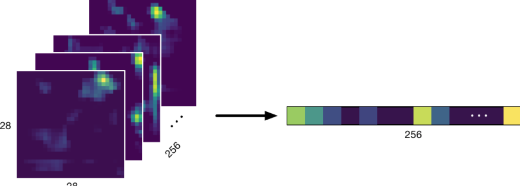

# Chapter 7: Going Convolutional

------

In this chapter, you’ll learn why a simple neural network might not be enough when it comes to solving problems with images using machine learning. You’ll learn about how using a convolutional neural network provides a better approach to solving classification problems.

------

## 大綱

- [Got GPU?](#1)
  - [Your head in the clouds?](#2)
- [Convolution layers](#3)
  - [Convolution, say what now?](#4)
  - [Multiple filters](#5)
- [Your first convnet in Keras](#6)
  - [The flow of the tensors](#7)
  - [More about pooling](#8)
  - [The detected features](#9)
  - [Feeling hot hot hot](#10)
  - [Honey, I shrunk the tensors!](#11)
  - [Training the model](#12)
  - [Going dooooown?](#13)
  - [Learning rate annealing](#14)
  - [It’s better... but not good enough yet](#15)
- [Key points](#16)

------

<h2 id="1">Got GPU?</h2>

- Keras and TensorFlow do not support Mac GPUs yet. Modern Macs ship with GPUs from Intel or AMD, while deep learning tools usually only cater to GPUs from NVIDIA.
- The big benefit of Create ML and Turi Create is that they support most Mac GPUs through Metal.


------

<h2 id="2">Your head in the clouds?</h2>

- [Google Colaboratory](colab.research.google.com) is a free Jupyter notebook environment. You can use Colab to run your notebooks on a cloud GPU and even a TPU — Google’s own high-performance Tensor Processing Unit hardware — for free. That’s a pretty good deal. Your notebooks are stored in Google Drive. The easiest way to upload the dataset is through Google Cloud Storage, although they offer a few different options. It is best used from Chrome.”
- [Amazon AWS EC2](aws.amazon.com). AWS is the world’s most popular provider of general-purpose cloud computing. This is just like having your own deep-learning box, except that you’re renting it from Amazon. You can start out by using the free tier but they also have GPU instances. Not the easiest or cheapest solution, but definitely the most flexible.

------

<h2 id="3">Convolution layer</h2>

- Flatten the image
  - **Destroys the spatial nature of the input data**. 
  - The three color components for each pixel: red, green and blue. These three values are closely related, so you don’t really want to treat them as three separate numbers, but as one indivisible unit: the pixel’s color.
- **Convolutional layer**
  - directly works on the original three-dimensional structure of the image.
- A neural network made up of such layers is called **a convolutional neural network**, **convnet**, or just **CNN** for short.


------

<h2 id="4">Convolution, say what now?</h2>

- Convolution的本質就是做**dot products**
- A convolution is **a little “window” that slides over the image**. 
  - At every position, it takes the value of the center pixel and of the surrounding pixels, multiplies these values by a fixed set of numbers — the **convolution weights** — and writes the result to an output image. 
  - The **output** of a convolution layer **is another image of the same width and height as the input image**.
  - Usually, the convolution window is **3×3** pixels in size, but you’ll also see larger windows such as **5×5 and 7×7**. 
  - the window is also known as **the convolution kernel or filter.**


- For every pixel at coordinate i,j in the input image, this is the math that happens for a 3×3 convolution window
  - This formula is repeated for every pixel in the input image. 
  - i between **0 and the image height**, 
  - j between **0 and the image width**,
  - compute the **dot product** at each pixel coordinate i,j.

```python
y[i,j] = w[0,0] * x[i-1,j-1] + w[0,1] * x[i-1,j] + w[0,2] * x[i-1,j+1]
       + w[1,0] * x[i,  j-1] + w[1,1] * x[i,  j] + w[1,2] * x[i,  j+1]
       + w[2,0] * x[i+1,j-1] + w[2,1] * x[i+1,j] + w[2,2] * x[i+1,j+1]
       + bias
```


- The convolution operation tries to match **a small template — the weights** — to every group of **3×3 pixels** under the sliding window in the input image. 
  - If this group of pixels is a **good match for the template**, then the dot product’s output value will be **high**.
  - If the pixels **don’t match the template very well**, then the output value will be **small, often close to zero**. 
  - If the pixels are **the complete opposite of the template**, the output will be **high but negative**.

- During training, the convolution layer **learns values for its weights**, which means that it will learn a certain pattern of 3×3 pixels.
- **The convolution output** measures how much the input pixels “respond” to the learned template.
- A convolution layer is usually followed by an activation function, to turn the result from the dot product into something that is non-linear.


------

<h2 id="5">Multiple filters</h2>

- **The input** to this convolution filter is a tensor of **size (height, width, 3)**. **The output** is a **(height, width, 1)** tensor.
  - This assumes we’re using “same” or zero-padding; with “valid” padding, the height and width of the output tensor would be slightly smaller.


- In practice, a convolution layer will have more than one of these filters.
  - It’s common to see layers with 32, 64, 128, 256, 512 or even 1,024 or more of these convolutions. 
  - Each filter learns its own set of weights and bias values.


- The layer has 32 of those convolution filters, and so it can detect 32 different patterns. 
- Because it has 32 filters that all produce one channel’s worth of data, the output of this layer is a new image of dimensions 227×227×32. 
-  **The first layer** has learned **3×3×3×32 weights**. Read this as **kernelHeight × kernelWidth × inputChannels × outputChannels**. The layer also has learned **32 bias values, one for each output channel**.
  - Think of this output tensor as consisting of 32 individual grayscale images, each describing how well the input image matched the template or pattern learned by the corresponding convolution filter.
- **The second layer** has 64 of those filters, so its output image/tensor is of size 227×227×64. In total, this second layer will learn **3×3×32×64 weights plus 64 biases**.
- Remember, each filter learns to detect a unique pattern in the input data.
- A good feature extractor will learn patterns that tell you something meaningful about the images.


------

<h2 id="6">Your first convnet in Keras</h2>

- **A Conv2D layer** takes the following arguments:
  - **The number of filters**
    - In the first Conv2D layer this is 32. As in most convnet designs, **convolutional layers get more filters (or output channels) as you go deeper into the network**. The last Conv2D layer in this model has 256 filters. 
  - **The size of the kernel window**
    - For all Conv2D layers in this model, the kernel is 3×3 pixels. You can write this as a tuple (3, 3) but because square kernel windows are so common**, you can also specify the kernel size as just 3 and Keras will understand that you mean a 3×3 window**.
  - **The padding**
    - By default, padding in Keras is "**valid**", which means the pixels at the edges of the image are ignored and so the output image shrinks a little. 
    - Most of the time you want "**same**" padding instead, which adds an imaginary border of empty pixels around the edges so that the output image **keeps the same width and height as the input image**
  - **A non-linear activation function**
    - The activation that’s most typically used with convolution layers is ReLU
- **MaxPooling2D layers**
  - **Pooling** is a technique that **makes the data smaller** as it flows through the network, also known as subsampling.
- 

```python
import numpy as np
from keras.models import Sequential
from keras.layers import *
from keras import optimizers

%matplotlib inline
import matplotlib.pyplot as plt

image_width = 224
image_height = 224
num_classes = 20

model = Sequential()
model.add(Conv2D(32, 3, padding="same", activation="relu",
                 input_shape=(image_height, image_width, 3)))
model.add(Conv2D(32, 3, padding="same", activation="relu"))
model.add(MaxPooling2D(2))
model.add(Conv2D(64, 3, padding="same", activation="relu"))
model.add(Conv2D(64, 3, padding="same", activation="relu"))
model.add(MaxPooling2D(2))
model.add(Conv2D(128, 3, padding="same", activation="relu"))
model.add(Conv2D(128, 3, padding="same", activation="relu"))
model.add(MaxPooling2D(2))
model.add(Conv2D(256, 3, padding="same", activation="relu"))
model.add(Conv2D(256, 3, padding="same", activation="relu"))
model.add(GlobalAveragePooling2D())
model.add(Dense(num_classes))
model.add(Activation("softmax"))

```

------

<h2 id="7">The flow of the tensors</h2>

- 896 = 3(kernelHeight)×3(kernelWidth)×3(inputChannels)×32(filter數目) + 32(bias)
- 9248 = 3(kernelHeight)×3(kernelWidth)×32(inputChannels)×32(filter數目) + 32(bias)

```python
________________________________________________________________
Layer (type)                 Output Shape              Param #   
=================================================================
conv2d_1 (Conv2D)            (None, 224, 224, 32)      896       
______________________________________________________________
conv2d_2 (Conv2D)            (None, 224, 224, 32)      9248      
_________________________________________________________________
max_pooling2d_1 (MaxPooling2 (None, 112, 112, 32)      0         
_________________________________________________________________
conv2d_3 (Conv2D)            (None, 112, 112, 64)      18496     
_________________________________________________________________
conv2d_4 (Conv2D)            (None, 112, 112, 64)      36928     
_________________________________________________________________
max_pooling2d_2 (MaxPooling2 (None, 56, 56, 64)        0         
_________________________________________________________________
conv2d_5 (Conv2D)            (None, 56, 56, 128)       73856     
_________________________________________________________________
conv2d_6 (Conv2D)            (None, 56, 56, 128)       147584    
_________________________________________________________________
max_pooling2d_3 (MaxPooling2 (None, 28, 28, 128)       0         
_________________________________________________________________
conv2d_7 (Conv2D)            (None, 28, 28, 256)       295168    
_________________________________________________________________
conv2d_8 (Conv2D)            (None, 28, 28, 256)       590080    
_________________________________________________________________
global_average_pooling2d_1 ( (None, 256)               0         
_________________________________________________________________
dense_1 (Dense)              (None, 20)                5140      
_________________________________________________________________
activation_1 (Activation)    (None, 20)                0         
=================================================================
Total params: 1,177,396
Trainable params: 1,177,396
Non-trainable params: 0
_________________________________________________________________ 
```

- filter會將input 227x227x32轉化成227x227x1
  - 每個filter去掃描image上每個pixel看是否有符合這個filter的pattern。
  - 32個filters產生32個227x227x1


------

<h2 id="8">More about pooling</h2>

- The pooling layer simply takes the maximum value of each 2×2 group of pixels and writes it to the output tensor.
  - **max pooling**:akes the maximum value
  - **average pooling** that takes the average or mean of the pixels in that 2×2 window instead 

- **Stride**: this window slides over the input image
  - A stride of 2 means the width and height both get chopped in half. 
  - Usually, the stride is the same as the window size, but sometimes you’ll see other combinations, such as a window size of 3 with a stride of 2

- **Why use these pooling layers?** 
  - The main reason is to reduce the size of the data you’re working with — by k**eeping only the most interesting parts of the image**.
  - Reducing the size of the data is helpful for **making computations faster**


------

<h2 id="9">The detected features</h2>

- the first layer detects mostly simple colors and lines, the second layer will look for somewhat higher level patterns, such as circles and corners.
  - the second layer actually sees a larger region from the original image. This is called t**he receptive field** of the layer. The receptive field of the second layer, i.e., how much it sees from the original RGB image, is 5×5 pixels.
- Each convolution layer learns to see ever higher-level, more abstract patterns. 
  - And because **the receptive field grows bigger**, convolution layers deeper in the network see more of the input image than early layers. 
  - This allows the later layers to learn to recognize real-world concepts like “this is a dog-like shape”, “this is a human face”, “this object is pointed to the left” and so on.”

------

<h2 id="10">Feeling hot hot hot</h2>

- **Heatmap** because it’s “hot” (yellow) where the pixels responded a lot to the pattern but “cold” elsewhere (dark blue).
  - In this example, the pixels in the top-right corner are hot, meaning that the pattern from this filter was detected in that position in the original RGB input image
- Exactly what the convnet learns can be hard for humans to interpret
  - convert this result into something meaningful, such as **adding a logistic regression** that maps these patterns to the classes you’re interested in.


------

<h2 id="11">Honey, I shrunk the tensors!</h2>

- For a classification model, you don’t really care so much where exactly the pattern was matched, only whether it was matched at all.
- That trick is called **global pooling or adaptive pooling**.
  - The **GlobalAveragePooling2D** layer calculates the average value of each 28×28 feature map, which is just a scalar number
- After this global average pooling layer, you now have a **256-element vector** that says which of the **256 patterns** were detected in the original input image, and **how strong these detections are**
- The convolutional layers and pooling layers now act as a **feature extractor**
- Perform logistic regression on top of the extracted features.




------

<h2 id="12">Training the model</h2>

- Keras returns a History object from fit_generator() that has the loss and any other metrics you asked for.
- You can run this cell multiple times and the history won’t get lost
- It’s useful to **train for a few epochs to see how the model is doing** before you commit to training for many epochs.


```python
model.compile(loss="categorical_crossentropy",
              optimizer=optimizers.Adam(lr=1e-3),
              metrics=["accuracy"])

histories = []

histories.append(model.fit_generator(train_generator,
                                     validation_data=val_generator,
                                     epochs=5,
                                     workers=8)) 
```

------

<h2 id="13">Going dooooown?</h2>


```python
def combine_histories():
    history = { "loss": [], "val_loss": [], "acc": [], "val_acc": [] }
    for h in histories:
        for k in history.keys():
            history[k] += h.history[k]
    return history
  
  history = combine_histories()
  
  def plot_loss(history):
    fig = plt.figure(figsize=(10, 6))
    plt.plot(history["loss"])
    plt.plot(history["val_loss"])
    plt.xlabel("Epoch")
    plt.ylabel("Loss")
    plt.legend(["Train", "Validation"])
    plt.show()

plot_loss(history) 

def plot_accuracy(history):
    fig = plt.figure(figsize=(10, 6))
    plt.plot(history["acc"])
    plt.plot(history["val_acc"])
    plt.xlabel("Epoch")
    plt.ylabel("Accuracy")
    plt.legend(["Train", "Validation"])
    plt.show()

plot_accuracy(history) 
```


-  About 25 epochs, you can see that the validation loss keeps going up. This is a sign that the model is overfitting


- The training accuracy keeps increasing, as the model starts to remember literal training examples, but that is not what you want. **The validation accuracy starts to level off after 25 epochs** and will eventually become worse

------

<h2 id="14">Learning rate annealing</h2>

- One trick you can use to give the accuracy a little boost is to **change the learning rate**.
- K refers to the Keras backend package, which is a wrapper around TensorFlow. 
  - You cannot set the optimizer’s learning rate directly and must do it in this special way.

```python
import keras.backend as K

K.set_value(model.optimizer.lr, K.get_value(model.optimizer.lr) / 10) 
```

- you’ll see a bump where the learning rate was changed, **at epoch 30**


- In general, you want to start with as high a learning rate as you can get away with, **then lower it over time**.
- Usually, you want to **lower the learning rate** when you see that **the validation loss is no longer decreasing**


------

<h2 id="15">It’s better... but not good enough yet</h2>

- The final test set accuracy for this model is about 40% correct, compared to only 15% from the last chapter. That’s a big improvement!
- This particular model also **overfits** a lot 
  - With over one million parameters and only about 4,800 training images, there is too much freedom for the model to memorize the images.

------

<h2 id="16">Key points</h2>

- You need access to a powerful GPU in order to train these deep learning models. Unfortunately, Mac GPUs are not well supported by popular training tools. The cloud to the rescue!
- **Convolution layers** are key to making good image classifiers. Just like Dense layers they compute dot products, but only over small regions of the image. Speaking mathematically, convolution is actually the same as a Dense layer in which most of the connections are zero, and the other connections all share the same weights.
- Convnets are made up of a series of convolution layers and pooling layers. **Layers deeper in the network have more filters and learn to detect higher level patterns that represent more abstract concepts**.
- **Choosing the right values for the hyperparameters** such as the learning rate is essential for getting an optimal result. It’s also a good idea to **plot the loss and accuracy curves**, to see **if your model is overfitting or whether it is done learning**. You can use Keras callbacks to automate some of this work for you.
- test

