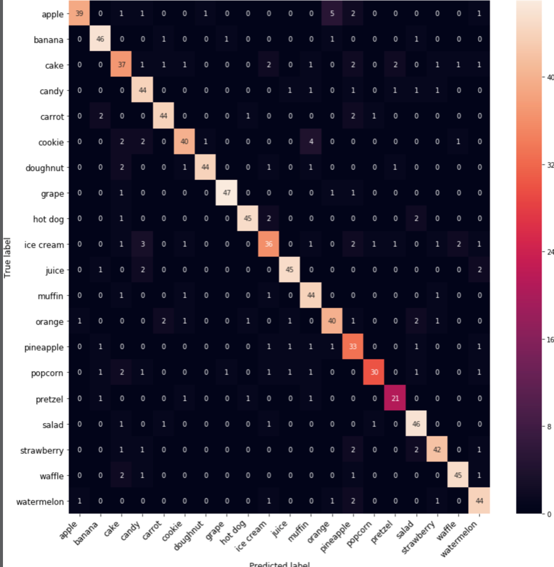
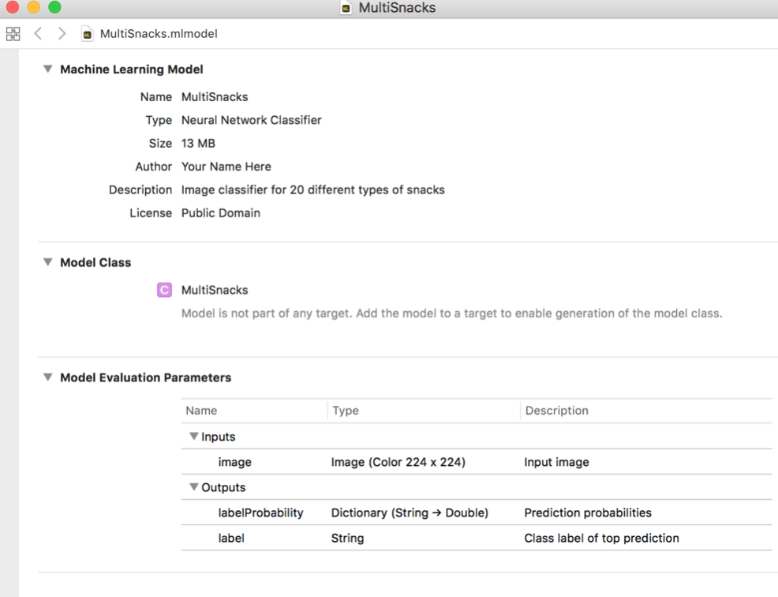

# Chapter 8: Advanced Convolutional Neural Networks

------

In this chapter, you’ll learn about advanced model architectures used for solving image classification. You’ll learn how you can use Keras to do transfer learning, and how applying advanced techniques such as dropout and regularization can improve your model’s performance.

------

## 大綱

- [SqueezeNet](#1)
  - [The Keras functional API](#2)
- [MobileNet and data augmentation](#3)
  - [Adding the classifier](#4)
  - [Data augmentation](#5)
  - [Training the classifier layer](#6)
  - [Fine-tuning the feature extractor](#7)
  - [Regularization and dropout](#8)
  - [Tune those hyperparameters](#9)
- [How good is the model really?](#10)
  - [Precision, recall, F1-score](#11)
  - [What are the worst predictions?](#12)
  - [A note on imbalanced classes](#13)
- [Converting to Core ML](#14)
- [Key points](#15)

------

<h2 id="1">SqueezeNet</h2>

- Turi Create actually gives you a choice between different convnets:
  - SqueezeNet v1.1
  - ResNet50
    - Over 25 million parameters, it’s on the big side for use on mobile devices 

  - Vision FeaturePrint.Screen
    - This model is built into iOS itself and so we don’t know what it actually looks like
- [SqueezeNet 架構](https://blog.csdn.net/xbinworld/article/details/50897870)

------

<h2 id="2">The Keras functional API</h2>

- **Keras functional API** - To code SqueezeNet’s branching structures with Keras, you need to specify your model in a slightly different way.
- 原本寫法
  - Creating a Sequential object and then doing model.add(layer)
  - that is limited to linear pipelines that consist of layers in a row


```python
model = Sequential()
model.add(Conv2D(32, 3, padding="same", activation="relu",
                 input_shape=(image_height, image_width, 3)))
model.add(Conv2D(32, 3, padding="same", activation="relu"))
model.add(MaxPooling2D(2))
model.add(Conv2D(64, 3, padding="same", activation="relu"))
model.add(Conv2D(64, 3, padding="same", activation="relu"))
model.add(MaxPooling2D(2))
model.add(Conv2D(128, 3, padding="same", activation="relu"))
model.add(Conv2D(128, 3, padding="same", activation="relu"))
model.add(MaxPooling2D(2))
model.add(Conv2D(256, 3, padding="same", activation="relu"))
model.add(Conv2D(256, 3, padding="same", activation="relu"))
model.add(GlobalAveragePooling2D())
model.add(Dense(num_classes))
model.add(Activation("softmax"))
```

- 更彈性的寫法

```python
img_input = Input(shape=input_shape)

x = Conv2D(64, 3, padding='valid')(img_input)
x = Activation('relu')(x)
x = MaxPooling2D(pool_size=(3, 3), strides=(2, 2))(x)
x = fire_module(x, squeeze=16, expand=64)
x = fire_module(x, squeeze=16, expand=64)
x = MaxPooling2D(pool_size=(3, 3), strides=(2, 2))(x)
...

model = Model(img_input, x)
...
return model
```

- This layer object is immediately applied to the output from the previous layer
  - x is not a layer object but a tensor object

```python
x = LayerName(parameters)(x)
```

- 應用Keras functional API來寫SqueezeNet中fire_module結構
  - This has four tensors: 
    - x that has the input data, 
    - sq with the output of the squeeze layer, 
    - left for the left branch 
    - right for the right branch

```python
def fire_module(x, squeeze=16, expand=64):
    sq = Conv2D(squeeze, 1, padding='valid')(x)
    sq = Activation('relu')(sq)

    left = Conv2D(expand, 1, padding='valid')(sq)
    left = Activation('relu')(left)

    right = Conv2D(expand, 3, padding='same')(sq)
    right = Activation('relu')(right)

    return concatenate([left, right])
```

------

<h2 id="3">MobileNet and data augmentation</h2>

- **MobileNet**. Just like SqueezeNet, this is an architecture that is optimized for use **on mobile devices** 
  - MobileNet has more learned parameters than SqueezeNet, so it’s slightly bigger but it’s also more capable

- [MobileNet 架構]([https://medium.com/@chih.sheng.huang821/%E6%B7%B1%E5%BA%A6%E5%AD%B8%E7%BF%92-mobilenet-depthwise-separable-convolution-f1ed016b3467](https://medium.com/@chih.sheng.huang821/深度學習-mobilenet-depthwise-separable-convolution-f1ed016b3467))
  - **A depthwise convolution**
  - **A depthwise separable convolution**
    - The combination of a 3×3 DepthwiseConv2D followed by a 1×1 Conv2D 
  - **The batch normalization layer**
    - Without batch normalization, the data in the tensors would eventually disappear in deep networks because the numbers become too small — known as the problem of the vanishing gradients
- Keras’s MobileNet has been trained on the famous ImageNet dataset.
  - The final layer in this model outputs a tensor of size (7, 7, 1024).

```python
import numpy as np
from keras.preprocessing.image import ImageDataGenerator
from keras.models import Sequential
from keras.layers import *
from keras import optimizers, callbacks
import keras.backend as K

%matplotlib inline
import matplotlib.pyplot as plt

image_width = 224
image_height = 224

from keras.applications.mobilenet import MobileNet

base_model = MobileNet(input_shape=(image_height, image_width, 3),
                       include_top=False, weights="imagenet",
                       pooling=None)

from keras.utils import plot_model
plot_model(base_model, to_file="mobilenet.png") 
```

- **The Vision FeaturePrint model** that is built into iOS 12 is even more powerful than MobileNet, and it doesn’t even take up any space in your app bundle, but again is slower. And **you can’t use it on iOS 11 or other platforms**

------

<h2 id="4">Adding the classifier</h2>

- Create a second model for the classifier, to go on top of that base model
  - It’s a logistic regression. Just like before it has a Dense layer followed by a softmax activation at the end. 
  - You’re not going to be training the MobileNet feature extractor. This has already been trained on the large ImageNet dataset
  - The **GlobalAveragePooling2D** layer shrinks the **7×7×1024** output tensor from MobileNet to a vector of **1024** elements, by taking the average of each individual **7×7 feature map**.

```python
top_model = Sequential()
top_model.add(base_model)
top_model.add(GlobalAveragePooling2D())
top_model.add(Dense(num_classes))
top_model.add(Activation("softmax"))

for layer in base_model.layers:
    layer.trainable = False”

top_model.summary()

top_model.compile(loss="categorical_crossentropy",
                  optimizer=optimizers.Adam(lr=1e-3),
                  metrics=["accuracy"]) 
```

------

<h2 id="5">Data augmentation</h2>

- **Data augmentation**: You augment the training data through small random transformations.
- **ImageDataGenerator**: it should also rotate the images, flip them horizontally, shift the images up/down/sideways, zoom in/out, shear, and change the color channels by random amounts
- **preprocess_input** function from the Keras MobileNet module because that knows exactly how MobileNet expects the input data.

```python
from keras.applications.mobilenet import preprocess_input

train_datagen = ImageDataGenerator(
                    rotation_range=40,
                    width_shift_range=0.2,
                    height_shift_range=0.2,
                    shear_range=0.2,
                    zoom_range=0.2,
                    channel_shift_range=0.2,
                    horizontal_flip=True,
                    fill_mode="nearest",
                    preprocessing_function=preprocess_input)

val_datagen = ImageDataGenerator(
                    preprocessing_function=preprocess_input)

test_datagen = ImageDataGenerator(
                    preprocessing_function=preprocess_input) 

images_dir = "snacks/"
train_data_dir = images_dir + "train/"
val_data_dir = images_dir + "val/"
test_data_dir = images_dir + "test/"
batch_size = 64

train_generator = train_datagen.flow_from_directory(
                    train_data_dir,
                    target_size=(image_width, image_height),
                    batch_size=batch_size,
                    class_mode="categorical",
                    shuffle=True)

val_generator = val_datagen.flow_from_directory(
                    val_data_dir,
                    target_size=(image_width, image_height),
                    batch_size=batch_size,
                    class_mode="categorical",
                    shuffle=False)

test_generator = test_datagen.flow_from_directory(
                    test_data_dir,
                    target_size=(image_width, image_height),
                    batch_size=batch_size,
                    class_mode="categorical",
                    shuffle=False)
```

------

<h2 id="6">Training the classifier layer</h2>

- A very handy Keras feature: **callbacks**
  - **EarlyStopping callback** :will halt the training once the "val_acc" metric, the validation accuracy, stops improving.
  - **ModelCheckpoint callback**: smart to save a model checkpoint every so often. This is a copy of the model’s weights it has learned up to that point

```python
checkpoint_dir = "checkpoints/"
checkpoint_name = checkpoint_dir + "multisnacks-{val_loss:.4f}-{val_acc:.4f}.hdf5"

def create_callbacks():
    return [
        callbacks.EarlyStopping(monitor="val_acc", patience=10,
                                verbose=1),

        callbacks.ModelCheckpoint(checkpoint_name, monitor="val_acc",
                                  verbose=1, save_best_only=True),
    ]

my_callbacks = create_callbacks() 

histories = []
histories.append(top_model.fit_generator(train_generator,
                                         epochs=10,
                                         callbacks=my_callbacks,
                                         validation_data=val_generator,
                                         workers=8))
```

- Having feature extraction as a separate step only makes sense if you plan to reuse the same images in every epoch. 
  - But with data augmentation — where images are rotated, flipped and distorted in many other ways — no two images are ever the same. And so all the feature vectors will be different for every epoch.
  - In every epoch, Keras needs to compute all the feature vectors again because all the training images are now slightly different from last time.
  - It’s a bit slower, but that’s a small price to pay for **having a much larger training set with very little effort**.

------

<h2 id="7">Fine-tuning the feature extractor</h2>

- the pretrained feature extractor contains a lot of irrelevant knowledge, too, about animals, vehicles and all kinds of other things that are not snacks.
  - With fine-tuning, you can adjust the knowledge inside the feature extractor to make it more relevant to your own data

```python
for layer in base_model.layers:
    layer.trainable = True

top_model.compile(loss="categorical_crossentropy",
                  optimizer=optimizers.Adam(lr=1e-4),
                  metrics=["accuracy"]) 
```

- After about 10 epochs, the validation loss and accuracy no longer appear to improve. 
  - When that happens, it’s useful to reduce the learning rate. Here, you make it three times smaller
  - **LearningRateScheduler callback** that can automatically reduce the learning rate, which is especially useful for training sessions with hundreds of epochs that you don’t want to babysit. 
  - **ReduceLROnPlateau callback** will automatically lower the learning rate when the validation accuracy or loss has stopped improving. Very handy

```python
K.set_value(top_model.optimizer.lr,
            K.get_value(top_model.optimizer.lr) / 3)
```

- The final accuracy on the test set is 82%. That’s a lot better than the SqueezeNet model from Turi Create. 
  - There are two reasons for this: 
    - 1) MobileNet is more powerful than SqueezeNet; 
    - 2) Turi Create does not use data augmentation. 
    - Granted, 82% is still not as good as the model from Create ML, which had 91% accuracy

------

<h2 id="8">Regularization and dropout</h2>

- it would be better if the **validation curves were closer to the training curves**. You can do this by adding regularization to the model. This makes it harder for the model to get too attached to the training images. 
- **Regularization** is very useful, but keep in mind that it isn’t some magic trick that makes your validation score suddenly a lot better — it actually does the opposite and makes the training score a bit worse.
- There are different methods for regularization, but what they all have in common is that they make learning more difficult.
  - Batch normalization
  - Dropout
  - L2 penalty

```python
from keras import regularizers

top_model = Sequential()
top_model.add(base_model)
top_model.add(GlobalAveragePooling2D())
top_model.add(Dropout(0.5))              # this line is new
top_model.add(Dense(num_classes,
                    kernel_regularizer=regularizers.l2(0.001)))  # new
top_model.add(Activation("softmax"))
```

- **Dropout**
  - Randomly removes elements from the tensor by setting them to zero. 
  - Stop the neural network from relying too much on remembering specific training examples.
  - A hyperparameter, so you get to decide how high or low it should be. 0.5 is a good default choice. To disable dropout, simply set the rate to zero.
- **L2 penalty**
  - it actually adds the square of the weights to the loss term
  - large weights result in a large loss value. This prevents situations where some features get really large weights, making them seem more important than features with very small weights
  - The value 0.001 is a hyperparameter called **weight decay**. This lets you tweak how important the L2 penalty is in the loss function

------

<h2 id="9">Tune those hyperparameters</h2>

- By using **a grid search or a random search**, which will try all possible combinations of the hyperparameters
- It’s very important that you **use the validation set for tuning the hyperparameters**, not the training set or the test set.

------

<h2 id="10">How good is the model really?</h2>

- This loads the model from a checkpoint file that was saved by the ModelCheckpoint callback. (Replace the filename with your own best checkpoint.) 
- This HDF5 file contains the learned parameters for the model but also the architecture definition. 
  - Because the **relu6 activation** is not a standard part of Keras, you have to provide this in the custom_objects dictionary, otherwise, Keras won’t be able to load the model.

```python
from keras.models import load_model
import keras_applications

best_model = load_model(
    "checkpoints/multisnacks-0.7532-0.8304.hdf5",
    custom_objects={ "relu6": keras_applications.mobilenet.relu6 }) 

best_model.evaluate_generator(test_generator)

probabilities = best_model.predict_generator(test_generator)
predicted_labels = np.argmax(probabilities, axis=-1)

target_labels = test_generator.classes

from sklearn import metrics
conf = metrics.confusion_matrix(target_labels, predicted_labels)

import seaborn as sns

def plot_confusion_matrix(conf, labels, figsize=(8, 8)):
    fig = plt.figure(figsize=figsize)
    heatmap = sns.heatmap(conf, annot=True, fmt="d")
    heatmap.xaxis.set_ticklabels(labels, rotation=45,
                                 ha="right", fontsize=12)
    heatmap.yaxis.set_ticklabels(labels, rotation=0,
                                 ha="right", fontsize=12)
    plt.xlabel("Predicted label", fontsize=12)
    plt.ylabel("True label", fontsize=12)
    plt.show()

# Find the class names that correspond to the indices
labels = [""] * num_classes
for k, v in test_generator.class_indices.items():
    labels[v] = k

plot_confusion_matrix(conf, labels, figsize=(14, 14)) 
```

- On the diagonal — the bright squares — are the images that were correctly matched. 
  - Everything else is an incorrect match
- **TTA, or Test Time Augmentation**
  - For example, instead of making only one prediction for each test image, y**ou could do it once for the normal image and once for the image flipped**. Then the final score is the average of these two predictions. 



------

<h2 id="11">Precision, recall, F1-score</h2>


```python
print(metrics.classification_report(target_labels,
                     predicted_labels, target_names=labels))

			        precision    recall  f1-score   support
      apple       0.95      0.78      0.86        50
     banana       0.88      0.92      0.90        50
       cake       0.71      0.74      0.73        50
      candy       0.79      0.88      0.83        50
     carrot       0.90      0.88      0.89        50
     cookie       0.87      0.80      0.83        50
   doughnut       0.96      0.88      0.92        50
      grape       0.96      0.94      0.95        50
    hot dog       0.94      0.90      0.92        50
  ice cream       0.78      0.72      0.75        50
      juice       0.92      0.90      0.91        50
     muffin       0.80      0.92      0.85        48
     orange       0.82      0.80      0.81        50
  pineapple       0.67      0.82      0.74        40
    popcorn       0.91      0.75      0.82        40
    pretzel       0.81      0.84      0.82        25
      salad       0.82      0.92      0.87        50
 strawberry       0.88      0.86      0.87        49
     waffle       0.92      0.90      0.91        50
 watermelon       0.83      0.88      0.85        50

avg / total       0.86      0.85      0.85       952
```

- **Precision** means: how many of the images that were classified as being X really are X?
  - the more false positives there are, i.e. images the model thinks belong to class X but that aren’t, the lower the precision.


```python
# Get the class index for pineapple
idx = test_generator.class_indices["pineapple"]

# Find how many images were predicted to be pineapple
total_predicted = np.sum(predicted_labels == idx)

# Find how many images really are pineapple (true positives)
correct = conf[idx, idx]

# The precision is then the true positives divided by
# the true + false positives
precision = correct / total_predicted
print(precision) # 0.67
```

- **Recall** means: how many of the images of class X did the model find? 
  - Recall for banana is high, so the images that contained bananas were often correctly found by the model
  - The more false negatives there are, i.e., things that are wrongly predicted to not be class X, the lower the recall for X.


```python
# Get the class index for ice cream
idx = test_generator.class_indices["ice cream"]

# Find how many images are supposed to be ice cream
total_expected = np.sum(target_labels == idx)

# How many ice cream images did we find?
correct = conf[idx, idx]

# The recall is then the true positives divided by
# the true positives + false negatives
recall = correct / total_expected
print(recall) # 0.72
```

- **F1-score**. This is a combination of precision and recall and is useful if you want to get an average of the two.
  - The class with the lowest F1-score, 0.73, is cake. If you wanted to improve this classifier, the first thing you might want to do is find more and better training images for the cake category.


------

<h2 id="12">What are the worst predictions?</h2>

- Use the following code to find the images that the model was the most wrong about

```python
# Find for which images the predicted class is wrong
wrong_images = np.where(predicted_labels != target_labels)[0]

# For every prediction, find the largest probability value;
# this is the probability of the winning class for this image
probs_max = np.max(probabilities, axis=-1)

# Sort the probabilities from the wrong images from low to high
idx = np.argsort(probs_max[wrong_images])

# Reverse the order (high to low), and keep the 5 highest ones
idx = idx[::-1][:5]

# Get the indices of the images with the worst predictions
worst_predictions = wrong_images[idx]

index2class = {v:k for k,v in test_generator.class_indices.items()}

for i in worst_predictions:
    print("%s was predicted as '%s' %.4f" % (
        test_generator.filenames[i],
        index2class[predicted_labels[i]],
        probs_max[i]
    ))”

strawberry/09d140146c09b309.jpg was predicted as 'salad' 0.9963
watermelon/3571ba354fa3c699.jpg was predicted as 'pineapple' 0.9963
orange/36bcc5ef734dad83.jpg was predicted as 'salad' 0.9859
pineapple/0eebf86343d79a23.jpg was predicted as 'banana' 0.9846
carrot/4990e82cd005a1af.jpg was predicted as 'banana' 0.9822

from keras.preprocessing import image
img = image.load_img(test_data_dir + 
        test_generator.filenames[worst_predictions[0]])
plt.imshow(img) 
```

- 檢查model判斷錯誤的照片，了解model為何會判斷錯誤
  - 有可能是test set的label錯誤

------

<h2 id="13">A note on imbalanced classes</h2>

- If the disease happens to only 1% of the patients, the classifier could simply always predict “disease not present” and it would be correct 99% of the time
- There are various techniques you can use to deal with class imbalance
  - Oversampling where you use the images from the smaller categories more often
  - Undersampling where you use fewer images from the larger categories, or setting weights on the classes so that the bigger category has a smaller effect on the loss.
- Turi Create and Create ML currently have no options for this, so **if you need to build a classifier for an imbalanced dataset, Keras is a better choice.**


------

<h2 id="14">Converting to Core ML</h2>

- This has quite a few arguments
  - **Keras model object**
    - Here you’re using the best_model object that you loaded in the previous section.
  - **input_names**
    -  tells the converter what the inputs should be named in the .mlmodel file. Since this is an image classifier, it makes sense to use the name "image". This is also the name that’s used by Xcode when it automatically generates the Swift code for your Core ML model.
  - **image_input_names** 
    - tells the converter that the input called "image" should be treated as an image. This is what lets you pass a CVPixelBuffer object to the Core ML model. If you leave out this option, the input is expected to be an MLMultiArray object, which is not as easy to work with.
  - **output_names and predicted_feature_name** 
    - The first one is "labelProbability" and contains a dictionary that maps the predicted probabilities to the names of the classes. 
    - The second one is "label" and is a string that contains the class label of the best prediction. These are also the names that Turi Create used.
  - **red_bias, green_bias, blue_bias, and image_scale** 
    - used to normalize the image. 
    - The chosen values are equivalent to the normalization function you’ve used before: image / 127.5 - 1
  - **class_labels**
    - contains the list of label names you defined earlier

```python
import coremltools

labels = ["apple", "banana", "cake", "candy", "carrot", "cookie",
          "doughnut", "grape", "hot dog", "ice cream", "juice",
          "muffin", "orange", "pineapple", "popcorn", "pretzel",
          "salad", "strawberry", "waffle", "watermelon"] 
coreml_model = coremltools.converters.keras.convert(
    best_model,
    input_names="image",
    image_input_names="image",
    output_names="labelProbability",
    predicted_feature_name="label",
    red_bias=-1,
    green_bias=-1,
    blue_bias=-1,
    image_scale=2/255.0,
    class_labels=labels)

coreml_model.author = "Your Name Here"
coreml_model.license = "Public Domain"
coreml_model.short_description = "Image classifier for 20 different types of snacks"

coreml_model.input_description["image"] = "Input image"
coreml_model.output_description["labelProbability"]= "Prediction probabilities"
coreml_model.output_description["label"]= "Class label of top prediction"

coreml_model.save("MultiSnacks.mlmodel")
```



------

<h2 id="15">Key points</h2>

- MobileNet uses depthwise convolutions because they’re less expensive than regular convolution. Ideal for running models on mobile devices. Instead of pooling layers, MobileNet uses convolutions with a stride of 2.
- T**raining a large neural network on a small dataset is almost impossible**. It’s smarter to **do transfer learning** with a pre-trained model, but even then you want to use data augmentation to artificially enlarge your training set. It’s also a good idea to adapt the feature extractor to your own data by fine-tuning it.
- **Regularization** helps to build stable, reliable models. Besides increasing the amount of training data, you can use **batch normalization, dropout and an L2 penalty** to stop the model from memorizing specific training examples. The larger the number of learnable parameters in the model, the more important regularization becomes.
- Try your model on the test set to see how good it really is. **Use a confusion matrix and a precision-recall report to see where the model makes mistakes**. Look at the images that it gets most wrong to see if they are really mistakes, or if your dataset needs improvement.
- Use **coremltools** to convert your Keras model to Core ML.