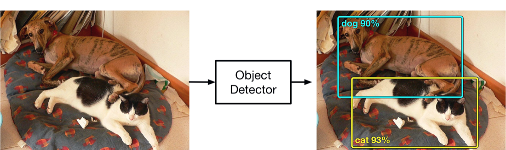
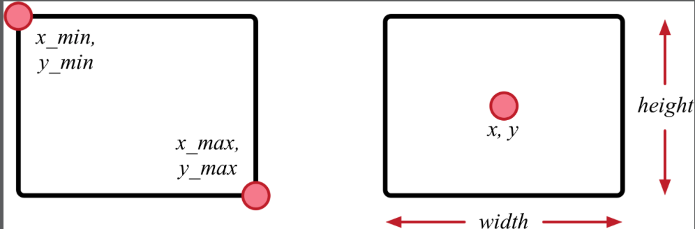
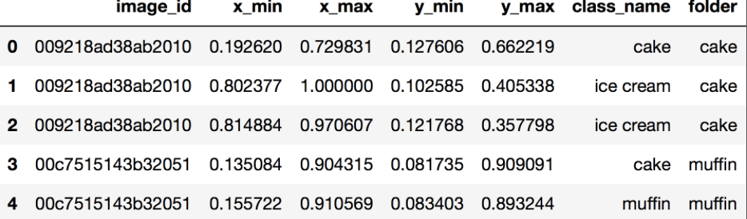
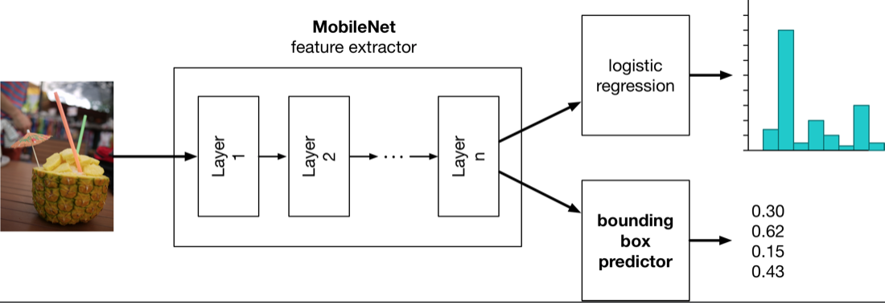
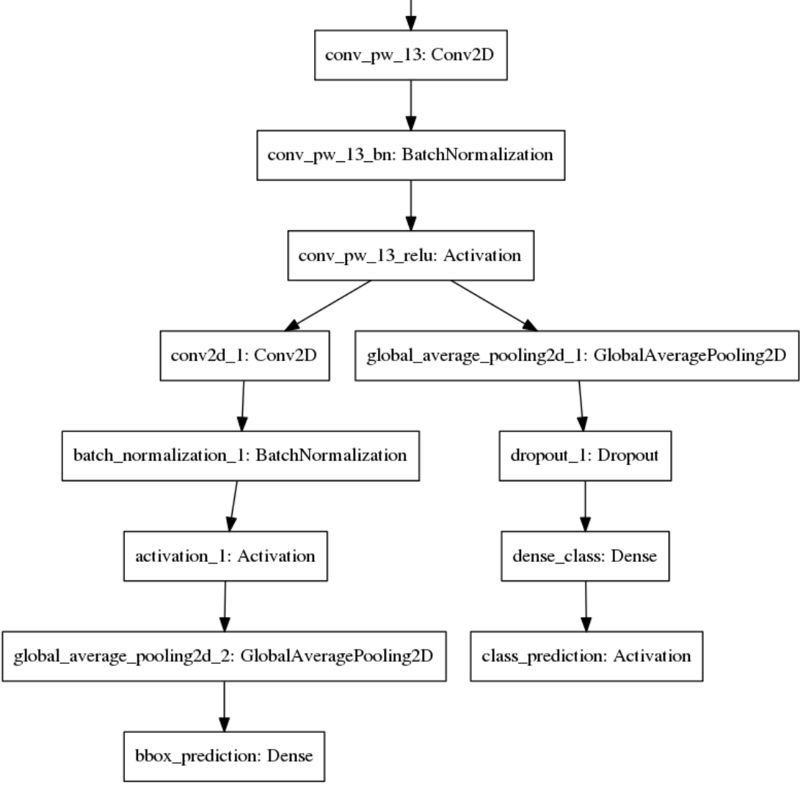
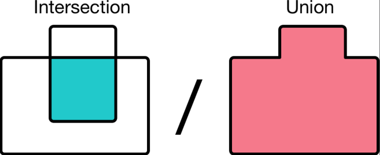

# Chapter 9: Beyond Classification

------

In this chapter, you’ll learn how to identify an object’s location in an image. You’ll learn how to build a simple localization model that predicts a single bounding box

------

## 大綱

- [Where is it?](#1)
  - [The ground-truth will set you free](#2)
  - [Show me the data!](#3)
  - [What about images without annotations?](#4)
  - [Your own generator](#5)
- [A simple localization model](#6)
  - [The new loss function](#7)
  - [Sanity checks](#8)
  - [Train it!](#9)
  - [IOU](#10)
  - [Trying out the localization model](#11)
  - [Conclusion: not bad, could be better](#12)
- [Key points](#13)

------


<h2 id="1">Where is it?</h2>

- **Object detection** is to find all the objects inside an image.
- It does this by predicting one or more **bounding boxes**, which are simply rectangular regions in the image.
  - Each bounding box also has a class — the type of the object inside the box — and a probability that tells you how confident the model is






------


<h2 id="2">The ground-truth will set you fre</h2>

- 目標: Just predict one bounding box
  - 起手式:  **revisit the dataset**
- 訓練model的流程是不變的
  - provide a dataset that consists of the images and the targets. 
  - provide a suitable loss function that calculates how wrong the model’s predictions are by comparing them to the targets. 
  - use a Stochastic Gradient Descent optimizer, such as Adam, to find the values for the model’s learnable parameters 
- 訓練資料的改變
  - Previously, the targets were just the class names for the images, but now **they must also include the so-called ground-truth bounding boxes**



- The first three rows in the dataframe all belong to the same image, a picture of a cake, but apparently, there’s also some ice cream in that image (see rows 1 and 2).
- **normalized coordinates**
  - between 0 and 1
  - It’s convenient to use normalized coordinates because it makes them independent of the actual size of the imag

------


<h2 id="3">Show me the data!</h2>

- **Garbage in equals garbage out.** If you’re training your model on data that doesn’t make sense, then neither will the model’s predictions and you just wasted a lot of time and electricity. Don’t be that person!

- Not all objects from all images have annotations, and some have duplicates, this dataset isn’t ideal
  - When you start building your own models, you’ll find that you’ll be spending a lot of time cleaning up your training data, filling in missing values, and so on.


```python
image_width = 224
image_height = 224

from helpers import plot_image

train_annotations.iloc[0]

image_id      009218ad38ab2010
x_min                  0.19262
x_max                 0.729831
y_min                 0.127606
y_max                 0.662219
class_name                cake
folder                    cake
Name: 0, dtype: object

from keras.preprocessing import image

def plot_image_from_row(row, image_dir):
    # Load the image from "folder/image_id.jpg"
    image_path = os.path.join(image_dir, row["folder"],
                              row["image_id"] + ".jpg")
    img = image.load_img(image_path,
                         target_size=(image_width, image_height))

    # Put the box coordinates and class name into a tuple
    bbox = (row["x_min"], row["x_max"],
            row["y_min"], row["y_max"], row["class_name"])”

# Draw the bounding box on top of the image”
plot_image(img, [bbox])

annotation = train_annotations.iloc[0]
plot_image_from_row(annotation, train_dir)
```

------


<h2 id="4">What about images without annotations?</h2>

- There are some tools that can help
  - **RectLabel**, available on the Mac App Store. This is a powerful tool with many options, but it expects the annotations to be provided as a separate XML file for each image. 
  - [Labelbox](labelbox.io) is an online tool for labeling training data for many different tasks, including object detection. This is a paid service but there is a free tier.
  - [Simple Image Annotator](github.com/sgp715) is a Python program that runs as a local web service. As its name implies, it’s pretty simple to use and offers only basic editing features. The output is a CSV file but it’s not 100% compatible with the CSV format we’re using.
  - [Sloth](github.com/opencv/cvat), which is available at sloth.readthedocs.io, and is an advanced labeling tool. Requires Linux.
    CVAT, or Computer Vision Annotation Tool

------


<h2 id="5">Your own generator</h2>

- Previously, you used I**mageDataGenerator and flow_from_directory()** to automatically load the images and put them into batches for training
- You’ll need a way to **read the rows from this dataframe** into a batch. Fortunately, Keras lets you write **your own custom generator.**

```python
from helpers import BoundingBoxGenerator

batch_size = 32
train_generator = BoundingBoxGenerator(train_annotations, train_dir,
                                       image_height, image_width,
                                       batch_size, shuffle=True)
train_iter = iter(train_generator)
X, (y_class, y_bbox) = next(train_iter)
```

- X.shape = (32, 224, 224, 3)
  - thirty-two 224×224 color images

- y_class = (32,) 
  - it has thirty-two class labels
- y_bbox is (32, 4) 
  - it has thirty-two bounding boxes — one per image — and each box is made up of four coordinates. 

```python
class BoundingBoxGenerator(keras.utils.Sequence):
    def __len__(self):
        return len(self.df) // self.batch_size

    def __getitem__(self, index):
        # ... code ommitted ...
        return X, [y_class, y_bbox]

    def on_epoch_end(self):
        self.rows = np.arange(len(self.df))
        if self.shuffle:
            np.random.shuffle(self.rows)
```

- **BoundingBoxGenerator** is a subclass of the **Keras Sequence object** that overrides a couple of methods

  - __len()__ method determines how many batches this generator can produce
    - The generator produces exactly 220 batches because 7,040 rows / 32 rows per batch = 220 batches. 
    - Usually, the size of the training set doesn’t divide so neatly by batch_size, in which case the last, incomplete batch is ignored or is padded with zeros to make it a full batc

  - __getitem__(). This method is called when you do next() or when you write train_generator[some_index]. 
    - Create new NumPy arrays to hold the images X, and the targets y_class and y_bbox for one batch. These arrays are initially empty.
    - Get the indices of the rows to include in this batch. It looks these up in self.rows.
    - For every row index, grab the corresponding row from the DataFrame.
    - Return X, as well as y_class and y_bbox, to the caller.

- BoundingBoxGenerator is currently not doing any data augmentation. If you’re up for a challenge, try adding data augmentation code to the generator — **but don’t forget that the bounding boxes should be transformed too along with the images!**

------


<h2 id="6">A simple localization model</h2>

- 利用之前訓練好的model, 但是現在要output兩種預測內容。
  - has two outputs: one for the classification results, and one for the bounding box predictions




- 如何利用functional API來實現branch架構
  - Ｃreate a layer object, such as **GlobalAveragePooling2D()**
  - Call this layer object on a tensor, such as **base_model.outputs[0]**, which is the output from the MobileNet feature extractor
  - The **layer_dict** lets you look up layers in the Keras model by name. **That’s why you named the new layers when you created them**.
  - layers[-2]. In Python notation, a negative index means that you’re indexing the array from the back, so **layers[-1] would be the last layer**. 


```python
import keras
from keras.models import Sequential
from keras.layers import *
from keras.models import Model, load_model
from keras import optimizers, callbacks
import keras.backend as K
import keras_applications

# 讀取原本訓練好的model
checkpoint = "checkpoints/multisnacks-0.7532-0.8304.hdf5"
classifier_model = load_model(checkpoint, custom_objects={
               "relu6": keras_applications.mobilenet.relu6 })

num_classes = 20

# The MobileNet feature extractor is the first "layer".
base_model = classifier_model.layers[0]

# 建立新的layer並從原本ouput layer取得tensor
# 此時pool是一個tensor
# Add a global average pooling layer after MobileNet.
pool = GlobalAveragePooling2D()(base_model.outputs[0])

# clf也是一個tensor
# Reconstruct the classifier layers.
clf = Dropout(0.7)(pool)
clf = Dense(num_classes, kernel_regularizer=regularizers.l2(0.01),
            name="dense_class")(clf)
clf = Activation("softmax", name="class_prediction")(clf)

# new branch from bbox
bbox = Conv2D(512, 3, padding="same")(base_model.outputs[0])
bbox = BatchNormalization()(bbox)
bbox = Activation("relu")(bbox)
bbox = GlobalAveragePooling2D()(bbox)
bbox = Dense(4, name="bbox_prediction")(bbox)

# 將兩個branch結合
model = Model(inputs=base_model.inputs, outputs=[clf, bbox])

for layer in base_model.layers:
    layer.trainable = False

layer_dict = {layer.name:i for i, layer in enumerate(model.layers)}

# Get the weights from the checkpoint model.
weights, biases = classifier_model.layers[-2].get_weights()

# Put them into the new model.
model.layers[layer_dict["dense_class"]].set_weights([weights, biases])
```

```python
from keras.utils import plot_model
plot_model(model, to_file="bbox_model.png")
```



------


<h2 id="7">The new loss function</h2>

- Two loss functions: sparse_categorical_crossentropy and mse. 
  - The model has two outputs and each predicts a different thing, so you want to use a different loss function for each output.
  - "mse" or mean squared error.
  - model.compile() now also has a **loss_weights** argument. Because there are two outputs, the loss computed during training looks like this:”


```python
model.compile(loss=["sparse_categorical_crossentropy", "mse"],
              loss_weights=[1.0, 10.0],
              optimizer=optimizers.Adam(lr=1e-3),
              metrics={ "class_prediction": "accuracy" })
```

```python
loss = 1.0*crossentropy_loss + 10.0*mse_loss + 0.01*L2_penalties
```

- this model has already been trained on the classification task but hasn’t learned anything about the bounding box prediction task yet, 
  - we’ve decided that the MSE loss for the bounding boxes should count more heavily. That’s why it has a weight of 10.0 versus a weight of 1.0 for the cross-entropy loss. 
  - This will encourage the model to pay more attention to errors from the bounding box output.

------


<h2 id="8">Sanity checks</h2>

- See what happens when you load an image and make a prediction.
- The preds variable is a list containing two NumPy arrays: 
  - **The first array, preds[0]**, is the 20-element probability distribution from the classifier output. 
  - **The second array, preds[1]**, has the four numbers for the bounding box.

```python
from keras.applications.mobilenet import preprocess_input
from keras.preprocessing import image

img = image.load_img(train_dir + "/salad/2ad03070c5900aac.jpg",
                     target_size=(image_width, image_height))

x = image.img_to_array(img)
x = np.expand_dims(x, axis=0)
x = preprocess_input(x)

preds = model.predict(x)
```

- Use the generator to make predictions

  - This will create predictions for all the rows in the train_annotations dataframe, 
  - an array of size (7040, 20) for the classification output, and an array of size (7040, 4) for the bounding box output. 

  ```python
  preds = model.predict_generator(train_generator)
  ```

------


<h2 id="9">Train it!</h2>

```python
val_generator = BoundingBoxGenerator(val_annotations, val_dir,
                                     image_height, image_width,
                                     batch_size, shuffle=False)

from helpers import combine_histories, plot_loss, plot_bbox_loss
histories = []
histories.append(model.fit_generator(train_generator,
                                     epochs=5,
                                     validation_data=val_generator,
                                     workers=8))

```

- bounding box loss is much smaller than the class loss, 0.1187 versus 0.4749. You can’t really compare these values because they were computed using completely different formulas
- there is no such metric for the bounding box predictions. That’s because you told model.compile() that you only wanted metrics={ "class_prediction": "accuracy" }.


```python
Epoch 1/5
220/220 [==============================] - 14s 64ms/step - loss: 1.8093 - class_prediction_loss: 0.4749 - bbox_prediction_loss: 0.1187 - class_prediction_acc: 0.8709 - val_loss: 1.2640 - val_class_prediction_loss: 0.5931 - val_bbox_prediction_loss: 0.0522 - val_class_prediction_acc: 0.8168
```

------


<h2 id="10">IOU</h2>

- For the **bounding box predictions**, there is also a metric that gives us some intuition about the quality of the model: IOU.
- **Intersection-over-Union**
  - A number between 0 and 1. 
  - The more similar the two boxes are, the higher the number. A perfect match is 1, while 0 means the boxes don’t overlap at all.



- To use this metric, you need to compile the model, again:
  - The **MeanIOU** object is a simple wrapper class that lets Keras and TensorFlow use the iou() function.. 


```python
from helpers import iou, MeanIOU, plot_iou

model.compile(loss=["sparse_categorical_crossentropy", "mse"],
              loss_weights=[1.0, 10.0],
              optimizer=optimizers.Adam(lr=1e-3),
              metrics={ "class_prediction": "accuracy",
                        "bbox_prediction": MeanIOU().mean_iou })
```

------


<h2 id="11">Trying out the localization model</h2>

- Write a function that makes a prediction on an image and plots both the ground-truth bounding box and the predicted one:

```python
def plot_prediction(row, image_dir):
    # Same as before:
    image_path = os.path.join(image_dir, row["folder"],
                              row["image_id"] + ".jpg")
    img = image.load_img(image_path,
                         target_size=(image_width, image_height))
    bbox_true = [row["x_min"], row["x_max"],
                 row["y_min"], row["y_max"],
                 row["class_name"].upper()]

    # Make the prediction:
    x = image.img_to_array(img)
    x = np.expand_dims(x, axis=0)
    x = preprocess_input(x)
    pred = model.predict(x)
    bbox_pred = [*pred[1][0], labels[np.argmax(pred[0])]]

    # Plot both bounding boxes and print the IOU:
    plot_image(img, [bbox_true, bbox_pred])   
    print("IOU:", iou(bbox_true, bbox_pred))
   

# view the results for a random image from the test set
row_index = np.random.randint(len(test_annotations))
row = test_annotations.iloc[row_index]
plot_prediction(row, test_dir) 
```

- 目前模型只能畫出一個boudingbox, 所以對照片中有多個物件出現的狀況仍無法正確處理, 需要可以讓model正確畫出多個boundingbox.

------


<h2 id="12">Conclusion: not bad, could be better</h2>

- On the validation set, it had an average IOU of a little over 30%. 
  - In general, we only consider a bounding box prediction correct when its IOU is over 0.5 or 50%
- how to create a model that can predict more than one bounding box.

------


<h2 id="13">Key points</h2>

- **Object detection models** are more powerful than classifiers: They can find many different objects in an image. It’s easy to make a simple localization model that predicts a single bounding box, but more tricky to make a full object detector.

- To train an object detector, you need **a dataset that has bounding box annotations**. There are various tools that let you create these annotations. You may **need to write your own generator** to use the annotations in Keras. Data wrangling is a big part of machine learning.

- **A model can perform more than one task**. To predict a bounding box in addition to classification probabilities, simply add a second output to the model. This output needs to have its own targets in the training data and its own loss function.

- The loss function to use for linear regression tasks, such as predicting bounding boxes, is **MSE or Mean Squared Error**. An interpretable metric for the accuracy of the bounding box predictions is IOU or Intersection-over-Union. **An IOU of 0.5 or greater is considered a good prediction**.

- When working with images, make plenty of plots to see if your data is correct. **Don’t just look at the loss and other metrics, also look at the actual predictions to check how well the model is doing**.

  