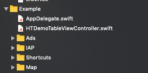

# My Utility Tool

花了點時間把之前做的app中某些功能抽出來當元件，原本想來試試看[Swift Package Manager](https://www.appcoda.com.tw/swift-package-manager/)也有考慮用[Carthage](https://gist.github.com/weihanglo/97e949a9dbf92deb111999b6e42e9654)，但後來還是決定用比較主流的[Cocoapod](https://cocoapods.org/)。之前自己是有嘗試做過自己的podspec，但那已經是很久之前的事情了。所以就當在練習，再玩一次。

因為想要把常用的元件抽出來，方便以後可以重複使用，但我不想每個元件都做的podspec，因此我的初步架構就是把不同的元件切割成不同的subspec, 這樣只要一個podspec就夠了，想要哪個元件就用哪個subspec就可以了，此外一定還要附上sample project這樣才方便之後的功能測試。

[Coacoapods Gudline](https://guides.cocoapods.org/)絕對是入門的起手式，一開始我先自己弄專案，然後寫podspec，但不知道什麼原因就是在subspec會發生錯誤，`pod spec lint`一直跑不過去。卡了幾天，都不知道是什麼原因，後來決定用了`pod lib create`產生一個template專案，再從這個專案下去改subspec就OK了。

架構如下

APP_UtilityTool

- Ads(處理廣告)
- Shortcut(Siri捷徑)
- IAP(內部購買)
- Map(地圖相關)

```ruby
Pod::Spec.new do |s|
  s.name             = 'APP_UtilityTool'
  s.version          = '0.1.0'
  s.summary          = 'iOS APP Utility Tool.'

  s.description      = <<-DESC
This is an utility tool for developing iOS app.
                       DESC

  s.homepage         = 'https://github.com/htaiwan/APP_UtilityTool'
  s.license          = { :type => 'MIT', :file => 'LICENSE' }
  s.author           = { 'Cheng, Chien-Tai' => 'htaiwan@gmail.com' }
  s.source           = { :git => 'https://github.com/htaiwan/APP_UtilityTool.git', :tag => s.version.to_s }

  s.ios.deployment_target = '12.0'
  s.swift_version = '4.2'
  s.static_framework = true

  s.frameworks = 'UIKit', 'Foundation'

  s.subspec 'Ads' do |ss|
    ss.dependency "Google-Mobile-Ads-SDK"
    ss.source_files  = "APP_UtilityTool/Ads/Classes/**/*"
  end

  s.subspec 'Shortcut' do |ss|
    ss.frameworks = 'Intents', 'IntentsUI'
    ss.source_files  = "APP_UtilityTool/Shortcut/Classes/**/*"
  end

  s.subspec 'IAP' do |ss|
    ss.frameworks = 'StoreKit'
    ss.source_files  = "APP_UtilityTool/IAP/Classes/**/*"
  end


  s.subspec 'Map' do |ss|
      ss.frameworks = 'CoreLocation', 'MapKit'
      ss.source_files  = "APP_UtilityTool/Map/Classes/**/*"
  end


end
```

範例專案使用的podfile

```ruby
use_frameworks!

target 'APP_UtilityTool_Example' do

  pod 'APP_UtilityTool/Ads', :path => '../'
  pod 'APP_UtilityTool/IAP', :path => '../'
  pod 'APP_UtilityTool/Shortcut', :path => '../'
  pod 'APP_UtilityTool/Map', :path => '../'

end
```

每個subspec都在範例專案有對應的範例，之後如果有寫到什麼好用東西就抽出來成一個subspec，再添加個範例，之後就可以重複使用了。



最後再把原本上架app的code再稍微整理一下，改用已經抽出來的元件。

```ruby
target 'WhereIsCar' do
  
  use_frameworks!
  
  pod 'APP_UtilityTool/Ads', :git => 'https://github.com/htaiwan/APP_UtilityTool.git', :tag => '0.2.0'
  pod 'APP_UtilityTool/IAP', :git => 'https://github.com/htaiwan/APP_UtilityTool.git', :tag => '0.2.0'
  pod 'APP_UtilityTool/Shortcut', :git => 'https://github.com/htaiwan/APP_UtilityTool.git', :tag => '0.2.0'
  pod 'APP_UtilityTool/Map', :git => 'https://github.com/htaiwan/APP_UtilityTool.git', :tag => '0.2.0'

end

target 'WhereIsCarIntents' do
  use_frameworks!

  pod 'APP_UtilityTool/Map', :git => 'https://github.com/htaiwan/APP_UtilityTool.git', :tag => '0.2.0'

end

target 'WhereIsCarIntentsUI' do
  use_frameworks!

  pod 'APP_UtilityTool/Map', :git => 'https://github.com/htaiwan/APP_UtilityTool.git', :tag => '0.2.0'

end
```

