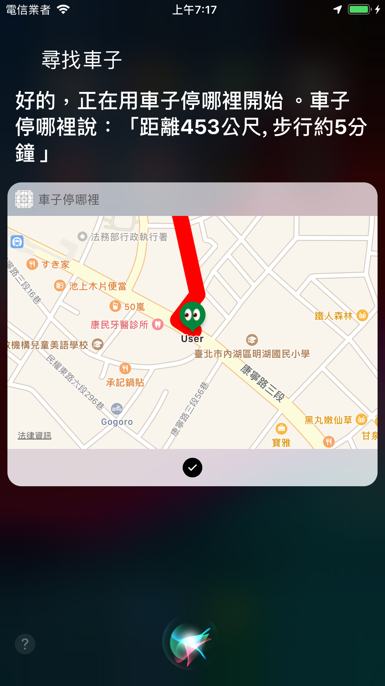

# 車子停哪裡

------

- # [車子停哪裡](https://reurl.cc/l36jv)

- #### 距離上次上架自己的app應該已經超過七年了，之後忙著幫公司幫客戶上架，慢慢忘記了當初上架自己app的那種感動的心情，為什麼想再上架自己的app，就是想再找回當初那種感動。

- #### 來説說為什麼要寫這個app, 其實這個app並不難，在app store也有很多類似這樣功能的app, 但我認爲這樣的app應該要簡單，方便使用。上面的app很多都太複雜了，我只想做到跟Siri說，我的車子停哪裡。Siri可以回覆我想知道的結果，不需要再花時間打開手機，然後再滿滿的app icon中，找到我的app，開啟我的app才能使用這個簡單功能。所以我就決定來寫這個app。



- ### 這個app有幾個主要部分組成

  - ### **In-App Purchase & Google-Mobile-Ads-SDK**

    - #### 寫app，除了找回感動，還是想多點麵包，混口飯吃。Google-Mobile-Ads-SDK線上文件範例寫的清楚明白，簡單好串。靠廣告來增加點外快。另外整合了In-App Purchase可以透過購買方式來隱藏廣告欄位，這樣的模式，算是相當主流的賺外快模式，線上滿多的app應該都是這樣的玩法。

    - ### 參考資源

      - ### [In-App Purchase Tutorial: Getting Started](https://www.raywenderlich.com/5456-in-app-purchase-tutorial-getting-started)

      - ### [Google-Mobile-Ads-SDK整合](https://developers.google.com/admob/ios/quick-start?hl=zh-cn)

  - ### **MapKit & CoreLocation**

    - #### 地圖跟定位，算是這個app的主要功能，CoreLocation並不陌生，之前滿多app都會用到，拿來定位用，倒沒什麼太大困難。MapKit這個雖然之前有些專案曾經玩過幾次，但還是需要在回憶一下。MKAnnotation，MKAnnotationView這都算是MapKit中的入手式，如何在map中增加Annotation。倒是有個MKDirections是我第一次用，可以拿來畫路線並計算距離，這個距離跟算兩點座標的直線距離並不一樣。

    - ### 參考資源
  
      - ### [MapKit and Core Location](https://www.raywenderlich.com/9236-mapkit-and-core-location)
  
  - ### **Siri Shortcut**
  
    - #### 這個應該是這個專案中坑最多的地方，畢竟算是比較新的東西，網路上可以找到資源也比較少，在現在公司的產品玩過一次，當時也是採了不少坑。 Intnet & Intent UI的使用，如何讓Siri可以正確念出我想要他唸的回應。雖然坑多，但我覺得shortcut是一個很棒的app extension。每個人的手機中的app這麼多，還要花時間找app開app，實在太麻煩了，可以透過shortcut可以簡化使用app方式, 透過對話方式，來達到app所想要的功能，這再直覺也不過了。
  
    - ### 參考資源
  
      - ### [Soup Chef: Accelerating App Interactions with Shortcuts](https://developer.apple.com/documentation/sirikit/soup_chef_accelerating_app_interactions_with_shortcuts)
  
      - ### [Siri Shortcuts Tutorial in iOS 12](https://www.raywenderlich.com/6462-siri-shortcuts-tutorial-in-ios-12)
  
  - ### **多國語言**
  
    - #### 支援英文，繁中，簡中。很久沒處理多國語言，不過因為APP功能簡單，所以處理上沒花太久時間。
    
    - ### 比較特別就是帶有參數的多國語言處理
    
    ```Swift
    "Find Path Success" = "%@ meters away, about %@ minutes walk";
    
    let text = String(format: NSLocalizedString("Find Path Success", comment: ""), direction.1, direction.2)
    Toast(text: text).show()
    ```
    
    - ### 參考資源
    
      - ### [Localization](https://www.raywenderlich.com/5039-localization)
    
  - ### Tracking
  
    - ### 原本一開始是整GA，但Google已經決定要淘汰這套系統了，所以就改用Firebase Analytics。
  
    - ### 參考資源
  
      - ### [Firebase Analytics](https://firebase.google.com/products/analytics)
  
- ### 送審過程(總共被打搶3次)

  - ### Guideline 2.1 - Performance - App Completeness

    - ### We are unable to complete the review of your app because one or more of your in-app purchase products have not been submitted for review.

    - ### 原因: 太久沒玩IAP，更久沒碰過App Store connect，忘記在App Store connect中把建好的in-app purchase products設定到我的app中。

  - ### Guideline 2.5.10 - Performance - Software Requirements

    - ### We noticed that your app or its screenshots include test advertisements. Apps or metadata items that include features that are for test or demonstration purposes are not appropriate for the App Store.

    - ### 原因: 截圖被打槍，因為上傳截圖的畫面中出現廣告欄位，就把廣告先蓋掉，再重傳一次。

  - ### Guideline 5.2.5 - Legal - Intellectual Property

    - ### Your app does not comply with the [Guidelines for Using Apple's Trademarks and Copyrights](https://www.apple.com/legal/intellectual-property/guidelinesfor3rdparties.html). Specifically, your app includes:

      - ### Siri in the app name or subtitle in an inappropriate manner
    
    - #### 原因: 這個打槍，卡了我3天，"Siri in the app" 這幾個字一直誤導我方向，我一直以爲是我app中哪個有關siri的畫面有問題，所以還截圖給apple，問他們是哪個畫面上的siri是有問題的，結果他們又回給我更多的guildline給我，叫我自己看，一開始，我是留電話請apple聯絡我，但又要再等3~5個工作天，就想說一邊等電話，一邊就硬著頭皮在茫茫大海的guildline文件找尋一絲絲的蛛絲馬跡，後來在這[guildline文件](https://developer.apple.com/siri/style-guide/)找到可疑的線索。
    
      > "To indicate your app’s support of SiriKit and Siri Shortcuts in your documentation and marketing materials, use the phrase “MyApp works with Siri.”。 
    
      
    
      - ### 原來是我在App Store connect中的app subtitle有問題，所以我改成他們指定的phrase，就過關了。
    
    


