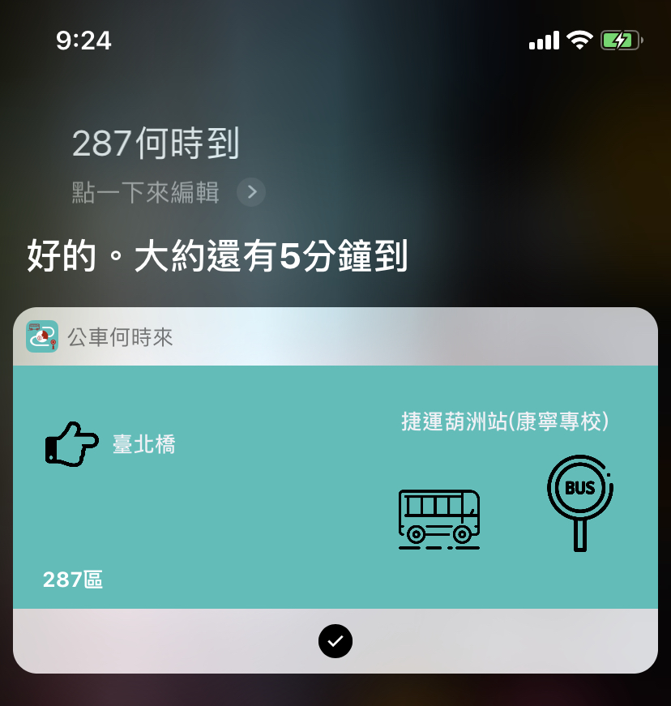

# 公車何時來

[公車何時來](https://apps.apple.com/us/app/公車何時來/id1478062327?ls=1)

又完成了一個上架app，台灣公車的app其實就是那幾個，我覺得弄的最完整應該就是[Bus+](https://apps.apple.com/tw/app/bus-公車動態-臺鐵-ubike-查詢/id967861325)，整體的設計給人非常的舒服，也提供一些其他公車app沒有的功能，例如無需解鎖，就可查到站時間的**即時查**。其實我這個app就是用Siri也做到類似這樣的功能。沒錯，又是Siri，跟上個app是相類似的概念。因為，用的技術類似，所以開發和審查的速度也比上次順利很多。

- 這個APP大致的組成跟上次差不多，所以相同的部分就不提了(In-App Purchase & Google-Mobile-Ads-SDK, Siri Shortcut)，來講講這次比較有趣的部分。

- [MOTC Transport API](https://ptx.transportdata.tw/MOTC#)

  - 這個平臺涵蓋全國的公車、臺鐵、高鐵、捷運、航空、自行車等公共運輸旅運資料服務API。
  - 剛開始覺得這些API很複雜，但他們的[文件](https://ptxmotc.gitbooks.io/ptx-api-documentation/content/)寫的算是很清楚，花點時間看過一遍，其實還不算太難懂。
  - 另外所有的API都支援[OData](https://zh.wikipedia.org/wiki/OData協定)，讓API使用上更加彈性多變化。
    - [支援OData查詢語法](https://ptxmotc.gitbooks.io/ptx-api-documentation/content/api-te-se/odata.html)

- API串接

  - 撰寫串接API的service算是寫app的基本功，各家門派也都有自己一套串接的方式，雖然是基本功，但隨著串接API越來越多，Service也會越來越龐大，越來越多重複的程式碼。
  - 自己也看過網路上不少各門派的撰寫方式，從早期的OC到現在Swift，分享兩篇自己看到，也嘗試實作過的串接方式，我自己是覺得還蠻不錯的。
  - [Write a Networking Layer in Swift 4 using Alamofire 5 and Codable Part 1: API Router](https://medium.com/@AladinWay/write-a-networking-layer-in-swift-4-using-alamofire-and-codable-part-1-api-router-349699a47569)
    - 這一篇也是這個app串接service的主要架構。
    - 最主要的特色就是利用Swift非常強而有力的Enum來實做**API Router**，這個router在架構中扮演相當重要的角色。
      - 利用router來擴充service的能力，而擴充的方式是利用enum。
      - enum讓整個router寫法變得非常的清楚。
        - 最後再透過Alamofire定義好的protocol-[URLRequestConvertible](http://cocoadocs.org/docsets/Alamofire/4.0.0/Protocols/URLRequestConvertible.html)產生畫龍點睛之妙，將router內的所有變數串接起來成一個url request。
      - 另外Alamofire也利用Swift5中新增的[Result](https://medium.com/@azamsharp/understanding-result-type-in-swift-5-387d5ef9f45e) - 透過Swtich case語法來處理API的Response, 在API使用上加優美。
  - [Writing a Scalable API Client in Swift 5](https://medium.com/makingtuenti/writing-a-scalable-api-client-in-swift-4-b3c6f7f3f3fb)
    - 這門派的寫法，定義了一個很清楚protocol - APIRequest, APIResponse的protocol。不同的API都實作APIRequest，讓request跟service脫鉤。Service只是單純負責send的動作。
    - 也用到Rsult來處理response。

- [PromisedFuture](https://github.com/AladinWay/PromisedFuture)

  - 用串接多知API, 避免產生的[callback hell](https://zonble.gitbooks.io/kkbox-ios-dev/blocks/callback_hell.html)。
  - 其實比較有名應該是這個[PromiseKit](https://github.com/mxcl/PromiseKit), 這個版本用法比較簡單但功能也相對單純。
  - 在iOS13之後, apple就會提供類似這樣功能的 native framewrok可以使用 - [Combine](https://developer.apple.com/documentation/combine), 目前還在beta版本。

- 送審過程

  - 這次送審過程到沒遇到什麼太大問題，畢竟跟上次是同類型的app, 不過還是被打槍了一次。原因是我的IAP裡面沒有做restore button，上次的app，我是有放這個，但我覺得好像沒必須，反正當你購買過，你再按購買按鈕，IAP就會跳提示視窗說“此app已購買過了”，想說都有這個提示了，就把restore button移掉。
    - 結果就是被打槍，IAP一定要有restore的功能。
    - 補上後，卻被回我說功能不正常，又打槍我，但我測試是正常的，所以我把我詳細的測試步驟提供給apple。然後就過關了 @@
    - 心得: apple測試人員真知道restore button是怎麼樣使用嗎？

  

  

  