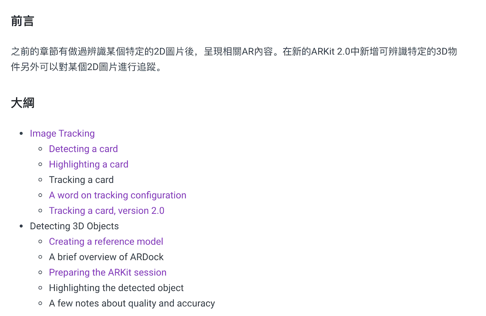

# ARKit by Tutorials讀後感

我的ARKit鐵人賽終於在今天先告一段落了，也達到下半年給自己的另外一個目標，在一個月內讀完一本書。

這個月，我挑戰的是這本書 - [ARKit by Tutorials](https://store.raywenderlich.com/products/arkit-by-tutorials), 回顧了我的commit的時間，在8/30送出第1章的筆記，到9/24完成第24章筆記，雖然不是確實每一天完成一章筆記，但我盡力讓自己可以達到可以平均一天一章的速度。

這個自我挑戰的背後意義就是:

> 堅持每天都多懂一些，多進步一些。永遠讓今天的我比昨天的我更厲害。

------

接下來説說，我都是怎樣看這類型的書本。通常每個章節我會分成三階段

**第一階段:** 我會快速讀過章節的重點內容，把重要的內容畫上筆記。

**第二階段:** 接下來，我會將每章節的範例程式，逐步的實作，並清楚的commit，然後每一章範例結束後，我就會打個tag。其實這步對我很重要，因為有時候回來查東西時，不見得都是看筆記，而是直接看code來把遺失的記憶喚醒。

**第三階段:** 最後就是完成筆記，我現在都是利用Gitbook做筆記，真的滿不錯。強烈建議。至於筆記的內容，我都會有前言跟大綱。

- **前言:** 讓自己是否可以清楚說明這章的主要內容是什麼
- **大綱:** 我會依照作者的編排順序，把這章所有的大小標題都清楚列出來，我認爲這些標題是貫串一整個文章的脈絡思緒，我也會參考這些標題，來進行對應的commit。

至於筆記，我並不一定都會把每個標題的內容都做筆記，我覺得不重要或者太簡單，這些我都會省略。做筆記的意義就是把重點挑出來，如果做得太詳細，那就跟直接看書有什麼不同。

------

最後，就說說看完這本書的心得。

當初想看這本書，是覺得AR跟AI是目前很夯的主題，剛好之前的hack day也都玩過幾次AR，所以就挑了這本書來點燃AR的新技能。

看完這本書，我自己把AR這個技能再細分幾個領域。

- AR建模
  - 透過程式碼或者是透過UI(.scene)中來完成模型，然後將模型讀取出來放到場景中
    - 這塊內容，這本書有在幾個範例程式都有帶過，例如透過程式碼來建立的3D房間，或者透過UI來組合車子模型。
  - 空間座標的處理，例如模型旋轉，放大縮小等動作。
    - CH9的**SceneKit coordinate system**
    - CH11的**The world coordinate system**
    - CH15的**Face coordinate system**
  - 還外材質，燈光的控制，這些都真的需要多練習才能深入。
    - CH9的Texture, Lighting
    - 在matrial中diffuse.content可以直接把UIKit的元件(ex. ImageView, UILabel..等)貼在AR物件表面上，這應該是滿常用的結合。
- 物理引擎
  - CH6的擲骰子行為。CH19, 20車子開動的行為。
  - 雖然這些物理行為都不需要自己寫程式來模擬，都是現成內建的，但這些物理行為的屬性真的超級多，例如摩擦力，滑動, 剛性，重力。可能都要回去複習一下高中物理，才能真的理解這些參數到底是做什麼。
- Apple Framework的熟悉
  - ARKit, SceneKit是貫穿這本書最主要的兩個framework
    - 常用到的session delegate，如何獲取anchor等。
  - CH22的Connectivity Framework也是達成多人共享AR體驗所需要熟悉的
  - 另外有些比較特殊的綜合使用，CH17中的人臉特徵的追蹤，CH13結合Beacon的微定位應用。