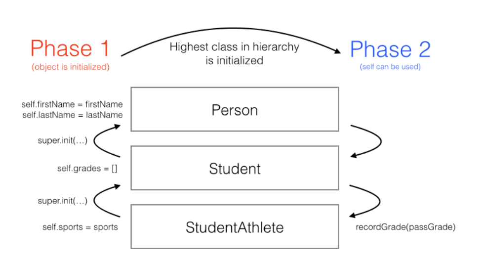

# Chapter 14: Advanced Classes

------

## 大綱

- [Introducing inheritance](#1)
  - [Polymorphism](#2)
  - [Runtime hierarchy checks](#3)
  - [Inheritance, methods and overrides](#4)
  - [Introducing super](#5)
  - [When to call super](#6)
  - [Preventing inheritance](#7)
- [Inheritance and class initialization](#8)
  - [Two-phase initialization](#9)
  - [Required and convenience initializers](#10)
- [When and why to subclass](#11)
  - [Single responsibility](#12)
  - [Strong types](#13)
  - [Shared base classes](#14)
  - [Extensibility](#15)
  - [Identity](#16)
- [Understanding the class lifecycle](#17)
  - [Deinitialization](#18)
  - [Retain cycles and weak references](#19)
- [Key points](#20)

------

<h2 id="1">Introducing inheritance</h2>

- A Swift class can inherit from only one other class, a concept known as **single inheritance**.
- **There’s no limit to the depth of subclassing**, meaning you can subclass from a class that is also a subclass
  - A chain of subclasses is called a **class hierarchy**
  - A superclass is also called the **parent class** of its **child class**.


```swift
class Person {
  var firstName: String
  var lastName: String
  
  init(firstName: String, lastName: String) {
    self.firstName = firstName
    self.lastName = lastName
  }
}

// the Student class now inherits from Person, indicated by a colon after the naming of Student
class Student: Person {
  var partner: Student?
  var grades: [Grade] = []
  
  func recordGrade(_ grade: Grade) {
    grades.append(grade)
  }
}
```


------

<h2 id="2">Polymorphism</h2>

- **polymorphism** is a programming language’s ability to treat an object differently based on context.

```swift
func phonebookName(_ person: Person) -> String {
  return "\(person.lastName), \(person.firstName)"
}

let person = Person(firstName: "Johnny", lastName: "Appleseed")
let oboePlayer = OboePlayer(firstName: "Jane", lastName: "Appleseed")

phonebookName(person) // Appleseed, Johnny
// OboePlayer也是一個person
phonebookName(oboePlayer) // Appleseed, Jane
```

------

<h2 id="3">Runtime hierarchy checks</h2>

- Swift provides the as operator to treat a property or a variable as another type:
  - **as**: Cast to a specific type that is known at compile time to succeed, **such as casting to a supertype.**
  - **as?**: An optional downcast (to a subtype). **If the downcast fails, the result of the expression will be nil.**
  - **as!**: A forced downcast. **If the downcast fails, the program will crash**. Use this rarely, and only when you are certain the cast will never fail.”

```swift
var hallMonitor = Student(firstName: "Jill", lastName: "Bananapeel")

hallMonitor = oboePlayer

oboePlayer as Student
//(oboePlayer as Student).minimumPracticeTime // ERROR: No longer a band member!

hallMonitor as? BandMember
(hallMonitor as? BandMember)?.minimumPracticeTime // 4 (optional)

hallMonitor as! BandMember // Careful! Failure would lead to a runtime crash.
(hallMonitor as! BandMember).minimumPracticeTime // 4 (force unwrapped)
```

- The optional downcast as? is particularly useful in if let or guard statements

```swift
if let hallMonitor = hallMonitor as? BandMember {
  print("This hall monitor is a band member and practices at least \(hallMonitor.minimumPracticeTime) hours per week.")
}
```


------

<h2 id="4">Inheritance, methods and overrides</h2>

- Besides creating their own methods, subclasses can **override** methods defined in their superclass
- If your subclass were to have an identical method declaration as its superclass, **but you omitted the override keyword, Swift would emit a compiler error**


------

<h2 id="5">Introducing super</h2>

- The super keyword is similar to self, except it will invoke the method in the nearest implementing superclass

------

<h2 id="6">When to call super</h2>

- It’s best practice to **call the super version of a method first when overriding**. That way, the superclass won’t experience any side effects introduced by its subclas

```swift
class StudentAthlete: Student {
  var failedClasses: [Grade] = []
  
  override func recordGrade(_ grade: Grade) {
    super.recordGrade(grade)
    
    if grade.letter == "F" {
      failedClasses.append(grade)
    }
  }
```

------

<h2 id="7">Preventing inheritance</h2>

- By marking the FinalStudent class **final**, you tell the compiler to prevent any classes from inheriting. 

```swift
final class FinalStudent: Person {}
class FinalStudentAthlete: FinalStudent {} // Build error!
```

- can mark **individual methods as final**, if you want to allow a class to have subclasses, but protect individual methods from being overridden:

```swift
class AnotherStudent: Person {
  final func recordGrade(_ grade: Grade) {}
}

class AnotherStudentAthlete: AnotherStudent {
  override func recordGrade(_ grade: Grade) {} // Build error!
}
```

------

<h2 id="8">Inheritance and class initialization</h2>

- **Initializers** in subclasses are required to call super.init because without it, the superclass won’t be able to provide initial states for all its stored properties 

------

<h2 id="9">Two-phase initialization</h2>

- two-phase initialization.
  - **Phase one**: Initialize all of the stored properties in the class instance, from the bottom to the top of the class hierarchy. You can’t use properties and methods until phase one is complete.
  - **Phase two**: You can now use properties and methods, as well as initializations that require the use of self.




```swift
class StudentAthlete: Student {
  var sports: [String]

  init(firstName: String, lastName: String, sports: [String]) {
    // 1: initialize the sports property of StudentAthlete
    self.sports = sports
    // 2: create local variables for things like grades, you can’t call recordGrade(_:) yet because the object is still in the first phase
    let passGrade = Grade(letter: "P", points: 0.0, 
                          credits: 0.0)
    // 3: call super.init. When this returns, you know that you’ve also initialized every class in the hierarchy
    super.init(firstName: firstName, lastName: lastName)
    // 4: After super.init returns, the initializer is in phase 2, so you call recordGrade(_:)
    recordGrade(passGrade)
  }
  // original code
}
```


------

<h2 id="10">Required and convenience initializers</h2>

- it’s possible to have multiple initializers in a class
- Swift supports this through the language feature known as **required initializers**
  - This keyword will force all subclasses of Student to implement this initializer.
- You can also mark an initializer as a **convenience initializer**
- A non-convenience initializer is called a **designated initializer** and is subject to the rules of two-phase initialization. 

```swift
class NewStudentAthlete: NewStudent {
  var failedClasses: [Grade] = []
  var sports: [String]
  // designated initializer
  init(firstName: String, lastName: String, sports: [String]) {
    self.sports = sports
    let passGrade = Grade(letter: "P", points: 0.0, credits: 0.0)
    super.init(firstName: firstName, lastName: lastName)
    recordGrade(passGrade)
  }
  // required / designated initializers
  required init(firstName: String, lastName: String) {
    self.sports = []
    super.init(firstName: firstName, lastName: lastName)
  }
  
  override func recordGrade(_ grade: Grade) {
    super.recordGrade(grade)
    
    if grade.letter == "F" {
      failedClasses.append(grade)
    }
  }
  // convenience initializer
  convenience init(transfer: NewStudent) {
    self.init(firstName: transfer.firstName, lastName: transfer.lastName)
  }
  
  var isEligible: Bool {
    return failedClasses.count < 3
  }
}
```

- Here’s a summary of the compiler rules for using designated and convenience initializers:
  - A designated initializer must call a designated initializer from its immediate superclass.
  - A convenience initializer must call another initializer from the same class.
  - A convenience initializer must ultimately call a designated initializer.
    

------

<h2 id="11">When and why to subclass</h2>


------

<h2 id="12">Single responsibility</h2>

- single responsibility principle states that any class should have a single concern.


------

<h2 id="13">Strong types</h2>

- Subclassing creates an additional type

```swift
class Team {
  // A team has players who are student athletes. If you tried to add a regular Student object to the array of players, the type system wouldn’t allow it
  var players: [StudentAthlete] = []

  var isEligible: Bool {
    for player in players {
      if !player.isEligible {
        return false
      }
    }
    return true
  }
}
```


------

<h2 id="14">Shared base classes</h2>

- It makes sense for Button to be concerned with the press behavior, and the subclasses to handle the actual look and feel of the button.


```swift
// A button that can be pressed.
class Button {
  func press() {}
}

// An image that can be rendered on a button
class Image {}

// A button that is composed entirely of an image.
class ImageButton: Button {
  var image: Image

  init(image: Image) {
    self.image = image
  }
}

// A button that renders as text.
class TextButton: Button {
  var text: String

  init(text: String) {
    self.text = text
  }
}
```

------

<h2 id="15">Extensibility</h2>

- you can subclass Button and add your custom subclass to use with code that’s expecting an object of type Button.


------

<h2 id="16">Identity</h2>

- it’s important to understand that classes and class hierarchies model what objects are. 
- If your goal is to share behavior (what objects can do) between types, **more often than not you should prefer protocols over subclassing**

------

<h2 id="17">Understanding the class lifecycle</h2>

- In Swift, the mechanism for deciding when to clean up unused objects on the heap is known as **reference counting**. 
- **When a reference count reaches zero**, that means the object is now abandoned since nothing in the system holds a reference to it. When that happens, Swift will clean up the object.

```swift
var someone = Person(firstName: "Johnny", lastName: "Appleseed")
// Person object has a reference count of 1 (someone variable)

var anotherSomeone: Person? = someone
// Reference count 2 (someone, anotherSomeone)

var lotsOfPeople = [someone, someone, anotherSomeone, someone]
// Reference count 6 (someone, anotherSomeone, 4 references in lotsOfPeople)

anotherSomeone = nil
// Reference count 5 (someone, 4 references in lotsOfPeople)

lotsOfPeople = []
// Reference count 1 (someone)

someone = Person(firstName: "Johnny", lastName: "Appleseed")
// Reference count 0 for the original Person object!
// Variable someone now references a new object
```


------

<h2 id="18">Deinitialization</h2>

- A deinitializer is a special method on classes that runs when an object’s reference count reaches zero, but before Swift removes the object from memory.
  - What you do in an deinitializer is up to you. Often you’ll **use it to clean up other resources, save state to a disk or execute any other logic you might want when an object goes out of scope**


```swift
class Person {
  // original code
  deinit {
    print("\(firstName) \(lastName) is being removed
          from memory!")
  }
}
```


------

<h2 id="19">Retain cycles and weak references</h2>

```swift
class Student: Person {
  var partner: Student?
  // original code
  deinit {
    print("\(firstName) is being deallocated!")
  }
}

var alice: Student? = Student(firstName: "Alice",
                              lastName: "Appleseed")
var bob: Student? = Student(firstName: "Bob",
                            lastName: "Appleseed")

// 造成Retain cycles
alice?.partner = bob
bob?.partner = alice

// 即使都變成nil, 也無法release
alice = nil
bob = nil

```

```swift
class Student: Person {
  // 利用weak來處理Retain cycles
  // Weak references must be declared as optional types so that when the object that they are referencing is released, it automatically becomes nil
Excerpt From: By Ray Fix. “Swift Apprentice.” Apple Books. 
  weak var partner: Student?
  // original code
}
```


------

<h2 id="20">Key points</h2>

- **Class inheritance** is one of the most important features of classes and enables **polymorphism**.
- **Subclassing** is a powerful tool, but it’s good to know when to subclass. Subclass when you want to extend an object and could benefit from an “is-a” relationship between subclass and superclass, but be mindful of the inherited state and deep class hierarchies.
- The keyword **override** makes it clear when you are overriding a method in a subclass.
- The keyword **final** can be used to prevent a class from being subclassed.
- Swift classes use **two-phase initialization** as a safety measure to ensure all stored properties are initialized before they are used.
- Class instances have their own lifecycles which are controlled by their **reference counts**.
- **Automatic reference counting**, or ARC, handles reference counting for you automatically, but it’s important to watch out for retain cycles.
  