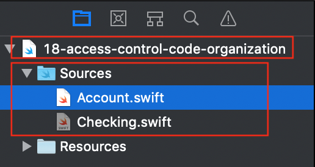

# Chapter 18: Access Control & Code Organization

- 如何透過access control來控制interface的使用。

------

## 大綱

- [Problems introduced by lack of access control](#1)
- [Introducing access control](#2)
  - [Private](#3)
  - Playground sources
  - [Fileprivate](#4)
  - Internal, public and open
    - [Internal](#5)
    - [Public](#6)
    - [Open](#7)
- [Organizing code into extensions](#8)
  - [Extensions by behavior](#9)
  - [Extensions by protocol conformance](#10)
  - [available()](#11)
- [Key points](#12)

------

<h2 id="1">Problems introduced by lack of access control</h2>

```swift
/// 利用protocol來描述一個帳號的核心功能
protocol Account {
  associatedtype Currency

  var balance: Currency { get }
  func deposit(amount: Currency)
  func withdraw(amount: Currency)
}

typealias Dollars = Double

/// 建立 "basic" account.來實作Account protocol
class BasicAccount: Account {

  var balance: Dollars = 0.0

  func deposit(amount: Dollars) {
    balance += amount
  }

  func withdraw(amount: Dollars) {
    if amount <= balance {
      balance -= amount
    } else {
      balance = 0
    }
  }
}
```

雖然balance在protocol是宣告成read-only, 但在實作時並沒有限制balance的操作，所以外部可以隨時更改balance的狀態。

```Swift
// 建立新帳號
let account = BasicAccount()

// 測試存款跟領款的功能
account.deposit(amount: 10.00)
account.withdraw(amount: 5.00)

// 問題點: 竟然還可以隨意修改帳戶餘額
account.balance = 1000000.00
```

------

<h2 id="2">Introducing access control</h2>

正確做法是要加入access identifier到balance中

```Swift
// 限制balance的setter為private, 外部不可以隨意使用
private(set) var balance: Dollars
```

目前Swift中的access modifiers

> - **<u>private</u>**: Accessible only to the defining type, all nested types and extensions on that type within the same source file.
> - **<u>fileprivate</u>**: Accessible from anywhere within the source file in which it’s defined.
> - **<u>internal:</u>** Accessible from anywhere within the module in which it’s defined. This is the default access level.
> - **<u>public</u>**: Accessible from anywhere within the module in which it is defined, as well as another software module that imports this module.
> - **<u>open</u>**: The same as public, with the additional ability of being able to be overridden by code in another module.

------

<h2 id="3">Private</h2>

```Swift
class CheckingAccount: BasicAccount {
  private let accountNumber = UUID().uuidString

  class Check {
    let account: String
    var amount: Dollars
    private(set) var cashed = false

    func cash() {
      cashed = true
    }

    init(amount: Dollars, from account: CheckingAccount) {
      self.amount = amount
      // 讀取外部type的private value
      self.account = account.accountNumber
    }
  }
}
```

CheckingAccount中有個nested type check可以讀取CheckingAccounty在private value。

------

<h2 id="4">Fileprivate</h2>

```swift
// 將Check中的init宣告為private
private init(amount: Dollars, from account: CheckingAccount) { }
```

這樣的做法，可以避免外部可以任意產生check，但也因為宣告成private，所以也無法讀取外部class的CheckingAccount，因此改成Fileprivate，既可以避免外部使用，也可以使用外部的class的CheckingAccount。

使用時機：

> The fileprivate modifier is ideal for code that is “cohesive” within a source file; that is, code that is closely related or serves enough of a common purpose to have shared but protected access. Check and CheckingAccount are examples of two cohesive types.
>

------

<h2 id="5">Internal</h2>

> 在Xcode中的playground的設計中，Sources目錄下的所有的檔案都算是在同一個module內，playground檔案是在另外一個module裡。



當在playground中，新增下列code, 會出現錯誤，這是因為swift中所有type的default值是 internal，只允許在同一個module內讀取，然而playground中要用Sources中的class，是屬於另外一個module，所以無法讀取。

```Swift
// Create a checking account for John. Deposit $300.00
let johnChecking = CheckingAccount() // use unsolved identifier "CheckingAccount"
johnChecking.deposit(amount: 300.00)
```

------

<h2 id="6">Public</h2>

要讓CheckingAccount在不同的module下也可以使用，那就是要宣告成public

```swift
public class CheckingAccount: BasicAccount
```

但這樣只是表示這個type是public，裡面所有member也要根據需求宣告成public才行。

------

<h2 id="7">Open</h2>

目前CheckingAccount和BasicAccount，都宣告成public，這樣就可以在playground直接使用，那如果要在playground中建立SavingsAccount繼承BasicAccount並overridden相關的code，則會報錯。

```Swift
class SavingsAccount: BasicAccount {
  var interestRate: Double // 錯誤: can not inheirt from non-open class

  init(interestRate: Double) {
    self.interestRate = interestRate
  }

  func processInterest() {
    let interest = balance * interestRate
    deposit(amount: interest)
  }
}
```

如果想要在不同module繼承另外一個moudle中的class，則就要宣告成open。

<h2 id="8">Organizing code into extensions</h2>

> “A theme of access control is the idea that your code should be **<u>loosely coupled</u>** and **<u>highly cohesive</u>**. Loosely coupled code limits how much one entity knows about another, which in turn makes different parts of your code less dependent on others. Highly cohesive code, as you learned earlier, helps closely related code work together to fulfill a task.”

- loosely coupled: 兩個不同entity盡量彼此之前越少交集越好。
- highly cohesive: 相關的code進量越靠近越好。

<h2 id="9">Extensions by behavior</h2>

> “An effective strategy in Swift is to organize your code into extensions by behavior”
>

- 根據不同的行為模式建構不同的extension。

```Swift
private extension CheckingAccount {
  func inspectForFraud(with checkNumber: Int) -> Bool {
    return issuedChecks.contains(checkNumber)
  }

  func nextNumber() -> Int {
    let next = currentCheck
    currentCheck += 1
    return next
  }
}
```

- private extension: 表示其中所有的member都是private。

> “Putting these two methods together also connects two related, cohesive methods. It’s clear to yourself and anyone else maintaining the code that these two are cohesive and help solve a common task.”

------

<h2 id="10">Extensions by protocol conformance</h2>

> **Adding Protocol Conformance with an Extension**

利用 extension 讓型別遵從 protocol 和定義 protocol 的功能

```Swift
// 利用 extension 讓CheckingAccount遵從 protocol CustomStringConvertible的定義跟功能
extension CheckingAccount: CustomStringConvertible {
  public var description: String {
    return "Checking Balance: $\(balance)"
  }
}
```

------

<h2 id="11">available()</h2>

用來宣告某個method即將deprecated, 改用另外一個method。

```Swift
class SavingsAccount: BasicAccount {
  var interestRate: Double
  private let pin: Int
  
  @available(*, deprecated, message: "Use init(interestRate:pin:) instead")
  init(interestRate: Double) {
    self.interestRate = interestRate
    pin = 0;
  }
  
  init(interestRate: Double, pin: Int) {
    self.interestRate = interestRate
    self.pin = pin
  }
}
```

------


<h2 id="12">Key points</h2>

- Access control modifiers are private, fileprivate, internal, public and open. The internal access level is the default.
- Modifiers can be used to control your code’s visible interface and hide complexity.
- private and fileprivate protect code from being accessed by code in other types or files, respectively.
- public and open allow code to be accessed from another module. The open modifier additionally allows entities to be overridden by other modules.
- When access modifiers are applied to extensions, all members of the extension receive that access level.
- Extensions that mark protocol conformance cannot have access modifiers.
- The keyword available can be used to evolve a library by deprecating APIs.


