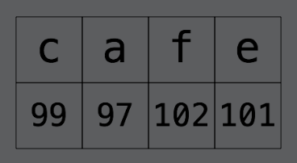
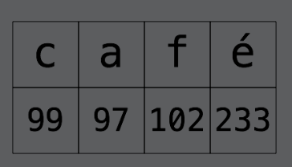
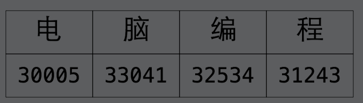
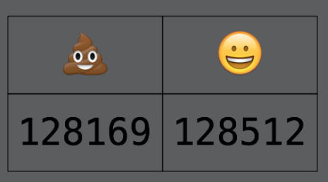
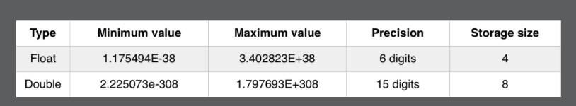
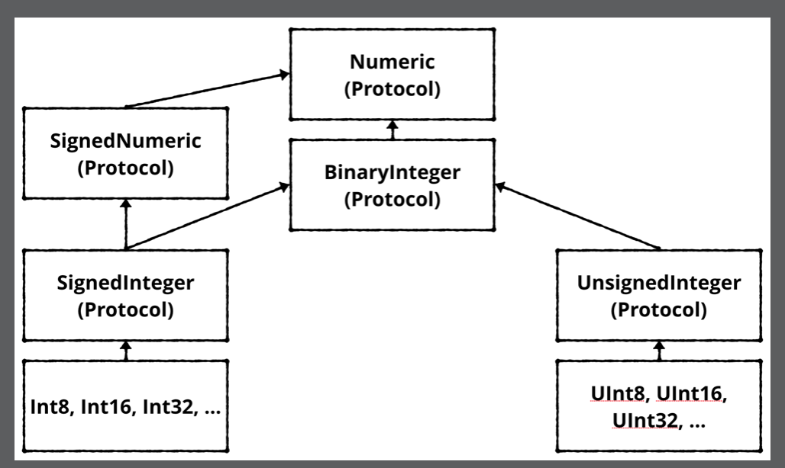

# Chapter 2: Types & Operations

------

大綱

- [Type conversion](#!)
  - Operators with mixed types
  - Type inference
- Strings
  - [How computers represent strings](#2)
  - [Unicode](#3)
- [Strings in Swift](#4)
  - Characters and strings
  - Concatenation
  - Interpolation
  - Multi-line strings
- [Tuples](#5)
- [A whole lot of number types](#6)
- [A peek behind the curtains: Protocols](#7)
- [Key points](#8)

------

<h2 id="1">Type conversion</h2>

```swift
// Operators with mixed types
var integer: Int = 100
var decimal: Double = 12.5
//integer = decimal /* Cannot assign value of type 'Double' to type 'Int' */
integer = Int(decimal)

let hourlyRate: Double = 19.5
let hoursWorked: Int = 10
//let totalCost: Double = hourlyRate * hoursWorked /* Binary operator '*' cannot be applied to operands of type 'Double' and 'Int' */
let totalCost: Double = hourlyRate * Double(hoursWorked)

// Type inference
let typeInferedInt = 42 /* Type = Int */
let typeInferedDouble = 3.14159 /* Type = Double */

let wantADouble = 3 /* Type = Int */

let actuallyDouble = Double(3)
let actuallyDouble: Double = 3
let actuallyDouble = 3 as Double
let wantADouble = 3.0

```


------

<h2 id="2">How computers represent strings</h2>

- Computers think of strings as a collection of individual characters.
- a computer needs to be able to translate a character into the computer’s own language, and it does so by **assigning each character a different number**. This forms a two-way mapping from character to number that is called **a character set**.


------

<h2 id="3">Unicode</h2>

- There have been several standards over the years, but the most modern standard is **Unicode**. It defines the character set mapping that almost all computers use today.









------

<h2 id="4">Strings in Swift</h2>

```swift
// CHARACTERS
let characterA: Character = "a"
let characterDog: Character = "🐶"
let stringDog = "Dog"

// STRING CONCATENTATION
var message = "Hello" + " my name is "
let name = "Matt"
message += name // Hello my name is Matt
let exclamationMark: Character = "!" 
message += String(exclamationMark) // Hello my name is Matt!

// STRING INTERPOLATION
message = "Hello my name is \(name)!"

let oneThird = 1.0 / 3.0
let oneThirdLongString = "One third is \(oneThird) as a decimal."

// Multi-line strings
let bigString = """
  You can have a string
  that contains multiple
  lines
  by
  doing this.
  """
print(bigString)
```


------

<h2 id="5">Tuples</h2>

```swift
let coordinates = (2, 3) /* Type = (Int, Int) */
let coordinatesDoubles = (2.1, 3.5) /* Type = (Double, Double) */
let coordinatesMixed = (2.1, 3) /* Type = (Double, Int) */

let x1 = coordinates.0
let y1 = coordinates.1

let coordinatesNamed = (x: 2, y: 3)
let x2 = coordinatesNamed.x
let y2 = coordinatesNamed.y

let coordinates3D = (x: 2, y: 3, z: 1)
let (x3, y3, z3) = coordinates3D
//let x3 = coordinates3D.x
//let y3 = coordinates3D.y
//let z3 = coordinates3D.z

let (x4, y4, _) = coordinates3D
```

------

<h2 id="6">A whole lot of number types</h2>




------

<h2 id="7">A peek behind the curtains: Protocols</h2>



------

<h2 id="8">Key points</h2>

- Type conversion allows you to convert values of one type into another.
- Type conversion is required when using an operator, such as the basic arithmetic operators (+, -, *, /), with mixed types.
- Type inference allows you to omit the type when Swift already knows it.
- Unicode is the standard for mapping characters to numbers.
- A single mapping in Unicode is called a code point.
- The Character data type stores single characters. The String data type stores collections of characters, or strings.
- You can combine strings by using the addition operator.
- You can use string interpolation to build a string in-place.
- You can use tuples to group data into a single data type.
- Tuples can either be unnamed or named. Their elements are accessed with index numbers for unnamed tuples, or programmer given names for named tuples.
- There are many kinds of numeric types with different storage and precision capabilities.
- Protocols are how types are organized in Swift.