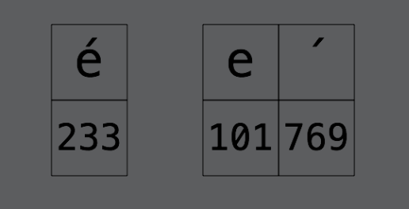
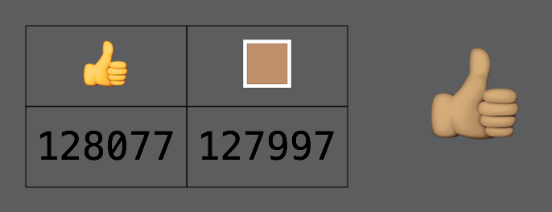

# Chapter 9: Strings

------

## 大綱

- [Strings as collections](#1)
  - [Grapheme clusters](#2)
  - [Indexing strings](#3)
  - [Equality with combining characters](#4)
- [Strings as bi-directional collections](#5)
- [Substrings](#6)
- [Encoding](#7)
  - [UTF-8](#8)
  - [UTF-16](#9)
- [Converting indexes between encoding views](#10)
- [Key points](#11)

------

<h2 id="1">Strings as collections</h2>

- String是一種collections

```swift
let string = "Matt"
for char in string {
  print(char)
}

let stringLength = string.count
let fourthChar = string[3] // error: 'subscript' is unavailable: cannot subscript String with an Int, see the documentation comment for discussion
```


------

<h2 id="2">Grapheme clusters</h2>

- There are two ways to represent some characters. One example is the é in café.

  - The single character to represent this is code point 233.
  - The two-character case is an e on its own followed by an acute accent combining character

  

  - The combination of these two characters in the second diagram forms what is known as a **grapheme cluster** defined by the Unicode standard
    - Grapheme clusters are represented by the Swift type Character.


  

  ```swift
  // GRAPHEME CLUSTERS
  let cafeNormal = "café"
  let cafeCombining = "cafe\u{0301}"
  
  cafeNormal.count // 4
  cafeCombining.count // 4
  
  cafeNormal.unicodeScalars.count // 4
  cafeCombining.unicodeScalars.count // 5
  
  for codePoint in cafeCombining.unicodeScalars {
    print(codePoint.value)
  }
  99
  97
  102
  101
  769
  ```

  

<h2 id="3">Indexing strings</h2>

```swift
// 取得第一個字
let firstIndex = cafeCombining.startIndex // firstIndex的type是String.Index不是integer.
let firstChar = cafeCombining[firstIndex] // firstChar的type是Character也是grapheme cluster

// 取得最後一個字
let lastIndex = cafeCombining.endIndex // Fatal error: String index is out of bounds
let lastIndex = cafeCombining.index(before: cafeCombining.endIndex)
let lastChar = cafeCombining[lastIndex]

// 取得第四個字
let fourthIndex = cafeCombining.index(cafeCombining.startIndex, offsetBy: 3)
let fourthChar = cafeCombining[fourthIndex]

fourthChar.unicodeScalars.count
fourthChar.unicodeScalars.forEach { codePoint in
  print(codePoint.value)
}
```


------

<h2 id="4">Equality with combining characters</h2>

- String comparison in Swift uses a technique known as **canonicalization**
  - Before checking equality, Swift canonicalizes both strings, which means they’re converted to use the same special character representation.
  - café using the single é character and café using the e plus combining accent character had the same length.

```swift
let equal = cafeNormal == cafeCombining // true
```

------

<h2 id="5">Strings as bi-directional collections</h2>

- 如何進行string的反轉

```swift
let name = "Matt"
let backwardsName = name.reversed() // ReversedCollection<String>
let secondCharIndex = backwardsName.index(backwardsName.startIndex, offsetBy: 1)
let secondChar = backwardsName[secondCharIndex]

let backwardsNameString = String(backwardsName) // 透過init反轉回String格式
```


------

<h2 id="6">Substrings</h2>

- The reason for this extra Substring type is a **cunning optimization**. 
- A Substring shares the storage with its parent String that it was sliced from. This means that when you’re in the process of slicing a string, you use no extra memory. 

```Swift
let fullName = "Matt Galloway"
let spaceIndex = fullName.index(of: " ")! // String.Index
let firstName = fullName[..<spaceIndex]  // Matt
let lastName = fullName[fullName.index(after: spaceIndex)...] // Galloway (String.SubSequence)
let lastNameString = String(lastName) // Galloway(String)
```


------

<h2 id="7">Encoding</h2>


------

<h2 id="8">UTF-8</h2>


------

<h2 id="9">UTF-16</h2>


------

<h2 id="10">Converting indexes between encoding views</h2>


------

<h2 id="11">Key points</h2>

- Strings are collections of Character types.
- A Character is **grapheme cluster** and is made up of one or more code points.
- A **combining character** is a character that alters the previous character in some way.
- You use special (non-integer) indexes to subscript into the string to a certain grapheme cluster.
- Swift’s use of **canonicalization** ensures that the comparison of strings accounts for combining characters.
- Slicing a string yields a substring with type Substring, which shares storage with its parent String.
- You can convert from a Substring to a String by initializing a new String and passing the Substring.
- Swift String has a view called **unicodeScalars**, which is itself a collection of the individual Unicode code points that make up the string.
- There are multiple ways to encode a string. UTF-8 and UTF-16 are the most popular.
- The individual parts of an encoding are called code units. UTF-8 uses 8-bit code units, and UTF-16 uses 16-bit code units.
- Swift’s String has views called utf8 and utf16 that are collections which allow you to obtain the individual code units in the given encoding